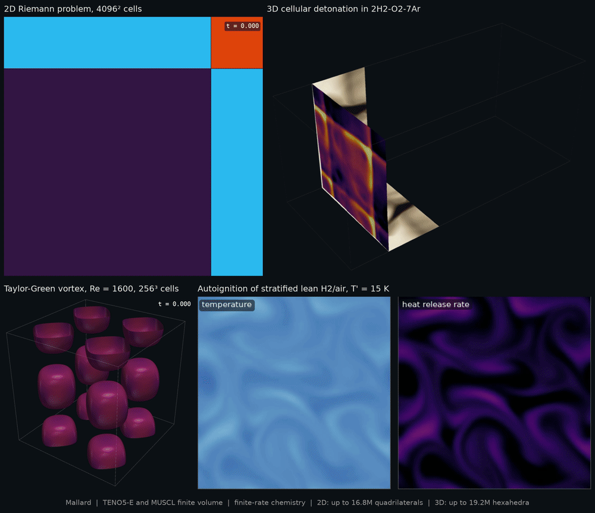

[](https://www.apache.org/licenses/LICENSE-2.0)
[](https://doi.org/10.5281/zenodo.23112953)


Mallard is a high-order unstructured finite volume solver for the compressible Euler and Navier-Stokes equations, written in C++ with [Kokkos](https://github.com/kokkos/kokkos) for performance portability.



*Configuration 3 of the 2D Riemann problem on 4096² quadrilaterals (16.8M cells), with Kelvin-Helmholtz roll-ups along the slip lines of the jet; a cellular detonation in 2H2-O2-7Ar in a 3 cm square duct, 19.2M hexahedra in a window that follows the front, whose transverse waves sweep both directions and print their tracks on the numerical soot foils of the walls (front speed within 0.2% of the Chapman-Jouguet speed); the Taylor-Green vortex at Re = 1600 on the full periodic box at 256³ (16.8M hexahedra), whose kinetic-energy dissipation rate, traced beside it, peaks within 0.3% of the 512³ spectral DNS of the [High-Order CFD Workshop](https://cfd.ku.edu/hiocfd/); and a DNS of the autoignition of thermally stratified lean H2/air at 41 atm (T' = 15 K, after Chen et al.), burning by spontaneous ignition fronts and deflagrations ([`examples/`](examples)).*

> **NOTE:** Mallard is under active development; finite-rate chemistry is new, and its GPU performance is still being tuned.

## Features

**Meshes**
- 2D (triangles, quadrilaterals) or 3D (tetrahedra, hexahedra, prisms, pyramids, mixed), chosen at build time
- Gmsh 2.2/4.1 or HDF5 mesh files (`mallard-mesh-convert`), or generated boxes
- Periodic boundaries: generated meshes, or paired zones of mesh files
- Axisymmetric (r-z) flows in 2D: revolved finite volumes, at design order up to the axis

**Numerics**
- Reconstruction: first order; MUSCL with Barth-Jespersen or Venkatakrishnan limiting; [TENO-E](https://doi.org/10.1007/s10915-025-02918-w) of orders 3 to 6, optionally bound preserving (measured orders 3-6 on triangles and quadrilaterals)
- Riemann solvers: Rusanov, HLL, HLLC, Roe and the rotated-hybrid HLL-Roe (RHLL), carbuncle-free except at shocks at rest on cell faces, all for single gases and mixtures
- Low-Mach correction of the upwind dissipation
- Explicit time integration (forward Euler, SSPRK3, RK4) at a CFL number or a fixed step

**Physics**
- Compressible Euler and Navier-Stokes; constant, Sutherland or power-law viscosity
- Thermally perfect multicomponent mixtures from [Cantera](https://cantera.org) YAML files; optional double-flux scheme for interfaces
- Finite-rate chemistry: elementary, three-body, falloff, PLOG and Chebyshev reactions; a Rosenbrock (RODAS) integrator per cell with analytical Jacobians, Strang-split from the flow; ignition delays match Cantera up to 1268 species
- Mixture-averaged, unity-Lewis or constant-Lewis transport
- Gravity and arbitrary source terms

**Large-eddy simulation** ([design](docs/design/les.md))
- Explicit LES: Sigma (default), WALE, Vreman or Smagorinsky eddy viscosity for single gases and mixtures, with Scotti's filter width on anisotropic cells and an opt-in dynamic constant
- Kinetic-energy-preserving hybrid convective flux, with the Riemann solver only at compressions, and a run-time dissipation budget that separates the model's, the scheme's and molecular dissipation
- Thickened flame (TFLES) with dynamic thickening and Charlette efficiency; partially stirred reactor (PaSR) closure, experimental
- Synthetic turbulent inflow: a digital filter with prescribed Reynolds stresses and length scales, or the statistics of a precursor run, bitwise the same on any number of ranks ([design](docs/design/synthetic_inflow.md))
- Channel flow at Re<sub>τ</sub> = 395 and 590: Re<sub>τ</sub> within 0.7% and 1.6% of the DNS of Moser, Kim & Mansour

**Boundary conditions**
- Slip, adiabatic, isothermal and heat-flux walls, optionally moving
- Inflow, characteristic far field, pressure outlets (local or area-averaged), transmissive, time-dependent expressions
- Partially non-reflecting characteristic (NSCBC) inlets and outlets with transverse terms (1% of an acoustic pulse reflected, against 97-99% at a fixed-pressure outlet); sponge layers
- Zones split between conditions by expressions

**Performance and parallelism**
- [Kokkos](https://github.com/kokkos/kokkos) backends: Serial, Threads, OpenMP, CUDA (NVIDIA) and HIP (AMD); double or single precision
- MPI with multi-jagged (cuboid blocks), Hilbert-curve or graph (dKaMinPar) partitions, GPU-aware halo exchange overlapped with computation: 93% weak-scaling efficiency on 16 A100 GPUs
- No rank holds the whole mesh (HDF5 or generated meshes)
- Bitwise-identical results on any number of threads or MPI ranks; restarts bit for bit, also on a different number of ranks
- Stiff chemistry on GPUs: a warp or wider team per cell and a sparse LU for large mechanisms

**Input, output and diagnostics**
- TOML input; initial conditions, boundary states, sources and sponges as analytical expressions
- VTU (ParaView) or parallel HDF5 with XDMF; surface output of boundary zones
- Running means and covariances, point and line probes, domain integrals (kinetic energy, enstrophy, ...), wall forces
- Heat release, species production rates and detonation soot foils (`P_MAX`)
- `MallardReactor`, a 0D reactor, and Python tools for plotting, animation and HDF5 output

**Validation and testing**
- 38 [examples](examples) against exact solutions, theory, DNS or Cantera, e.g.:
  - Sphere wake at Re = 300: Strouhal number and drag within 3% and 2% of Johnson & Patel
  - Compressible isotropic turbulence: enstrophy within 2.4% of the filtered DNS of Johnsen et al.
  - CJ detonation speed within 0.01%; H2/air flame speeds within 0.81% of Cantera from φ = 0.6 to 1.4
- Over 300 unit and regression tests: exact Riemann solutions, design order, conservation, bitwise MPI and restart reproducibility
- CI on every code change (2D, 3D, MPI on 1-4 ranks, single precision, GCC and Clang, warnings as errors); nightly sanitizers; a performance suite with per-hardware baselines

The sources of every method and of the validation data are listed in [docs/references.md](docs/references.md).

## Building

Mallard depends on [Kokkos](https://github.com/kokkos/kokkos) (5.x), [toml11](https://github.com/ToruNiina/toml11) and [exprtk](https://github.com/ArashPartow/exprtk), all included in this repository; Kokkos and toml11 are submodules.

```sh
git clone --recursive https://github.com/MatthewBonanni/mallard.git
cd mallard
cmake -S . -B build -DCMAKE_BUILD_TYPE=Release -DUSE_SYSTEM_KOKKOS=OFF -DKokkos_ENABLE_THREADS=ON
cmake --build build -j
```

Add `-DMallard_DIM=3` (in a separate build directory) for the 3D solver.

Pick the Kokkos backend at configure time, for example `-DKokkos_ENABLE_OPENMP=ON`, or `-DKokkos_ENABLE_CUDA=ON -DKokkos_ARCH_AMPERE80=ON -DCMAKE_CXX_COMPILER=$PWD/src/external/kokkos/bin/nvcc_wrapper` for NVIDIA A100 GPUs (add `-DKokkos_ENABLE_OPENMP=ON` too, so host-side setup such as TENO's precomputation runs in parallel). To use an installed Kokkos instead, pass `-DUSE_SYSTEM_KOKKOS=ON -DKokkos_DIR=/path/to/kokkos`.

For AMD GPUs, build with ROCm's Clang (ROCm 6.2 or newer, with the HIP development headers):

```sh
cmake -S . -B build-hip -DCMAKE_BUILD_TYPE=Release -DUSE_SYSTEM_KOKKOS=OFF \
    -DKokkos_ENABLE_HIP=ON -DKokkos_ARCH_AMD_GFX950=ON -DKokkos_ENABLE_OPENMP=ON \
    -DCMAKE_CXX_COMPILER=/opt/rocm/bin/amdclang++
```

`AMD_GFX950` is the MI350X/MI355X; use `AMD_GFX942` for the MI300X/MI300A or `AMD_GFX90A` for the MI250X. Instinct GPUs run 64-wide wavefronts where NVIDIA GPUs run 32-wide warps; the chemistry gives each cell a wavefront, and a team's results do not depend on its width. With MPI and dKaMinPar, also pass `-DCMAKE_POSITION_INDEPENDENT_CODE=ON`. On a node with automatic NUMA balancing on (`/proc/sys/kernel/numa_balancing` is 1), the ROCm driver stalls a process's GPU queues for up to seconds at a time: turn it off, as AMD recommends for Instinct GPUs, or bind each rank to its GPU's NUMA node (`numactl --cpunodebind=N --membind=N`).

| CMake option | Default | Description |
|---|---|---|
| `USE_SYSTEM_KOKKOS` | `ON` | Use an installed Kokkos instead of the submodule |
| `Mallard_DIM` | `2` | Spatial dimension, `2` or `3` (one binary per dimension) |
| `Mallard_USE_DOUBLE` | `ON` | Double precision (single precision otherwise) |
| `Mallard_ENABLE_MPI` | `OFF` | Distributed memory with MPI: `mpirun -n N Mallard -i input.toml` splits the mesh between ranks; with generated meshes or HDF5 mesh files (`mallard-mesh-convert`) no rank ever holds the whole mesh, while Gmsh files are read whole by every rank |
| `Mallard_GPU_AWARE_MPI` | `OFF` | With MPI on GPUs: hand device buffers to a CUDA- or ROCm-aware MPI (e.g. Open MPI over UCX built with CUDA or ROCm) instead of staging halos through host memory |
| `Mallard_ENABLE_NCCL` | `OFF` | With MPI on NVIDIA GPUs: exchange halos with NCCL, stream-ordered with the kernels, so the host never waits for a halo (finds NCCL through `NCCL_HOME` or `NCCL_ROOT`); `[parallel] halo_exchange` chooses at run time |
| `Mallard_ENABLE_KAMINPAR` | `OFF` | With MPI: the [dKaMinPar](https://github.com/KaHIP/KaMinPar) graph partitioner for `[parallel] partitioner = "graph"` (fetched at configure time; needs [oneTBB](https://github.com/uxlfoundation/oneTBB), found through `CMAKE_PREFIX_PATH`, e.g. built with `cmake -S oneTBB -B build -DTBB_TEST=OFF -DCMAKE_INSTALL_PREFIX=$HOME/tbb && cmake --build build -j && cmake --install build`). The default multi-jagged partitions need no library and cut box meshes at least as well. With CUDA, configure with the host compiler (`-DCMAKE_CXX_COMPILER=g++`) instead of `nvcc_wrapper`: Kokkos then compiles the code that uses it through `nvcc_wrapper` itself, and dKaMinPar does not compile with nvcc |
| `Mallard_ENABLE_HDF5` | `OFF` | HDF5 mesh files and solution output (`format = "hdf5"`, with XDMF for ParaView; parallel HDF5 with MPI, when available) and the `mallard-mesh-convert` tool |
| `Mallard_WARNINGS_AS_ERRORS` | `OFF` | Treat compiler warnings in Mallard's own code as errors (on in CI) |
| `BUILD_DOCS` | `OFF` | Doxygen documentation target |

## Running

```sh
cd examples/riemann_2d
../../build/src/Mallard -i input.toml --kokkos-num-threads=8
```

See [`examples/`](examples) for complete input files and [`docs/input.md`](docs/input.md) for every input option.

## Testing

```sh
./build/test/MallardTest
```

The test suite checks mesh geometry, the Riemann solvers against an exact Riemann solver, time integrator convergence orders, gradient and limiter properties, TENO design order on triangles and quadrilaterals and on 3D tetrahedra and hexahedra (with polynomial exactness on prisms, pyramids and mixed meshes), free-stream preservation, discrete conservation, symmetry preservation, shock tubes against exact solutions, viscous flows against exact solutions (Couette, Stokes' first problem, conduction), axisymmetric well balance and design order (manufactured solution, Hagen-Poiseuille), and bit-for-bit restarts.

## Postprocessing

`tools/` contains Python scripts (numpy, matplotlib, scipy, imageio) for reading Mallard's VTU files, plotting profiles against exact solutions, and rendering animations:

```sh
python tools/animate.py examples/riemann_2d/solut riemann
```

## Contributing

Mallard uses the [Google C++ Style Guide](https://google.github.io/styleguide/cppguide.html).

## Citing

If you use Mallard, please cite it ([doi:10.5281/zenodo.23112953](https://doi.org/10.5281/zenodo.23112953), or the DOI of the version you used on Zenodo) with the metadata in [CITATION.cff](CITATION.cff) (GitHub's "Cite this repository" button), and the papers behind the methods you use ([docs/references.md](docs/references.md)).

## License

Mallard is licensed under the [Apache License, Version 2.0](LICENSE). Redistributions and derivative works must keep the attribution in [NOTICE](NOTICE). Versions 0.1.0 to 0.6.0 were released under the AGPL v3.0.

Mallard includes code and data derived from [Cantera](https://cantera.org) under the BSD 3-Clause License ([licenses/Cantera-BSD-3-Clause.txt](licenses/Cantera-BSD-3-Clause.txt)).

---

<p align="center">
  
  <br>
  <em>Mach 8 flow over a mallard: 1.07M triangles, TENO5 + RHLL (<a href="examples/mallard">examples/mallard</a>).</em>
</p>
