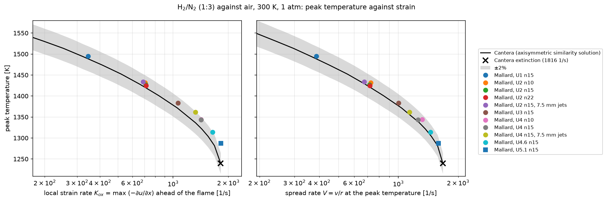

# Design: finite-rate chemistry

Status: accepted (see [Decisions on the open questions](#decisions-on-the-open-questions)).
Implementation follows the [milestones](#10-milestones); done: 1, 2, 3, 4, 5, 6, 7, 8, 9, 10.

Mallard today solves a single calorically perfect gas. This document adds
multicomponent, thermally perfect mixtures and finite-rate chemistry with
mechanisms read at runtime, on NVIDIA GPUs (A100 class) and CPUs, within the
existing C++20 / Kokkos / CMake / TOML stack.

## Goals

- **Arbitrary mechanisms at runtime.** A Cantera YAML file named in the input
  defines species, thermodynamics, reactions and transport data. Changing the
  mechanism never requires recompiling.
- **Mechanism sizes from 10 to about 500 species** (hydrogen to detailed
  hydrocarbon and surrogate-fuel mechanisms), with a path to 1000.
- **One code path for GPU and CPU**, through Kokkos, in 2D and 3D, in double
  and float builds.
- **Inviscid and viscous reacting flow:** reactive Euler for detonations and
  shock-induced ignition, reactive Navier-Stokes with mixture-averaged
  transport for flames.
- **No cost for the single-gas solver.** A run without a mechanism compiles to
  the code that runs today and gives bit-identical results.
- **Determinism and rank-count independence** as in [mpi.md](mpi.md) and
  #49: the result does not depend on the thread or rank count.
- **A validation suite** with reference data and pass criteria, run on every
  milestone.

## Non-goals

- Real-fluid equations of state (cubic EOS, transcritical injection),
  multiphase and spray, soot, radiation beyond the optically thin limit, plasma
  and ionized species, surface
  chemistry and catalytic walls.
- Full multicomponent (Stefan-Maxwell) transport, Soret and Dufour effects,
  bulk viscosity. The transport interface leaves room for them.
- Turbulence-chemistry interaction models (LES closures such as thickened
  flame, flamelet tables, PaSR). Mallard resolves the flame or detonation.
- Implicit time stepping of the flow. The flow stays explicit (SSPRK3); only
  the chemistry is implicit.
- A Chemkin parser. Chemkin input is converted once with Cantera's `ck2yaml`.

## Summary of decisions

| # | Decision | Main alternative | Why |
|---|---|---|---|
| 1 | Species count is a runtime value; species live in their own `View` beside the unchanged flow state | Species count as a compile-time template parameter, like `Mallard_DIM` | Arbitrary mechanisms without recompiling; register-resident species arrays do not scale past ~30 species anyway |
| 2 | The gas model is a template parameter of the RHS kernels (`PerfectGas`, `Mixture`), dispatched once per stage | Runtime branches in every kernel | Single-gas path compiles to today's code; no divergence or register cost in it |
| 3 | Riemann solvers take, per side, `[rho, u, p]` plus two thermodynamic surrogates `(gamma, e0)` with `rho E = p / (gamma - 1) + rho e0 + rho u^2 / 2` | Pass full species vectors to the Riemann solver | Fixed-width face states independent of the species count; exact for a perfect gas (`e0 = 0`); one code path |
| 4 | Species fluxes by mass-flux upwinding (Larrouturou) of linearly reconstructed mass fractions, with one shared stencil and one shared limiter per cell | Species as extra components of every Riemann solver; per-species nonlinear TENO | Positivity, sum Y = 1 at faces to round-off, and a cost that is pure bandwidth per species |
| 5 | Strang splitting of chemistry around the full SSPRK3 step | Chemistry inside the RK stages (IMEX) | Second order, keeps the explicit flow integrator untouched, lets the stiff solver adapt its own sub-steps |
| 6 | Own Kokkos-native chemistry layer: runtime mechanism tables on the device, analytical Jacobian, batched Rosenbrock integrator; BDF and codegen kernels later | Adopt TChem, Zero-RK, PelePhysics or SUNDIALS | See [Libraries](#stiff-chemistry-libraries-and-integrators); no candidate meets Kokkos 5 + runtime mechanisms + Mallard's data layout without a heavier dependency than the code it saves |
| 7 | Chemistry always in double precision, also in float builds | Chemistry in `rtype` | Stiff Newton/Rosenbrock linear algebra and equilibrium constants lose too much in float; A100 FP64 is fast |
| 8 | Mechanisms are Cantera YAML, read in C++ with yaml-cpp; transport fits computed at setup by a port of Cantera's fitting | Link Cantera's C++ library; offline Python converter | No Cantera build dependency (Cantera builds with SCons and pulls Boost, Eigen, fmt, SUNDIALS); one-step workflow |
| 9 | Load balancing of chemistry by redistributing cell states (DLBFoam-style), separate from mesh repartitioning | Only cost-weighted mesh repartitioning | Chemistry is pointwise: moving states is cheap and needs no halo rebuild |
| 10 | Fully conservative by default, primitive reconstruction; double flux as an input option | Double flux always; conservative only | Conservation where it matters (shocks, detonations) by default; oscillation-free contacts when asked for |

Each is detailed below.

## 1. Multicomponent state

### Variables

The conservative state becomes `[rho, rho u, rho E, rho Y_1 .. rho Y_Ns]`.

- `rho` is kept as its own equation and all `Ns` species are transported, so
  `sum_k rho Y_k = rho` holds to round-off by construction of the fluxes
  (section 3), not by eliminating a bath species. Eliminating the last
  species (`Y_N = 1 - sum`) breaks its positivity whenever the others
  overshoot, and the bath species is not always the most abundant one.
- `E` includes the chemical energy through the species' formation
  enthalpies (NASA polynomials are referenced to the standard state), so
  chemistry does not appear in the energy equation as a source.

### Storage

```cpp
using StateView   = Kokkos::View<rtype *[N_CONSERVATIVE]>;   // unchanged: rho, rho u, rho E
using SpeciesView = Kokkos::View<rtype **, SpeciesLayout>;    // (cell, k): rho Y_k
struct State { StateView flow; SpeciesView species; };       // species.extent(1) == 0 without a mechanism
```

- The flow block keeps its compile-time width, so every existing kernel,
  local array and Riemann solver is untouched in size.
- `SpeciesLayout` is one alias. Kokkos' default per backend
  (`LayoutLeft` on CUDA: cell index fastest) coalesces one-cell-per-thread
  kernels; `LayoutRight` (species contiguous per cell) coalesces kernels that
  put a team per cell and species across vector lanes, which is what chemistry
  and transport of larger mechanisms use (section 5). Kernels index through
  the `View`, so this is a measured choice in milestone 10, not an
  architectural one. The starting point is `LayoutRight`.
- The time integrator, `axpby`, halo exchange, restart and conservation sums
  take a `State` and loop over both parts. Without a mechanism the species
  extent is 0 and these loops vanish.

### Why runtime species count

A template parameter `NS` (like `Mallard_DIM`) would let kernels hold species
in registers and let the compiler unroll, at the price of a build per
mechanism. It buys little:

- Register arrays sized `NS` spill to local memory beyond a few tens of
  species, which is exactly where chemistry matters. Large-mechanism kernels
  must stream species from memory either way.
- The kernels that would benefit (face states, Riemann solvers, TENO
  characteristic projection) are kept free of species by decision 3.

The option stays open where measurements justify it: hot kernels can be
dispatched over a few compile-time species buckets (`NS <= 16, 32, 64`, with
runtime `Ns` below the bucket) the way TENO dispatches over its degree.

### Memory budget

Per cell and species, in `rtype` words: state 1, SSPRK3 scratch 1, RHS 1,
species face fluxes one per face side (about 3 per triangle, 6 per
hexahedron; section 3), and for viscous runs gradients `N_DIM` and the
mixture-averaged diffusivity 1. That is about 6 words in 2D Euler and 15 in
3D Navier-Stokes,
so 50 species on 10 M hexahedra in double is about 60 GB: one A100-80GB.
Species work arrays are processed in blocks of species when memory is short
(the species loop is outermost in every species kernel, so blocking is a loop
split, not a redesign).

## 2. Thermodynamics

### Thermally perfect mixture

- Ideal gas: `p = rho R_u T sum_k Y_k / W_k`.
- Species `cp_k(T)`, `h_k(T)`, `s_k(T)` from NASA-7 (two ranges) or NASA-9
  (any number of ranges) polynomials, as in Cantera's `NasaPoly2` and
  `Nasa9PolyMultiTempRegion`. Coefficients live on the device in one flat
  table: per species, its range bounds and 7 or 9 coefficients per range,
  NASA-7 stored as NASA-9 with zero extra terms so there is one evaluation
  routine.
- Outside the fitted range the outermost polynomial is extrapolated;
  `check_interval` reports cells outside the common range of
  all species' fits.

```cpp
struct Mixture {                       // POD of Views, captured by value in kernels
    int n_species;
    Kokkos::View<const double *> W;    // molar masses
    ThermoTable thermo;                // NASA ranges and coefficients
    TransportTable transport;          // fits, section 6
    KOKKOS_FUNCTION double R(const Yview &) const;
    KOKKOS_FUNCTION double e(double T, const Yview &) const;      // and cv, cp, h, g_k/RT
    KOKKOS_FUNCTION double T_from_e(double e, const Yview &, double T_guess) const;
};
```

### Temperature from energy

`e(T, Y) = sum_k Y_k e_k(T)` is monotone (`cv > 0`), so Newton on `T` with
`de/dT = cv` converges in 1 to 3 iterations from the previous value of `T`,
which is cached per cell (it is the `T` column of `primitives`). The iteration
is safeguarded by a bracket (half the highest lower bound to twice the lowest
upper bound of the species' fits: the common fitted range, with some
extrapolation) with a bisection fallback, and stops at `|dT| < 1e-10 T`. The
thermodynamics are in double precision in every build (decision 7), so float
builds use the same tolerance. Newton is needed once per cell per RK stage and at the start and end
of each chemistry step (which carries `T` as an unknown, section 4); face
states never need it (section 3).

The cached `T` makes the iteration count, and so the last bits of `T`,
history dependent. Restart files therefore carry `T` (section 9) so that
restarts stay bit-identical.

### Surrogate thermodynamics for the flux

From a cell's `(rho, T, Y)` the RHS computes the frozen ratio of specific heats
and an energy offset:

```text
gamma = cp(T, Y) / cv(T, Y)
e0    = e(T, Y) - R(Y) T / (gamma - 1)        so   rho e = p / (gamma - 1) + rho e0  (exact at the cell)
a^2   = gamma p / rho                          (frozen sound speed)
```

For a calorically perfect gas `e0 = 0` and `gamma` is the constant `gamma`.
These two numbers are what the Riemann solvers, the characteristic projection
and the time step need; they are reconstructed to faces like any other scalar
(section 3).

## 3. Numerics for multicomponent flow

### Riemann solvers

Today every solver takes `W = [rho, u, p]` per side and one global `gamma`.
They become functions of `W` and per-side `(gamma, e0)`:

- `rho E = p / (gamma - 1) + rho e0 + rho |u|^2 / 2`,
  `a = sqrt(gamma p / rho)`, `H = (rho E + p) / rho`.
- **Rusanov, HLL, HLLC** need only `U`, `F` and `a` per side: direct
  generalization. Einfeldt speeds use the perfect-gas Roe averages with
  `sqrt(rho)`-weighted averages of `gamma` and `e0`,
  `a_roe^2 = (gamma_roe - 1) (H_roe - e0_roe - |u_roe|^2 / 2)`, so that a mixture
  whose sides share `gamma` and have `e0 = 0` gets exactly the perfect-gas
  speeds (Einfeldt's 1988 `gamma`-free estimate
  `(sqrt(rho_L) a_L^2 + sqrt(rho_R) a_R^2) / (sqrt(rho_L) + sqrt(rho_R)) + eta_2 (u_R - u_L)^2`
  was the plan, but it differs from the perfect-gas solver's speeds, and the
  one-species mixture could not then reproduce it; implementation, milestone 3).
  The low-Mach correction uses each side's `gamma` in its Mach number.
- **Roe and RHLL** need a Roe average for a variable-`gamma` gas
  (Shuen, Liou & van Leer 1990; Glaister 1988). As implemented (milestone
  12): with `p = kappa rho e + chi rho` per side (`kappa = gamma - 1`,
  `chi = -kappa e0`), any averages leave a pressure residual
  `dp - chi_roe d(rho) - kappa_roe d(rho e)` from the jump in composition,
  which a multicomponent Roe matrix carries in its species waves. Those move
  at `u_n` with the entropy and shear waves, so all linearly degenerate waves
  together carry `dU` minus the two acoustic waves, whatever the equation of
  state, and the flux takes the jump form
  `F = (F_L + F_R - |u_n| dU - sum_+- (|u_n +- a| - |u_n|) alpha_+- r_+-) / 2`,
  `alpha_+- = (dp +- rho_roe a du_n) / (2 a^2)`, `r_+- = [1, u +- a n, H +- a u_n]`.
  The Roe property then holds for any `a`; it is `a_roe` of the Einfeldt
  speeds above, so the species never enter the solver. A contact between
  gases is upwinded exactly, and with one `gamma` and `e0 = 0` the flux is the
  perfect-gas Roe flux to round-off. RHLL rotates as for one gas, with HLL
  and Roe on `(gamma, e0)` and the larger side's frozen sound speed scaling
  its fallback threshold; the single-gas solvers are unchanged bit for bit.
- The perfect-gas instantiation passes the constant `gamma` and `e0 = 0`
  as compile-time-known values, so it compiles to the current code.

Species are not passed to the Riemann solvers at all. The mass flux
`mdot = F_rho` at every face quadrature point is stored (one value per point)
and the species fluxes follow from it.

### Species fluxes

[Larrouturou's scheme (1991)](https://doi.org/10.1016/0021-9991(91)90253-H): the species flux is the mass flux times the
upwind mass fraction,

```text
F_k = max(mdot, 0) Y_k^L + min(mdot, 0) Y_k^R
```

- If `Y^L`, `Y^R` are in `[0, 1]` and sum to 1, then `sum_k F_k = mdot` exactly
  and `rho Y_k` stays non-negative whenever `rho` does, under the same CFL
  condition. This holds for every Riemann solver, since it only uses `mdot`.
- For HLLC it coincides with the solver's own passive-scalar flux (species
  ride the contact). Rusanov's and HLL's own species fluxes would not have
  this property, because their dissipation acts on each `rho Y_k`
  separately.

### Reconstruction

The issue: with variable `gamma`, a fully conservative scheme generates
pressure oscillations at material interfaces even with a perfect face
reconstruction ([Karni 1994](https://doi.org/10.1006/jcph.1994.1080);
[Abgrall 1996](https://doi.org/10.1006/jcph.1996.0085)), because the update
of `rho E` in a mixed cell is inconsistent with pressure equilibrium. For a
thermally perfect gas this happens at any temperature or composition jump,
not only between species. Reconstructing conservative or characteristic
variables adds oscillations of its own; primitive reconstruction with `p` is
needed for oscillation-free contacts
([Johnsen & Colonius 2006](https://doi.org/10.1016/j.jcp.2006.04.018);
[Coralic & Colonius 2014](https://doi.org/10.1016/j.jcp.2014.06.003)). The
remaining error from the conservative update is of the order of the jump in
`gamma` and `e0`: negligible across resolved premixed flames and detonation
reaction zones, but percent-level at sharp fuel/oxidizer or hot/cold contacts
(e.g. hydrogen injected into air), which is what double flux addresses
([Houim & Kuo 2011](https://doi.org/10.1016/j.jcp.2011.07.031) is the closest
analogue to Mallard: WENO with double flux for thermally perfect reacting
flow).

The design:

1. **Flow block**: reconstruct `W = [rho, u, p]` (MUSCL already does). In
   TENO, mixture runs switch the smooth-cell polynomial and the troubled-cell
   characteristic projection from conservative variables to the primitive
   system, whose eigenvectors depend only on `rho`, `u` and `a` and so are
   valid for any equation of state. The perfect-gas path keeps today's
   conservative variables.
2. **Scalars** `Y_1 .. Y_Ns`, `gamma`, `e0`: reconstructed **linearly with
   one stencil per cell and face, shared by all scalars**:
   - smooth cells: the large central stencil (as for the flow block);
   - troubled cells: the stencil TENO selected for the entropy/contact
     characteristic field at that face (species and entropy waves share the
     eigenvalue `u_n`), stored by the flow pass as one byte per face;
   - MUSCL: least-squares gradients with one limiter value per cell, the
     minimum of Barth-Jespersen (or Venkatakrishnan) over all scalars, with
     the flow block's neighbors and ghost placement. The gradients are
     stored (`N_DIM` words per scalar and cell; recomputing them in the
     species-flux kernel instead is a milestone-10 memory option), and the
     limiter value is reduced further so that every `Y_k` stays in `[0, 1]`
     and `gamma - 1` keeps at least half its cell value at every face
     (the physical bounds of item 3).
   Least-squares reconstruction reproduces constants, so with shared weights
   `sum_k Y_k = 1` at every face point to round-off.
3. **Bounds**: one scaling `theta` per cell
   ([Zhang & Shu 2010](https://doi.org/10.1016/j.jcp.2010.08.016)), the largest value
   in `[0, 1]` that keeps every `Y_k` at every face point in `[0, 1]` and
   `gamma > 1` in smooth cells, and within the range of the cell and its face
   neighbors in troubled cells. Smooth cells get only the physical bounds,
   because a local-range bound clips smooth extrema (e.g. radical peaks in a
   flame) and costs the design order; Zhang–Shu scaling to physical bounds does
   not. Applied to all scalars at once, it preserves `sum Y = 1`.
4. **Troubled-cell indicator**: today's density-jump variance misses species
   interfaces at constant density (common in non-premixed flames). It becomes
   the maximum of the variances of `rho` and of the mixture molar mass `W`.

As implemented (milestone 4): the primitive eigenvectors take the face
average of `W` and the sound speed from the average of the two cells' frozen
`gamma`; the entropy field's choice on each face side is stored as one byte
(`0xFF` for the large stencil, else a bitmask of the kept sector stencils,
averaged with equal weights as TENO does); the scalars' face values are not
stored but recomputed from the stencil weights twice per stage, once for
`theta` and the face values of `gamma` and `e0` before the flux, once for the
species slots after it. The local-range bound of troubled cells clips smooth
extrema where the indicator flags a smooth but coarsely resolved field: a
smooth composition wave on 16^3 hexahedra flags every cell at TENO5 and
converges at about third order there, at fifth order once resolved (2D).
At sharp contacts between gases of different `gamma` the conservative
scheme's pressure error stays at 2-3% under refinement with TENO5 (the contact
stays a few cells wide), against a slow decrease with MUSCL: double flux
(milestone 5) is the remedy.

This makes species reconstruction a sequence of dot products with weights
already computed for the flow block: no smoothness indicators per species and
no per-species branching. The price is that species never get the high-order
nonlinear stencil choice of their own; at a fuel/oxidizer interface they use
the contact field's choice, which is the physically relevant one.

**Option: double flux** ([Abgrall & Karni 2001](https://doi.org/10.1006/jcph.2000.6685);
[Billet & Abgrall 2003](https://doi.org/10.1016/S0045-7930(03)00004-5);
[Ma, Lv & Ihme 2017](https://doi.org/10.1016/j.jcp.2017.03.022)). Each cell's
fluxes are computed with that cell's `(gamma, e0)` frozen over the RK stage on
both sides of its faces, and `rho E` is reset from the true equation of state
after the stage. This keeps `p` and `u` exactly uniform across contacts, at the
cost of energy conservation in proportion to the jump; Houim & Kuo switch back
to the conservative flux at shocks. The surrogate interface makes it a
localized change: a face computes two fluxes, one with each side's frozen
`(gamma, e0)`, so the per-face flux array of #49's deterministic
accumulation gets a second slot for the energy flux. It is milestone 5, enabled by input,
right after the conservative scheme and the interface test that measures the
oscillations. A TENO/double-flux scheme on unstructured meshes appears not to
have been published, so this is also where Mallard would be new.

As implemented (milestone 5, `[numerics] double_flux = true`): `(gamma, e0)`
are frozen per cell once per time step, from the true equation of state at the
step's start (the temperature seed's only update in this mode, so its history
stays rank independent), and every stage takes the cells' pressure from the
frozen relation. Each face point computes the Riemann flux twice, with each
side's frozen `(gamma, e0)` on both of its states; mass and momentum use the
mean of the two (conservative, and equal to both at a contact, where HLLC
and Roe return the upwind physical flux), so `mdot` and the species fluxes stay
unique, and each side takes its own energy flux (one extra word per face).
Both fluxes estimate the wave speeds with each side's own frozen
`(gamma, e0)` (milestone 12): HLL and Rusanov smear a contact by an amount set
by those speeds, and with each flux's own they gave the two fluxes different
mass fluxes there, perturbing `p` by 0.1% (as did RHLL, which is HLL at a
contact without a velocity jump).
After the step `rho E` is reset to the true equation of state at the pressure
of the frozen one. There is no shock switch yet: the energy error over the
multicomponent shock tube is 0.16% of the total energy, with an L1 pressure
error equal to the conservative scheme's; contacts keep `p` and `u` uniform to
1e-12 with MUSCL and TENO5 (HLLC, Roe and RHLL).

### Species fluxes without races

Following #49, species fluxes are written per face, never scattered with
atomics. Because Larrouturou's flux takes each side's contribution from one
side only, a kernel over `(cell, species block)` reconstructs the cell's
species, evaluates them at its face points, and writes
`w_q max(mdot_out, 0) Y_k(q)` into the slot `(face, side, k)` it owns. A
second kernel gathers each cell's slots in `faces_of_cell` order. This needs
`2 x n_faces x Ns` words and no face storage of reconstructed species values.

### Time step

Unchanged for inviscid flow, with the frozen sound speed. Viscous runs use
`nu_eff = max(4/3 mu / rho, lambda / (rho cv), max_k D_k)`. Chemistry does not
limit the flow step (section 4).

## 4. Coupling chemistry and flow

### Strang splitting (default)

```text
U^n --chem(dt/2)--> U* --SSPRK3 flow step(dt)--> U** --chem(dt/2)--> U^{n+1}
```

- Chemistry changes only `rho Y_k`. `rho`, `rho u` and `rho E` are constant in
  each cell during a chemistry substep, so each cell is a constant-volume,
  adiabatic 0D reactor: `dY_k/dt = W_k omega_k / rho` with `T` following from
  `e`. The integrator state is `(Y_1 .. Y_Ns, T)`; `T` is carried as an
  unknown (`dT/dt = -sum_k e_k W_k omega_k / (rho cv)`), which gives a better
  conditioned Jacobian than recomputing `T` from `e` in every RHS, and is
  checked against `e` at the end of the substep.
- The two half steps of consecutive steps are fused (one `dt` chemistry
  call between flow steps) except around output and restart times, as usual.
- Second order in time for smooth problems; the flow integrator, the CFL
  logic and the RK stages stay as they are.

### Alternatives

- **Chemistry in the RK stages, explicit.** Impossible for stiff chemistry:
  radical time scales are 1e-9 s or less, flame and detonation flow steps
  1e-8 to 1e-6 s.
- **Additive IMEX Runge-Kutta** ([Kennedy & Carpenter 2003](https://doi.org/10.1016/S0168-9274(02)00138-1)) with implicit
  chemistry per stage: higher formal order and no splitting error, but a
  Newton solve per stage at the flow step size, with no error control on the
  chemistry, and a new integrator family to maintain. Fixed steps through an
  ignition transient are inaccurate unless `dt` is small.
- **Spectral deferred corrections / chemistry with frozen advective
  forcing** (PeleLM, [Nonaka et al. 2012](https://doi.org/10.1080/13647830.2012.701019);
  PeleC, [Henry de Frahan et al. 2023](https://doi.org/10.1177/10943420221121151)):
  integrate `dU/dt = A + R(U)` per cell with the transport tendency `A` frozen
  over the step, and iterate. Removes most splitting error, notably in steady
  flames where Strang splitting is not steady-state preserving
  ([Speth et al. 2013](https://doi.org/10.1137/120878641) and
  [Lu et al. 2017](https://doi.org/10.1016/j.jcp.2017.01.044) on balanced
  splitting; [Wu, Ma & Ihme 2019](https://doi.org/10.1016/j.cpc.2019.04.016)
  compare splittings in a compressible solver). The chemistry interface takes
  an optional per-cell forcing vector, so this can be added without touching
  the integrator.

### Known splitting issues and how the design handles them

- **Spurious wave speeds for under-resolved stiff fronts**
  ([LeVeque & Yee 1990](https://doi.org/10.1016/0021-9991(90)90097-K)) come from under-resolution, not from splitting; the detonation tests
  check resolution (points per half-reaction length) and CJ speed.
- **Steady flames**: Strang splitting error appears as a `dt`-dependent
  flame speed. The flame-speed test runs at two CFL numbers and requires the
  difference to be below the pass tolerance; if it is not, the forcing option
  above is the remedy.

### Stiffness, load imbalance and skipped cells

- **Skipping inactive cells.** A cell is chemically frozen when
  `T < T_frozen` (input, off by default) or when a cheap estimate
  `dt max_k |omega_k W_k / rho| < eps_Y` holds. Active cells are compacted
  into a queue, as TENO compacts troubled cells.
- **GPU imbalance between cells.** Cells in an ignition kernel take 100x the
  sub-steps of cells in burnt or fresh gas. With one cell per thread a warp
  runs at its slowest lane. The design puts **one cell per team** (a warp, or a
  small team, with species across vector lanes) for mechanisms above about 30
  species, so the hardware block scheduler balances independent cells; for
  small mechanisms, where one cell per thread is faster, cells are **binned by
  the sub-step count of their previous step** (stored per cell) and launched
  in bins of similar cost.
- **MPI imbalance.** Flame and detonation fronts put most of the chemistry
  cost on a few ranks. Chemistry is pointwise, so it is balanced by moving
  cell states, not cells: before the chemistry step, ranks exchange cost
  estimates (`allreduce`), overloaded ranks send `(rho, e, Y, T, h_last)` of
  their most expensive active cells to underloaded ranks, which integrate them
  and send `Y, T, h_last` back ([Tekgul et al. 2021](https://doi.org/10.1016/j.cpc.2021.108073),
  [DLBFoam](https://github.com/Aalto-CFD/DLBFoam), which reports up to about
  10x speedup on reacting OpenFOAM cases). This needs no
  halo or stencil rebuild and keeps results rank-count independent (each
  cell's integration is the same wherever it runs). Long-term imbalance of the
  flow work (TENO troubled cells, species fluxes) uses the dynamic mesh
  rebalancing prepared in [mpi.md, section 10](mpi.md#10-dynamic-load-balancing),
  with the measured per-cell chemistry cost added to the partition weights.

### As implemented (milestone 8)

`src/solver/solver_chemistry.cpp`: `take_step` runs chemistry over `dt / 2`,
the flow step, and chemistry over `dt / 2` again; the two halves of
consecutive steps are not fused yet (each half restarts RODAS from the
cell's last sub-step, so the cost of the split is one extra Jacobian per
cell and step; fusing is an optimization for later). Owned cells are
processed in chunks sized to keep the per-cell work memory (mass fractions,
RODAS vectors and two `(Ns + 1)^2` matrices) under 1 GiB; in each chunk a
kernel flags the cells that need chemistry (`T >= T_frozen` and
`dt/2 max_k |W_k omega_k / rho| > atol / 100` at the current state), a scan
compacts them into a queue, and one thread per queued cell integrates.
Halo cells get no chemistry: the halo exchange of the first RK stage
refreshes them. Chemistry does not update the Newton seed of `T`
(`T_SEED`): only the RHS does, so halo copies of a cell keep the same seed
as its owner and runs stay bitwise independent of the rank count (writing
the seed from chemistry broke this at the 1e-5 level through the ignition
delay's sensitivity to 1e-10 differences in `T`). `CHEM_H` is restarted;
`HRR` and `CHEM_COST` are output variables. PLOG (`ln k` linear in `ln p`
between levels, constant outside, rates at one pressure summed) and
Chebyshev reactions use `p = C_total R T`, so their Jacobian gains
`d q / d C_j = q (d ln k / d ln p) / C_total` for every `j` and
`d q / dT` a `(d ln k / d ln p) / T` term.

Validation (MUSCL, HLLC, SSPRK3, h2o2 mechanism, default tolerances):
- V7 (`examples/detonation_1d`): with this mechanism the recombination zone
  of 2H2-O2-7Ar at 6.67 kPa is about 0.8 m (ZND), so a detonation started by
  a driver at a closed end stays under-supported over practical tubes (it
  ran steadily 9% below D_CJ over 0.6 m). The case therefore starts from the
  ZND profile (`tools/znd_restart.py`) instead of an overdriven start. Front
  speed against D_CJ = 1616.9 m/s: +0.11%, +0.01%, 0.00% at 10, 20, 40 cells
  per ZND induction length (1.525 mm); induction length -4.5%, -1.8%, +2.7%
  (one cell at 40 is 2.5%); peak pressure 174.8 kPa against the von
  Neumann 174.7 kPa. Roe and RHLL (milestone 12; in 1D RHLL is HLL, the
  velocity jump being normal to every face) give the same front speed and
  induction length to the digits above at 10 and 20 cells per induction
  length (+0.11% and +0.01%; -4.5% and -1.8%), with profiles within 0.6% of
  each other.
- V6 (`examples/reactive_shock_tube`): reaction front at 230 us at
  99.625, 99.662, 99.644 mm with 50, 25, 12.5 um cells (within one coarse
  cell of the finest); peak T 2875.2, 2876.1, 2876.6 K and peak p 316.6,
  315.7, 315.7 kPa.
- A100 with one cell per thread: these 1D cases (2,400 to 16,000 cells) run
  at 0.2-2 M cells/s, latency-bound (4-14 ms per step, 60-90% in chemistry);
  a CPU with 8 threads reaches 0.6 M cells/s on them. Milestone 10's
  team-per-cell kernels and larger meshes are what the GPU needs.

### Radiative heat loss (optically thin; issue #160)

`[radiation]` adds the optically thin model of the TNF workshop. Each cell
loses `q = 4 sigma sum_i p_i a_i(T) (T^4 - T_amb^4)` [W/m^3], where `p_i` are
the partial pressures [atm] of H2O, CO2, CO and CH4 and `a_i` their
Planck-mean absorption coefficients. The coefficients are fits to RADCAL
([Grosshandler 1993](https://doi.org/10.6028/NIST.TN.1402)) over 300-2500 K,
distributed with the TNF radiation model
([Barlow et al. 2001](https://doi.org/10.1016/S0010-2180(01)00313-3)): H2O
and CO2 as fifth-order polynomials in 1000/T, CH4 as a quartic in T, and CO
as two quartics joined at 750 K (`src/chemistry/radiation.h`).

- **Where.** The loss is a pointwise sink of `rho E` in the flow RHS
  (`src/solver/solver_radiation.cpp`, after the other sources). SSPRK3
  integrates it with the flow, outside the chemistry's half steps, so the
  constant-volume reactors stay adiabatic. The term is not stiff: the
  radiative time `rho cp T / q` is 0.1-1 s in flames, against flow steps of
  about 1e-7 s. `T` is `p / (rho R)` from the cell's state and
  `p_i = rho_i R_u T / W_i`, all in double precision.
- **Determinism.** One kernel runs over the owned cells, each from its own
  state, so runs stay bitwise independent of the rank count (the MPI test
  covers it). Runs without `[radiation]` launch nothing and are unchanged.
- **Cantera.** Cantera's flames with `radiation_enabled` use the same H2O and
  CO2 fits with no background term (its boundary emissivities are zero).
  `species = ["H2O", "CO2"]` with `T_ambient = 0` reproduces it, to 1e-9 in
  the unit test.
- **Limits.**
  - No absorption: the model holds where the gas is optically thin, such as
    laboratory-scale flames at 1 atm. With reabsorption, the limits and the
    limit speeds move ([Ju, Masuya & Ronney 1998](https://doi.org/10.1016/S0082-0784(98)80116-1)).
  - The fits cover 300-2500 K.

#### Validation

- **Homogeneous gas** (`RadiationTest`): H2O, CO2, CO, CH4 and N2 at 2000 K
  against a 1000 K background, in a quiescent periodic box without
  chemistry. After 0.2 s, by which `T` has fallen by more than 100 K, it
  matches RK4 on `de/dt = -q / rho` to 1e-6.
- **1D flames against Cantera with the same model.**
  - Setup: `tools/flame_restart.py --radiation cantera`, 12 cells per
    thermal thickness of the adiabatic flame, MUSCL, HLLC, SSPRK3, CFL 1.2.
  - S_c is the consumption speed averaged over the last third of each run.
  - Cantera's flames are on 5-10 cm domains. The radiating speed is the same
    at 5 and 10 cm, so the burnt gas cooling far downstream does not matter.

  | Mixture | Cantera S_L adiabatic / radiating [cm/s] | Mallard S_c adiabatic / radiating | S_rad / S_ad: Cantera, Mallard |
  |---|---|---|---|
  | CH4/air phi = 0.6, GRI-3.0 | 11.436 / 11.136 | (running) | 0.974 / (running) |
  | CH4/air phi = 0.5, GRI-3.0 | 4.880 / 3.958 | 4.821 / 3.935 (3 flame times, still slowing by 0.5% per 0.3) | 0.811 / 0.816 |
  | CH4/air phi = 0.44, two-step (`ch4_bfer.yaml`) | 4.231 / 3.600 | 4.194 / 3.568 | 0.8509 / 0.8507 |

  The TNF model (all four species, 300 K background) gives 3.563 cm/s for
  the two-step flame at phi = 0.44, against 3.568 with Cantera's model.
  CFL 0.8 gives the same speed to four digits.
- **Radiative flammability limit.**
  - Two-step mechanism: Cantera finds a radiating flame at phi = 0.41 and
    none at 0.405. Mallard's flame at 0.41 burns at 2.152 cm/s (Cantera
    2.181). At 0.40, started from the adiabatic profile, its speed falls from
    2.0 to 0.2 cm/s within 17 flame times and the flame dies.
  - GRI-3.0: Cantera's limit lies between phi = 0.48 and 0.49. At 0.49,
    S_rad / S_ad = 0.73, near the theoretical e^-1/2 = 0.61 at the turning
    point that Ju, Masuya & Ronney report for optically thin CH4/air.
    Mallard's flame at 0.47, started from the adiabatic profile, slows
    steadily from 3.2 to 1.8 cm/s in 2.7 flame times. That is below Cantera's
    slowest steady flame (3.19 cm/s at 0.49) and still falling.
- **Flame-vortex quenching.** `examples/flame_vortex_quenching` reproduces
  the quenching zone of the spectral diagram of Poinsot, Veynante & Candel
  (1991) with this model.

## 5. Chemistry

### Stiff chemistry libraries and integrators

Status checked against the repositories on 2026-10-02. "Runtime" means a new
mechanism needs no recompilation.

| Library | Status | License | Fit with Mallard | Mechanisms | Jacobian / integrator | GPU strategy | Verdict |
|---|---|---|---|---|---|---|---|
| [TChem](https://github.com/sandialabs/TChem) (Sandia) | No releases; `main` last changed 2023-07; newest branch targets Kokkos 4.2 (2025-08) | BSD-2 | Kokkos-native, but **no Kokkos 5 support**; depends on [Tines](https://github.com/sandialabs/Tines) (Kokkos <= 4.5), Sacado, OpenBLAS/LAPACKE, yaml-cpp | Runtime (Chemkin, Cantera YAML) | Sacado autodiff or FD; TrBDF2 | Team per sample | Closest in spirit; unusable with Kokkos 5 without porting it and Tines. Its successor [TChem-atm](https://github.com/sandialabs/TChem-atm) (v2.0.0, 2025-09; [Kim et al., GMD 2026](https://gmd.copernicus.org/articles/19/1281/2026/)) targets atmospheric chemistry and pins a fork of Kokkos Kernels |
| [Zero-RK](https://github.com/LLNL/zero-rk) (LLNL) | Active (2026-03), no tags | BSD-3 | CPU + CUDA (no Kokkos); SUNDIALS (tested up to 5.8), SuperLU, MAGMA | Runtime (Chemkin) | Analytical sparse Jacobian; CVODE with sparse preconditioned iterative solves ([McNenly et al. 2015](https://doi.org/10.1016/j.proci.2014.05.113)) | Batched multi-reactor with MAGMA / cuSolverRf | Best algorithms for large mechanisms; the CUDA-only GPU path and old SUNDIALS rule it out as a dependency. Its ideas (static sparse pattern, preconditioned Krylov above ~300 species) carry over |
| [PelePhysics](https://github.com/Pele-Suite/PelePhysics) | v1.0.0 (2026-02), very active | BSD-3 | **Requires AMReX** and SUNDIALS | **Build-time codegen** (CEPTR, from Cantera YAML), incl. QSS reduction ([arXiv 2405.05974](https://arxiv.org/abs/2405.05974)) | Generated analytical Jacobian; CVODE (MAGMA / cuSPARSE batched), ARKODE, explicit RK64, own BDF | Lock-step batches per box | The production reference for GPU combustion, but AMReX and codegen per mechanism are both against our constraints |
| [Cantera](https://github.com/Cantera/cantera) | 3.2.0 (2025-11) | BSD-3 | CPU only; builds with SCons; Boost, Eigen, fmt, yaml-cpp, SUNDIALS | Runtime YAML: the de facto format | Analytical/approximate sparse Jacobians; CVODES | None | **The reference oracle** (Python, in tests and tools) and the input format; not linked into Mallard |
| [SUNDIALS](https://github.com/LLNL/sundials) CVODE / ARKODE | 7.9.0 (2026-09); Kokkos 5 support in the Kokkos NVector since 7.7 | BSD-3 | Kokkos NVector and `KokkosDense` batched block-diagonal solver; MAGMA, cuSolverSp batch QR, Ginkgo batched (7.5+) | n/a (user RHS) | User Jacobian; BDF, ARK, RKC/RKL (`LSRKStep`) | One big system for all cells, driven from the host | **All cells share one step size and one error norm**: the stiffest cell sets the step for the batch, and a cell's result depends on the cells it is batched with, so results change with the decomposition ([Balos et al., IJHPCA 2024](https://doi.org/10.1177/10943420241280060)). A CPU reference integrator for tests, not the device integrator |
| [Kokkos Kernels ODE](https://github.com/kokkos/kokkos-kernels/tree/5.2.2/ode) | In Kokkos Kernels 5.2.2 (2026-09) | Kokkos license | Kokkos-native, Kokkos 5 | n/a | User dense Jacobian; adaptive RK, variable-order BDF (`BDFSolve`), Newton with static-pivoting dense LU | One system per thread, no team variant | `Experimental`, Newton iteration count hard-coded, `max_step` ignored; TChem-atm had to fork it. A design reference and prototype, not a dependency. Its batched `SerialLU`/`TeamLU` are what we build on |
| [accelerInt](https://github.com/SLACKHA/accelerInt), [pyJac](https://github.com/SLACKHA/pyJac) | Unmaintained since 2018-19 | MIT | CUDA / C codegen | Codegen | Analytical (pyJac); Rosenbrock, exponential, Radau-IIA | One thread per cell | Source of the GPU integrator comparisons below |
| [KinetiX](https://github.com/bogdandanciu/KinetiX) ([Danciu et al., CPC 2025](https://doi.org/10.1016/j.cpc.2025.109504)) | 2025 | BSD-2 | OCCA codegen (nekRS) | Codegen from Cantera YAML | Rates, thermo, transport; no integrator | Thread per point | Rate evaluation up to 1.7x faster than CEPTR on GPU; a model for our optional codegen layer |
| [Pyrometheus](https://arxiv.org/abs/2503.24286), [ChemGen](https://arxiv.org/abs/2510.10005) | 2025 | various (ChemGen: not OSI) | Python/C++ codegen | Codegen | ChemGen: analytical Jacobian and implicit integrators | not stated | Not adoptable as dependencies |

What the GPU literature says about integrators and parallel layout:

- **Batched dense direct solves beat matrix-free Krylov** at moderate size:
  Balos et al. (2024) found MAGMA batched LU about 10x faster than GMRES in
  PeleLMeX for the 53- and 88-species mechanisms (GMRES won at 21 species),
  and cuSPARSE batched 1.5-10x slower than MAGMA. Ginkgo's batched solvers beat
  vendor ones on PeleLM matrices ([Aggarwal et al. 2021](https://sc21.supercomputing.org/proceedings/workshops/workshop_pages/ws_lasalss105.html); [arXiv 2308.08417](https://arxiv.org/abs/2308.08417)).
- **Implicit one-step methods map well to GPUs, but divergence hurts.**
  Radau-IIA with an analytical (pyJac) Jacobian on one GPU matched CVODE on
  12-38 CPU cores for hydrogen, but only about 3 cores for GRI-3.0 at
  `dt` = 1e-4 s because of thread divergence; exponential methods were less
  competitive, and a finite-difference Jacobian cost 7-241x
  ([Curtis, Niemeyer & Sung 2017](https://doi.org/10.1016/j.combustflame.2017.02.005)).
  Rosenbrock and RK solvers vectorize well on GPUs and CPU SIMD
  ([Stone, Alferman & Niemeyer 2018](https://arxiv.org/abs/1608.05794)).
  Explicit RKC on a GPU was up to 57x faster than CPU VODE for GRI-3.0 at
  `dt` = 1e-6 s but 2.5x slower than 6-core VODE at 1e-4 s
  ([Niemeyer & Sung 2014](https://doi.org/10.1016/j.jcp.2013.09.025)):
  explicit methods are only an option for small splitting steps.
- **Thread per cell vs team per cell**: thread per cell wins for small systems
  and many cells (up to about 2x, [arXiv 2405.17363](https://arxiv.org/abs/2405.17363)),
  but a warp runs at the pace of its stiffest cell; team per cell is needed
  once the Jacobian no longer fits per thread (roughly 50-100 species).
- **Quasi-steady-state predictor-correctors** (CHEMEQ2, Mott, Oran & van Leer
  2000; YASS) are cheap and Jacobian-free but lose accuracy and conservation on
  large stiff mechanisms. **Dynamic adaptive chemistry** (per-cell DRG) gives
  each cell its own mechanism, which is hostile to SIMT. **Offline reduction**
  ([pyMARS](https://github.com/Niemeyer-Research-Group/pyMARS)) and
  **QSS-reduced mechanisms** remain the main lever for very large mechanisms;
  both produce ordinary Cantera YAML files that need nothing from us.
- No library publishes a throughput-versus-species-count curve on an A100 for
  10-1000 species. The benchmark suite (section 11) produces one.

### Recommendation

**Write our own chemistry core in Kokkos, small and specific, and use the
libraries as oracles and design references rather than dependencies.**

1. **Mechanism data at runtime** (Cantera YAML via yaml-cpp, flattened to
   device tables). No codegen, no recompilation.
2. **Analytical Jacobian** from the same tables: dense below about 100 species,
   static-pattern sparse above.
3. **Adaptive Rosenbrock integrator per cell** (one LU per step, no Newton
   loop, fixed work per step), on Kokkos Kernels' batched `SerialLU` /
   `TeamLU`, templated on the execution pattern (thread per cell or team per
   cell, chosen from `Ns`).
4. **Later layers behind the same interface, each only if benchmarks call for
   it:** an adaptive BDF for large mechanisms (with Zero-RK-style
   preconditioned Krylov above about 300 species); a mechanism-specialized,
   code-generated kernel (KinetiX/CEPTR-style C++ compiled as an optional
   plugin) for production runs on a fixed mechanism.
5. **Cantera (Python)** produces all reference data in the tests; **CVODE**
   (SUNDIALS, CPU, one instance per cell) is a test-only reference integrator.

Tradeoffs:

- We own an integrator, Jacobians for every reaction type, and transport
  fitting: roughly 3-5k lines that TChem or PelePhysics already have. In
  exchange we get Kokkos 5 and Mallard's data layout, runtime mechanisms,
  per-cell step control (decomposition-independent results), float builds,
  and no AMReX, Tines, Sacado or SUNDIALS in the build.
- A table-driven rate kernel is slower than generated code (KinetiX reports up
  to 1.7x over CEPTR for rates alone; the LU is unaffected). The codegen layer
  recovers that when it matters.
- Rosenbrock needs a Jacobian per step; BDF reuses one over many steps and wins
  for large mechanisms at loose tolerances. The interface is built for both,
  and the benchmarks decide when BDF is worth adding.
- If Sandia ships a Kokkos 5 TChem, adopting its kinetics behind our integrator
  interface becomes a reasonable alternative to milestone 6; nothing here
  precludes it.

### Device mechanism representation

The mechanism is converted on the host into flat, read-only device arrays
(structure of arrays), grouped by reaction type so that a warp evaluates
reactions of one kind:

| Table | Content |
|---|---|
| Species | molar mass, NASA ranges and coefficients, transport fits |
| Arrhenius | `log A`, `b`, `Ea / R_u` per rate (forward, and low/high for falloff) |
| Stoichiometry | CSR per reaction: reactant and product species, coefficients, orders (non-integer orders allowed) |
| Third body | CSR of non-default efficiencies, default efficiency |
| Falloff | type (Lindemann, Troe, SRI) and parameters |
| PLOG | per reaction, list of `(log p, Arrhenius)`; Cantera's interpolation rule, including several rates per pressure |
| Chebyshev | per reaction, `T` and `p` ranges and the coefficient matrix |
| Reverse | reversible flag, explicit reverse rates where given, `sum nu` for `Kc` |

Reaction ordering within a type is by number of reactants and products, so
neighboring lanes run the same loop trip counts.

### Rates

Per cell (one thread, or one team with reactions across lanes):

1. Concentrations `C_k = rho Y_k / W_k`; `g_k / (R_u T)` from the NASA
   polynomials (one evaluation per species, shared by all reactions).
2. Forward rate constants in log form: `k_f = exp(log A + b log T - Ea / (R_u T))`.
3. Third-body concentrations; falloff blending `Pr`, `F` (Troe/SRI); PLOG
   interpolation at `p = rho R T`; Chebyshev.
4. Reverse rate constants from `Kc = exp(-sum_k nu_k g_k / (R_u T)) (p_atm / R_u T)^sum nu`,
   unless explicit.
5. Rates of progress `q_i = k_f prod C^nu' - k_r prod C^nu''`, and net
   production `omega_k = sum_i nu_ki q_i` accumulated in registers (small
   mechanisms) or team scratch memory (large ones).

### Jacobian

Analytical, from the same tables: `d omega / d C` from the rates of progress
(including third-body and falloff derivatives, and `d k / d T` for the `T`
column), then chain-ruled to `(Y, T)`.

- **Dense** for `Ns` up to a threshold (default 100): `(Ns + 1)^2` doubles in
  team scratch (level 0 shared memory where it fits, level 1 global scratch
  above that), LU with partial pivoting.
- **Sparse** above it: the sparsity pattern of `I - gamma h J` is fixed by the
  mechanism, so the host computes a fill-reducing ordering and the symbolic
  LU (pattern of L and U) once at setup; the device does a numeric
  factorization without pivoting over the fixed pattern, with a diagonal
  check that falls back to a smaller step. Zero-RK's GPU path refactorizes
  on a fixed pattern in the same way (cuSolverRf); whether static pivoting is
  robust enough across our mechanisms is checked in milestone 10, with
  threshold partial pivoting within the pattern as the fallback.
- Approximations that keep the integrator converging while cutting cost
  (dropping the third-body and falloff concentration derivatives, as some codes do)
  are a tuning option, measured against the exact Jacobian.

Unit tests compare the Jacobian against finite differences of the rates, and
the rates against Cantera, at random states.

**Fractional orders below 1.** A global rate `k C^n` with `0 < n < 1`
(Westbrook–Dryer: `[C3H8]^0.1`, `[H2O]^0.5 [O2]^0.25`) has
`d(C^n)/dC = n C^(n - 1)`, unbounded as `C -> 0`, and is not Lipschitz there:
the exact solution reaches `C = 0` in finite time. The Jacobian then
overflows wherever such a reactant runs out or starts at zero (`inf * 0 = NaN`
when another reactant is also zero, as `CO` and `H2O` before ignition), and
step-size control stalls at depletion. Cantera evaluates the exact law
(`C_AnyN` in `StoichManager.h`: zero rate and derivative for `C <= 0`, the
pow otherwise); its CVODES integration of the two-step propane mechanism fails
at fuel depletion at `rtol = 1e-12`, and its reference data are generated at
`1e-10`. Mallard regularizes the rate law itself, below
`C_reg = 1e-12` kmol/m^3 (`KineticsTable::C_REG`):

    C^n  ->  C_reg^n x ((2 - n) + (n - 1) x),   x = C / C_reg,   0 <= x < 1
    C^n  ->  C_reg^n (2 - n) x,                 x < 0

the quadratic through the origin that matches `C^n` and its slope at
`C_reg` (`C^1`), continued linearly to negative concentrations as integer
orders are (a negative reactant gives a restoring rate). The slope at zero is
`(2 - n) C_reg^(n - 1)`, finite, and the rate is monotone; the analytical
Jacobian differentiates the regularized law, so RODAS sees the exact
Jacobian of the right-hand side it integrates. Below `C_reg` the reactant
decays exponentially instead of vanishing in finite time. `C_reg` is a fixed
concentration at the scale of the default `atol = 1e-10` on `Y`: the
concentration `rho Y / W` of a fuel at that mass fraction is about `1e-12`
kmol/m^3 at 1 atm and above it at higher pressures, so the regularization acts
where the error control already treats the reactant as zero. The fixed value
keeps the reaction tables free of the integrator's options. Integer orders,
orders above 1 (bounded slope) and negative orders (whose rates diverge
themselves) are unchanged. Tests: the Jacobian of the two-step propane
mechanism against finite differences as each fractional-order reactant goes
from above `C_reg` to zero and negative, and its constant-volume ignition at
the V1 conditions to depletion of fuel (lean), oxygen (rich) or both
(stoichiometric) against Cantera: ignition delays within 0.5%, end states
within `1e-6` in `Y`.

As implemented (milestone 6, `src/chemistry/kinetics.h`): one table set per
mechanism, compressed rows per reaction for the forward orders, the products
(reverse orders), the nonzero net coefficients and the non-default third-body
efficiencies; elementary, three-body and falloff (Lindemann, Troe, SRI)
reactions, explicit colliders `(+AR)`, irreversible reactions, non-integer
forward orders, duplicates, rate constants in any units. The kinetics layer
returns the rates of progress with `d q / dT` at fixed concentrations, the
production rates, and the dense `d omega / d C`; the chain rule to the
reactor's `(Y, T)` is the integrator's (milestone 7). Rates of progress and
production rates match Cantera to 1e-10 for h2o2, GRI-3.0 and a test
mechanism with every reaction type; both derivatives match Richardson-
extrapolated finite differences to 1e-6 of their row norms.

### Integrator

The first integrator is an adaptive Rosenbrock method with an embedded error
estimate (a stiffly accurate, L-stable RODAS-type scheme, or ROS4; Hairer &
Wanner, *Solving ODEs II*, ch. IV.7), integrating the
constant-volume reactor over the splitting step:

- one Jacobian and one LU per sub-step, a fixed number of stages, no Newton
  iteration: a predictable instruction stream, which matters for SIMT
  efficiency, and simple to implement against our own Jacobian;
- error control on `Y` (absolute tolerance, default 1e-10) and `T`
  (relative, default 1e-6); first sub-step size from the previous step's last
  accepted sub-step in that cell (stored, `h_last`);
- positivity: negative `Y_k` beyond `-atol` reject the sub-step; small
  negatives are clipped and `Y` renormalized at the end of the splitting step,
  with the energy unchanged (so `T` follows).

A variable-order BDF integrator (CVODE-like, reusing the Jacobian over many
steps) is more efficient for large mechanisms with loose tolerances and is a
later milestone behind the same interface, either our own or Kokkos Kernels'
batched BDF if it proves adequate. An explicit stabilized integrator (RKC/ROCK)
is an option for mildly stiff cases (preheat zones, very small `dt`).

```cpp
struct ChemistryIntegrator {
    // Advance every active cell over dt at constant (rho, e).
    // Y, T, h_last are updated in place; forcing is optional (SDC-style coupling).
    virtual void advance(double dt, CellQueue active, SpeciesView Y, View T,
                         View h_last, ConstView rho, ConstView e,
                         std::optional<ForcingView> forcing, CostView cost) = 0;
};
```

As implemented (milestone 7, `src/chemistry/rosenbrock.h`, `reactor.h`):
RODAS with Hairer's coefficients (`rodas.f`), one cell per thread, dense LU
with partial pivoting in per-cell work memory (`2 (Ns + 1)^2 + 16 Ns + 4 Nr + 10`
doubles: the Jacobian is kept across rejected sub-steps). The error norm is
the RMS of `err_i / (atol_i + rtol max(|y0_i|, |y1_i|))` (Hairer's), with
`atol` on `Y` only and one `rtol` (default 1e-6) on `Y` and `T`; sub-step
factor `0.9 err^(-1/4)` within [0.2, 6], no growth right after a rejection.
Sub-steps to `Y_k < -atol` or non-finite errors are rejected. At the end of
each call, negative `Y_k` are clipped, `Y` renormalized and `T` recomputed
from the initial `e`. The reactor Jacobian in `(Y, T)` includes the `T`
dependence of `cv` (a new `d cp / dT` in the thermo tables); it matches
finite differences to 1e-6 of the row norm for the three test mechanisms.
`MallardReactor` is constant volume only; constant pressure (another
Jacobian, no solver use) is left until a case needs it. V1/V2 at the
default tolerances, in device kernels, with each run split into three
calls as splitting steps would: ignition delays within 1.4e-4 (H2/air,
h2o2) and 3e-6 (CH4/air, GRI-3.0) of Cantera's at rtol 1e-12, `T` at 0.5
and 2 delays within 1%, equilibrium `T` within 0.1 K and mass fractions
within 1e-4 over the 36 cases. V3 (large mechanisms) moves to milestone 10
with the sparse LU.

### Precision

Chemistry runs in double in every build. Float builds convert the cell's
`(rho, e, Y)` to double on entry and back on exit. Reasons: equilibrium
constants involve exponentials of differences of large Gibbs energies;
`I - gamma h J` at large `h` is ill conditioned in float; and Newton-type
convergence tests near float round-off stall. A100 runs FP64 at half the FP32
rate, so the cost is modest. Float builds otherwise lose about seven digits of
`sum Y = rho`, which the renormalization absorbs.

### Determinism

Each cell's integration depends only on that cell's inputs, so the result is
independent of thread, team and rank assignment, and of the chemistry load
balancing, provided two rules hold: team reductions within a cell use a
fixed order (explicit loops over a fixed lane count, not `parallel_reduce`
with an implementation-defined tree), and the per-cell code path (thread or
team, team size) depends only on the mechanism and the build, never on the
cell, its bin or its rank, so binning and load balancing only reorder work.

### As implemented (milestone 10)

`src/chemistry/lanes.h`, `sparse_lu.h`; `src/solver/cell_chemistry.*`;
`benchmarks/`.

- **One code for a thread or a team.** Every chemistry kernel (thermo per
  species, rates of progress per reaction, production rates, Jacobian, the
  chain rule to `(Y, T)`, dense and sparse LU and solves, the RODAS stages and
  error norm, the reactor) is written once against a `Lanes` interface:
  `SerialLanes` (one thread per cell) or `TeamLanes` (all threads and vector
  lanes of a Kokkos team per cell). A team's sums accumulate 32 strided shares
  in index order and then the shares in order, whatever the team's width, so
  a cell's result depends only on whether a thread or a team integrates it,
  which is fixed per mechanism and build: results stay independent of the
  decomposition, the queue order, the binning, the team width and the rank
  count. With lanes the work is balanced across them: the
  Jacobian is assembled by entries (each entry's terms listed at setup), not
  by rows (H appears in a hundred GRI-3.0 reactions), and production rates
  by chunks of four reactions; dense matrices are stored by columns, so that
  the lanes' rows of an elimination step or a solve are contiguous. The LU
  with partial pivoting gives the same factors for any lane count.
- **Choice** (`[chemistry] lanes`, default automatic): a warp per cell on GPUs
  from 16 species, one thread per cell otherwise (and on CPUs).
- **Wide teams for expensive cells** (GPUs, with a warp per cell): after the
  cost ordering, the queued cells whose last call took at least 16 sub-steps
  get 8 warps each (16 from 512 species), launched on a second stream
  concurrently with the other cells' one-warp teams. These few igniting cells
  set the time at dt = 1e-6 s; with more lanes each of their sub-steps
  (rates, Jacobian entries, the sparse LU's updates per pivot, the solves)
  takes fewer rounds. Since a team's result does not depend on its width
  (bitwise; `VectorLanesIntegrateLikeOneThread` checks one against four warps
  on GPUs), which cells are wide is free to depend on their history: a
  restart, another decomposition or another queue order changes only the
  speed. Teams of up to 512 threads keep the warp kernel's 128 registers per
  thread (launch bounds 512 threads, one block per multiprocessor) and use
  global memory for their work. Cells that take one or two sub-steps never
  take this path, so the other cases are unchanged.
- **Cost ordering** (GPUs only; `bin_by_cost` in the benchmark): the queued
  cells are sorted by the sub-steps they took in their last call, most
  expensive first. With one thread per cell a warp's cells then take similar
  numbers of sub-steps; with a team per cell the expensive teams start first
  and cheap ones fill in behind them instead of leaving a tail. Only the order
  of work changes, never a cell's result.
- **Sparse LU** (`[chemistry] sparse`, by default from 30 species when its
  factors fill at most 60% of the dense matrix): the
  Jacobian splits into the static pattern of its mass-action and
  extra-efficiency terms, with the dense `T` row and column, plus a rank-one
  part `u v^T` (`v_j = 1 / W_j`) that holds everything that is the same in
  every column: third bodies at their default efficiency and the pressure of
  PLOG and Chebyshev reactions. The pattern is ordered by minimum degree (`T`
  last), its fill computed at setup, and factored without pivoting by a flat
  list of updates per pivot (a vanishing pivot rejects the sub-step);
  Sherman-Morrison adds the rank-one part with one more solve per
  factorization. GRI-3.0 fills 1,545 of 2,916 entries; the NUIG n-hexane
  mechanism (1268 species) 56,591 of 1.6 million, 3.5%.
- **Fused half steps** (`[chemistry] fuse_half_steps`, default off): the
  half steps of consecutive steps are one chemistry call, except where output,
  checks or the end of the run read the state (and the next step's `dt` comes
  from the state before the pending half step). One
  chemistry call per step instead of two halves the chemistry's cost where
  cells take one or two sub-steps per call: on the H2 flame (V8, one CPU
  core) chemistry falls from 7.7 to 3.8 s over 3000 steps and the step from
  3.8 to 2.5 ms. It is off by default because the result then depends on the
  output schedule (`check_interval`, writers, monitors): a run stopped by
  `t_wall_stop`, or restarted from a step at which the uninterrupted run wrote
  nothing, no longer reproduces that run bitwise. Making it the default needs
  the pending half step in the restart file and output from a flushed copy.
- **Layout**: `SpeciesLayout` is a CMake option (`Mallard_SPECIES_LAYOUT_LEFT`);
  every kernel indexes through the view. On the full-solver benchmark (A100)
  `LayoutLeft` (cells contiguous per species) takes 58.7 ms per step and the
  default `LayoutRight` (species contiguous per cell) 60.6 ms, the same in two
  runs: 3%, all of it in the flow kernels (chemistry 3.26 vs 3.24 s, its
  kernels copy a cell's species to work memory first). Too small to give the
  GPU and CPU builds different layouts by default; the option stays for
  large-mechanism runs to measure.

Validation: V3 at 100 species (n-dodecane/air, 20 atm, phi 0.5-2, 1000-1400 K,
`test/data/chemistry/ndodecane_ignition.csv`): ignition delays within 5.4e-6
of Cantera's with the dense and the sparse LU, `T` at 0.5 and 2 delays within
1% (the mechanism's irreversible soot-precursor reactions keep it from its UV
equilibrium, which is therefore not compared). At 1268 species
(`tools/v3_check.py`, 10 atm, phi 1, 1000-1400 K): delays within 4e-6, about a
second per case on one CPU core with the sparse LU (128 s with the dense one).
V1/V2/V6/V7 unchanged within their tolerances.

Baselines (`benchmarks/`, recorded in `benchmarks/baselines.csv`): cells per
second over one splitting step on states sampled along an ignition (2-38%
of them igniting, as the ignition's length in the sampled time; "1%": one in
a hundred), the best of the calls after a warm-up, one A100 (CUDA 12.9,
double). "Thread, unordered, dense" is milestone 8's execution (one thread
per cell, queue order, dense LU), the "before" of this milestone:

| Case | Species | Execution | dt = 1e-8 s | dt = 1e-6 s |
|---|---|---|---|---|
| h2o2 | 10 | thread per cell, ordered (default) | 6.53M | 2.64M |
| | | thread, unordered, dense | 6.75M | 1.64M |
| h2o2 1% | | thread, ordered / unordered | 6.51M / 6.73M | 3.33M / 2.47M |
| GRI-3.0 | 53 | warp per cell, sparse LU, ordered (default) | 525k | 530k |
| | | warp, sparse, unordered | 531k | 495k |
| | | warp, dense | 340k | 339k |
| | | thread, ordered, sparse | 222k | 126k |
| | | thread, unordered, dense | 121k | 98k |
| GRI-3.0 1% | | warp, sparse, ordered / unordered | 525k / 531k | 531k / 512k |
| n-dodecane | 100 | warp per cell, sparse LU, ordered (milestone 10) | 308k | 28.9k |
| | | warp, sparse, unordered | 307k | 27.6k |
| | | warp, dense | 89.6k | 9.8k |
| | | thread, unordered, dense | 11.7k | 874 |
| n-dodecane 1% | | warp, sparse, ordered / unordered | 327k / 305k | 29.0k / 28.1k |
| n-hexane | 1268 | warp per cell, sparse LU, ordered (milestone 10) | 5.13k | 190 |
| | | warp, sparse, full Jacobian | 677 | 23 |
| | | warp, dense | 3.9 | (not run) |

With wide teams for the expensive cells (now the default; same A100 and
cases):

| Case | Wide teams | dt = 1e-8 s | dt = 1e-6 s | Before (1e-6 s) |
|---|---|---|---|---|
| h2o2 | (thread per cell) | 6.08M | 2.62M | 2.64M |
| GRI-3.0 | 8 warps (no cell reaches 16 sub-steps) | 526k | 532k | 530k |
| n-dodecane | 8 warps for the 256 igniting cells | 309k | 48.8k | 28.9k |
| n-hexane | 16 warps for the 16 igniting cells | 5.08k | 581 | 190 |

Widths measured for the wide teams at 1e-6 s: n-dodecane 2/4/8 warps 40.0k,
46.9k, 48.9k cells per second; n-hexane 4/8/16 warps 434, 534, 581. Giving
every cell 4 warps instead (no cost threshold) reaches 45.2k for n-dodecane
at 1e-6 s but costs a third at 1e-8 s (195k), where every cell takes one
sub-step. The h2o2 run at 1e-8 s (6.08M against 6.53M) does not involve the
change (one thread per cell) and is run-to-run variation.

Sub-steps per cell at 1e-6 s (the benchmark's histogram): h2o2 127k cells
with 1, 53k with 2, 57k with 3-4, 16k with 5-8, 8k with 9-16; GRI-3.0 64.5k
with 1 and 1k with 3-4; n-dodecane 16.1k with 1 and 256 with 65-128;
n-hexane 1008 with 1 and 16 with 33-64. At 1e-8 s every cell takes one.

Against milestone 8's execution: 1.6x for h2o2 at 1e-6 s (ordering; 3% slower
at one sub-step per cell, the sort's cost), 4.3-5.4x for GRI-3.0 and 26-33x
for n-dodecane (warp per cell and sparse LU). A warp per cell beats a thread
per cell 2.4-3.9x at 53 species (both with the sparse LU); the sparse LU is 1.5x faster than the dense
one at 53 species, 3x at 100 and 1300x at 1268, where storing only the
pattern and the rank-one part (instead of a full Jacobian next to the sparse
factors) gains another 8x. Ordering teams by cost gains 5-7% where a few
cells take many sub-steps and costs about 1% where all take one. Work memory
in team scratch (`shared`) fits fewer cells per multiprocessor and was slower
in every case, so it is off by default.

Full solver on the A100, milestone 8 (main before this milestone) against this
one at its defaults, time per step (`benchmarks/solver/reactive_shock_tube_2d.toml`,
2400 x 400 cells, 400 steps; the GRI-3.0 variant with CH4 for H2 on 2400 x 40
cells, 40 steps; "hot": the same at 1200/1500 K (h2o2) or 1500/1800 K
(GRI-3.0), where every cell reacts):

| Case | Cells | Milestone 8 | Milestone 10 | Fused half steps |
|---|---|---|---|---|
| Reactive shock tube, h2o2 (no cell reacts yet) | 960,000 | 72.7 ms | 67.7 ms | 60.1 ms |
| The same, GRI-3.0 | 96,000 | 58.2 ms | 44.7 ms | 38.5 ms |
| Hot, h2o2 | 960,000 | 206 ms | 203 ms | |
| Hot, GRI-3.0 | 96,000 | 1.04 s | 396 ms | |

Where no cell reacts, the chemistry's cost is the activity check, one
evaluation of the rates per cell and half step: with GRI-3.0 it still takes
three quarters of the step (34 of 45 ms), a target for later (a cheaper test,
or `T_frozen`).

CPU (16 cores of an AMD EPYC 7763, OpenMP, one thread per cell, the same
cases with 4-16x fewer cells; shared node, about 10% run-to-run noise):

| Case | dt = 1e-8 s | dt = 1e-6 s | Sub-steps at 1e-6 s (igniting cells) |
|---|---|---|---|
| h2o2 | 952k | 438k | up to 13 |
| GRI-3.0 | 79.7k | 77.5k | up to 3 |
| n-dodecane | 60.7k | 24.7k | 108 |
| n-hexane | 2.93k | 877 | up to 44 |

One A100 thus does the work of 6-7 such 16-core slices (about one 128-core
node) for h2o2 and GRI-3.0, of 5 for n-dodecane and of 1.8 for n-hexane at
1e-8 s. At 1e-6 s the igniting cells of the large mechanisms take the same
sub-steps on both (n-dodecane 106 accepted and 2 rejected, with the same step
sizes and error estimates to 1e-9; n-hexane up to 44) and set the A100's
time: each is one warp's sequence of sub-steps, behind which the other cells
finish long before. The A100 then matched 1.2 slices for n-dodecane and was
4.6x slower than 16 cores for n-hexane (190 against 877 cells per second);
with wide teams for these cells it matches 2.0 slices for n-dodecane (48.8k)
and 0.66 for n-hexane (581), where 16 cells on 16 warps each still leave
most of the GPU idle. The first CPU numbers
of this milestone had these cells at 5-6 sub-steps: on host backends a mirror
view of the cells' state is that state, so every call after the warm-up
continued from the states the previous one had left instead of the sampled
ones (`ChemistryBenchmarkTest` checks this now). On the full
solver (2400 x 40 cells, h2o2, 20 steps; 2400 x 4 cells, GRI-3.0, 10 steps;
both "hot") milestone 8 and this milestone take 163-169 and 179 ms per step
(h2o2) and 295 and 270 ms (GRI-3.0); on CPUs the automatic choice is one
thread per cell and the queue is not reordered (OpenMP hands each thread a
contiguous block of it, which sorting would fill with the expensive cells:
3.6x slower for h2o2 at 1e-6 s).

0D ignitions on one CPU core against Cantera 3.2 (CVODES, the same rtol
1e-6 and atol 1e-10, the same output interval; its sparse preconditioned
solver with the mole-based reactor): GRI-3.0 at 1500 K 0.031 s (Cantera
0.015 s), n-dodecane 0.048 s sparse / 0.073 s dense (0.045 / 0.063 s),
n-hexane 0.61 s sparse / 128 s dense (1.5 / 6.4 s), with ignition delays as
above. The published GPU numbers (Niemeyer & Sung, Curtis et al., Balos et
al.) use other GPUs, mechanisms or measures (per-reactor wall time of a
whole ignition) and were not compared.

## 6. Transport

### Models

| Model | Viscosity | Conductivity | Species diffusion | Cost per cell |
|---|---|---|---|---|
| `mixture_averaged` | Wilke | Mathur et al. (average of mole-fraction-weighted arithmetic and harmonic means) | Hirschfelder-Curtiss mixture-averaged `D_km` from binary `D_ij`, with correction velocity | `O(Ns^2)` |
| `unity_lewis` | Wilke (or Sutherland/constant from input) | Mathur (or `mu cp / Pr`) | `D_k = lambda / (rho cp)` for all `k` | `O(Ns)` |
| `constant_lewis` | as above | as above | `D_k = lambda / (rho cp Le_k)`, `Le_k` per species from input | `O(Ns)` |

These match Cantera's `mixture-averaged` and `unity-Lewis-number` models
([docs](https://cantera.org/stable/reference/transport/index.html)), which
follow Kee, Coltrin & Glarborg, *Chemically Reacting Flow*
([Wiley](https://doi.org/10.1002/0471461296)), with
[Wilke 1950](https://doi.org/10.1063/1.1747673) viscosity and
[Mathur, Tondon & Saxena 1967](https://doi.org/10.1080/00268976700100731)
conductivity, so the flame comparisons isolate Mallard's numerics.

### Species properties

Pure-species viscosity, conductivity and binary diffusion coefficients use
the polynomial fits in `log T` that Cantera computes from the Lennard-Jones
and polarity data in the YAML file (collision integrals of Monchick & Mason,
fitted over the mechanism's temperature range). The fitting runs once on the
host at setup. It is a port of Cantera's `GasTransport` fitting (BSD-3
licensed; its license is in `licenses/Cantera-BSD-3-Clause.txt`); the test suite
checks the fits against Cantera's to 1e-6 relative.

### Fluxes

At each face, with face-averaged `rho`, `T`, `Y` and face gradients built like
today's (averaged least-squares cell gradients with the normal correction):

```text
j_k  = -rho D_km (W_k / W) grad X_k + rho Y_k V_c,    V_c = sum_k D_km (W_k / W) grad X_k
q    = -lambda grad T + sum_k h_k j_k
```

- The correction velocity `V_c` makes `sum_k j_k = 0`, so mass is conserved
  and `rho` needs no diffusion term.
- Species gradients are of `X_k` (mole fractions), computed per cell for all
  species with the existing gradient stencils (shared weights, one pass over
  the species).
- Walls: zero normal diffusive flux (non-catalytic), the existing one-sided
  `T` and velocity treatment. Transmissive and outflow boundaries: zero normal
  gradients, as today.
- The mixture-averaged `D_km` is `O(Ns^2)` per cell, which dominates the
  transport cost for large mechanisms. An input option computes it once per
  time step instead of per RK stage (frozen transport coefficients: first
  order in `dt` for the coefficients but small, since they vary slowly; the
  two-CFL flame test measures it), and `constant_lewis` avoids it.

### As implemented (milestone 9)

`src/chemistry/transport.h`, `transport.cpp`; `src/numerics/mixture_viscous_flux.h`.

- **Fits**: a port of Cantera 3.2's `GasTransport` fitting (collision
  integrals of Monchick & Mason with their fits in the reduced dipole moment,
  the polar/nonpolar corrections of the well depth and diameter, Parker's
  rotational relaxation in the conductivity, weighted least squares of degree
  4 in `ln T` over 50 points of the common thermo range). Species viscosities,
  conductivities and binary diffusion coefficients match Cantera's to 1e-6
  relative (worst seen: 2e-12) for h2o2 and GRI-3.0
  (`tools/transport_reference.py`).
- **Mixture rules** as Cantera's `mixture-averaged` and `unity-Lewis-number`
  models, including its floor of 1e-20 on mole fractions in the mixing rules,
  with two deviations that only matter where Cantera's formula breaks down:
  `1 - Y_k` in `D_km = (1 - Y_k) / sum_(j != k) X_j / D_kj` is summed from the
  other species (Cantera's `(W - X_k W_k) / W` leaves round-off over a
  denominator of order 1e-20 in a nearly pure species, which gave `D_km` of
  1e8 m^2/s and a vanishing time step), and negative mass fractions count as
  zero. Mixture properties match Cantera to 1e-6.
- **Fluxes** as in the formulas above (Cantera's default mole-fraction flux
  basis), with the face `Y` normalized so that `sum_k j_k = 0` to round-off.
  The coefficients are computed per cell (all cells, halo included, once per
  RK stage) and averaged to faces, rather than evaluated at a face state:
  half the `O(Ns^2)` work on hexahedra and a third on triangles, at the same
  order. The gradients of `[u, T, X_1 .. X_Ns]` use the viscous gradient's
  stencil and weights; boundary ghosts take the ghost state's velocity
  (no-slip walls), and the prescribed `T` and `X` at `upt` faces. Walls and
  symmetry planes carry no heat or species flux; transmissive faces take
  their image face's values; outflow faces have zero normal derivatives.
  `T = p / (rho R)` from `W`, also under double flux.
- **Positivity**: explicit diffusion with the correction velocity can make
  mass fractions slightly negative (1e-8 seen next to a contact); the
  transport coefficients clip them, and so does the reactor at the start of a
  chemistry call (renormalizing at the same energy), since a negative
  starting `Y_k` would reject every sub-step. Cells without negative mass
  fractions integrate exactly as before.
- Walls of mixture runs are no-slip under `navier_stokes`; isothermal walls
  (which need `R(Y)` in the ghost state) are still rejected for mixtures.
- The frozen-coefficient option is not implemented: transport is 25% of the
  GRI-3.0 flame's step on a CPU core, chemistry 75%.
- Output: `MU`, `LAMBDA`, `D_<species>` (`D_km`), and `OMEGA_<species>`
  (mass production rates `W_k omega_k`, for consumption speeds).

Verification (`test/mixture_transport_test.cpp`, exact solutions): the
interdiffusion of two gases with equal molar masses and thermodynamics
follows the erf solution with their binary coefficient (max error 1.9e-4 in
`Y` at 100 cells), with `p` uniform to 1e-9; the mixing of H2 and N2 at 1000 K
stays isothermal within 2 K (76 K without the enthalpy flux); periodic shear
and temperature waves decay at `mu k^2 / rho` (to 3e-6) and
`lambda k^2 / (rho cp)` (to 3e-3, the coupling to acoustics). Reacting
viscous runs are bitwise identical on 1-4 ranks and across restarts.

V8 (`examples/premixed_flame`, `tools/flame_reference.py`,
`flame_restart.py`, `flame_speed.py`): a 1D strip in
the flame's frame, started from Cantera's flame (`FreeFlame`, same mechanism
and transport model, refined to `slope = curve = 0.02`) shifted to 6 thermal
thicknesses `delta_T = (T_b - T_u) / max dT/dx` from the inlet, 9 to the
outlet; 20 cells per `delta_T` (cells ten times taller than wide, so that the
cross-stream faces do not limit the time step); fresh mixture entering at
Cantera's flame speed through `upt` and a pressure outlet at 1 atm; MUSCL,
HLLC, SSPRK3, CFL 0.2 (and 0.1), two flame times `delta_T / S_L`. Why this
setup: a frame moving with the flame would need moving-frame terms the solver
does not have, and a flame propagating into gas at rest needs a domain many
flame lengths long; holding it near its Cantera position keeps the domain at
15 `delta_T`. The flame speed is measured as the consumption speed of the
deficient reactant, `S_c = -int W_k omega_k dx / (rho_u (Y_k,u - Y_k,b))`
(H2 or CH4 lean, O2 rich), which equals the flame speed of a steady flame in
any frame, so the inflow velocity need not match it: the `upt` inlet, which
imposes `p` as well as `u`, lets the inflow settle 3% below the imposed
velocity, and the flame drifts upstream at a few cm/s. The displacement speed
`u_inlet - dx_f/dt` of the mid-temperature point is the cross-check; both
are averaged over the last third (`S_c`) or half (`S_d`) of the run, after the
transient of about half a flame time in which the flame relaxes from
Cantera's discretization to Mallard's.

| H2/air, phi | 0.6 | 0.8 | 1.0 | 1.2 | 1.4 |
|---|---|---|---|---|---|
| Cantera `S_L` [m/s], mixture-averaged | 0.8075 | 1.6567 | 2.3317 | 2.7806 | 3.0341 |
| Mallard `S_c` error | +0.60% | +0.31% | +0.24% | +0.32% | -0.20% |
| Mallard `S_d` error | +0.44% | +0.11% | +0.21% | +0.21% | -0.01% |
| Cantera `S_L` [m/s], unity Lewis | 0.9575 | 1.3716 | 1.6431 | 1.8013 | 1.8713 |
| Mallard `S_c` error | -0.81% | -0.72% | -0.68% | -0.65% | -0.56% |
| Mallard `S_d` error | -0.84% | -0.74% | -0.81% | -0.72% | -0.61% |

All within the 2% criterion at 20 cells per `delta_T`. CFL 0.1 against 0.2
(phi 0.6, 1.0, 1.4, both models): the consumption speeds differ by at most
0.01%, against the 0.5% criterion, so Strang splitting adds no measurable
error at these steps. Temperature and heat-release profiles overlay
Cantera's (`tools/plot_flame.py`; below, phi = 1, mixture-averaged): peak heat
release within 2%, temperature within 10-30 K where the profile is steepest
(a fraction of a cell of offset). The unity-Lewis flames are consistently
0.6-0.8% slow; Cantera's "unity-Lewis-number" model with its default
mole-fraction flux basis (as Mallard's) is not exactly unity Lewis, so this is
not a modeling difference, but its source has not been isolated.


CH4/air with GRI-3.0 costs about 15x more per step and needs 4-20x more steps
per flame time (slower flames, the acoustic time step), so only phi = 1 is
run here, over 1.5 flame times (three hours on six CPU threads):

| CH4/air, phi = 1 | Cantera `S_L` [m/s] | `S_c` error | `S_d` error |
|---|---|---|---|
| mixture-averaged (CFL 0.1) | 0.3758 | -0.93% | -1.80% |
| unity Lewis (CFL 0.2) | 0.2865 | -0.04% | -0.78% |

Both are within 2%; the mixture-averaged consumption speed was still falling
(0.4% over the last half flame time, and slowing), and the displacement speed,
averaged over a longer window, still carries some of the initial transient.
CFL 0.2 against 0.1 (mixture-averaged, at equal times up to 1.15 flame
times): within 0.03%. The other equivalence ratios (references in
`examples/premixed_flame/reference/`) are left as a follow-up for the GPU
kernels of milestone 10.

On a CPU core, chemistry is 68% of the H2 flame's step (h2o2) and 75% of the
CH4 flame's (GRI-3.0); transport is most of the rest of the latter.

### Inviscid runs

`type = "euler"` with a mechanism means reactive Euler: species are advected
and react, and no transport data is needed (species in the YAML without
transport data are accepted). Numerical diffusion then sets the reaction-zone
structure, which is the standard model for detonation studies; the validation
suite measures resolution in points per half-reaction length.

## 7. Mechanism input

### Format

Cantera YAML ([format reference](https://cantera.org/stable/yaml/index.html)),
read in C++ with [yaml-cpp](https://github.com/jbeder/yaml-cpp) (MIT,
FetchContent) at startup on every rank (mechanism files are small). Supported:

| Feature | First | Later |
|---|---|---|
| `ideal-gas` phase, `elements`, `species` | yes | |
| Thermo: `NASA7`, `NASA9`, `constant-cp` (the last for verification against the perfect-gas solver) | yes | |
| Reactions: elementary (`Arrhenius`), `three-body`, explicit reverse rates, `duplicate`, non-integer `orders` | yes | |
| Falloff: Lindemann, Troe, SRI | yes | |
| `pressure-dependent-Arrhenius` (PLOG), `Chebyshev` | | milestone 8 |
| `chemically-activated`, `Blowers-Masel`, `two-temperature-plasma`, interface and electrochemical reactions | | out of scope |
| Transport: `gas` model data (LJ, polarizability, rotational relaxation, dipole) | yes | |
| Units (`units:` sections), `phase` selection by name | yes | |

Unsupported entries are errors that name the reaction, never silently dropped.
Chemkin files are converted with Cantera's `ck2yaml` once, which also checks
them.

### TOML

```toml
[physics]
type = "navier_stokes"            # or "euler"
gas = "mixture"                   # "perfect" (default) keeps the gamma/R/mu inputs
mechanism = "mechanisms/h2o2.yaml"
phase = "ohmech"                  # optional; default: the first phase
transport = "mixture_averaged"    # "unity_lewis", "constant_lewis"; ignored for euler
lewis = { H2 = 0.3, H = 0.18 }    # constant_lewis; others default to 1

[chemistry]
enabled = true                    # false: non-reacting multicomponent flow
integrator = "rosenbrock"         # later "bdf", "rkc"
coupling = "strang"               # later "sdc"
rtol = 1.0e-6
atol = 1.0e-10
T_frozen = 0.0                    # no chemistry below this T
load_balance = true               # MPI: redistribute chemistry cost (section 4)

[initialize]
type = "constant"
u = [0.0, 0.0]
p = 101325.0
T = 300.0
X = { H2 = 2.0, O2 = 1.0, AR = 7.0 }     # or Y = {...}; normalized; unlisted species are 0

# analytical: one expression per listed species, plus "balance" for the rest
# Y = { H2 = "x < 0.5 ? 0.028 : 0.0", O2 = "x < 0.5 ? 0.226 : 0.233" }
# balance = "N2"

[[boundaries]]
zone = "left"
type = "upt"
u = [10.0, 0.0]
p = 101325.0
T = 300.0
X = { CH4 = 1.0, O2 = 2.0, N2 = 7.52 }
```

`X`/`Y` are accepted wherever a boundary or initial state takes `T`.
A `[chemistry]` table without `gas = "mixture"` is an error.

## 8. Boundary conditions

Every boundary keeps its meaning; the exterior state gains `Y` and the
surrogate `(gamma, e0)`:

| Boundary | Species | Thermo |
|---|---|---|
| `extrapolation`, image faces | from the image | from the image |
| `symmetry`, walls | interior `Y` (zero normal diffusive flux) | interior; isothermal walls use `R(Y)` |
| `upt`, `farfield`, `dirichlet` | given `Y`/`X` (expressions for `dirichlet`) | from given `p`, `T`, `Y` |
| `p_out`, `p_out_average` | interior `Y` | interior `gamma` |

`farfield` uses the Riemann invariants with each side's frozen `gamma`.
Catalytic walls and species-specific wall fluxes are out of scope.

Milestone 3 supports `extrapolation`, `symmetry`, `wall_adiabatic` (slip for
`euler`, no-slip for `navier_stokes` from milestone 9), `upt` and `p_out` for mixtures;
`farfield`, `dirichlet` and `p_out_average` are rejected at input until they
are needed. The composition of `upt` may vary along the boundary (stratified
inflows such as a mixing layer feeding a triple flame): each value of `X` or
`Y` can be an expression in `x`, `y`, `z`, with an optional `balance` species
as in `[initialize]`. Each face then gets its own copy of the condition, with
the composition, density and surrogates at its center, so the flux kernels
are unchanged.

## 9. Output and restart

- **VTU variables**: `Y_<name>`, `X_<name>` (any species, or `Y_*`, `X_*`
  for all), `T`, `HRR` (heat release rate `-sum_k h_k W_k omega_k`),
  `OMEGA_<name>`, `MW`, `GAMMA`, `CP`, `CHEM_COST` (sub-steps in the last
  step), and with transport `MU`, `LAMBDA`, `D_<name>`.
- **Restart format version 2**: the header gains the list of variable names,
  so restarts map fields by name: `RHO`, `RHOU_*`, `RHOE`, then
  `RHOY_<species>`, then the auxiliary fields `T_SEED` (the cached Newton
  seed of `T`, named apart from the output variable `T`, which is recomputed
  from the state) and `CHEM_H` (last chemistry sub-step). The auxiliary fields make restarted runs bit-identical
  (they seed Newton and the chemistry step size). Reading checks the species
  names against the mechanism; a restart can start a reacting run from a
  non-reacting multicomponent one, and a mechanism change that keeps names
  (e.g. a reduced mechanism) maps by name, with missing species set to zero
  after an explicit `allow_missing_species = true`. Version 1 files still
  read for perfect-gas runs.
- **Diagnostics**: `check_interval` prints min/max `T`, `max |sum Y - 1|`,
  the number of active chemistry cells and the max/mean sub-steps, and the
  chemistry wall time fraction.
- **0D tool**: `MallardReactor`, a small executable built from the same
  kernels, runs constant-volume or constant-pressure reactors from TOML and
  writes CSV. It backs the 0D validation and the chemistry benchmarks without
  a mesh.

## 10. Milestones

Each is a reviewable PR with its tests; nothing reacting is user-visible
until milestone 8 (the 0D tool arrives in milestone 7).

1. **State split.** `State {flow, species}` with zero species everywhere:
   time integrators, `axpby`, halo exchange, restart v2 with names.
   Bit-identical results; restart v1 still read. (Species conservation sums
   come with the first species, in milestone 3.)
2. **Mechanism and thermo.** yaml-cpp, Cantera YAML reader (species, NASA-7/9,
   units), device thermo tables, `T` from `e`. Tests against Cantera tables
   (generated by a Python script in `tools/`, committed as small CSV files).
3. **Non-reacting mixtures, first order and MUSCL.** Gas-model template on
   the RHS kernels, Riemann solvers on `(W, gamma, e0)` (Rusanov, HLL, HLLC),
   species fluxes, shared-limiter MUSCL, `X`/`Y` in initial and boundary
   conditions, VTU species output, species conservation sums. Tests: constant-`cp` single-species mixture
   reproduces the perfect-gas solver; species interface advection;
   multicomponent shock tube.
4. **TENO for mixtures.** Primitive characteristic reconstruction of the
   flow block, shared-stencil scalars, `theta` bounds, `W`-based troubled
   indicator. Tests: design order on smooth species advection; interface and
   shock tube tests at TENO5.
5. **Double flux** (input option). Tests: interface advection keeps `p`, `u`
   uniform to round-off; shock tube energy error reported.
6. **Kinetics.** Rate tables, elementary/three-body/falloff, production
   rates and analytical Jacobian. Tests: rates vs Cantera at random states;
   Jacobian vs finite differences.
7. **0D reactor and integrator.** Rosenbrock with dense LU; `MallardReactor`.
   Tests: ignition delays and equilibrium end states vs Cantera.
8. **Coupling.** Strang splitting in the solver; `[chemistry]` input;
   active-cell queue; PLOG and Chebyshev. Tests: reactive shock tube, 1D
   detonation (CJ speed, ZND structure).
9. **Transport.** Species fits, mixture-averaged, unity and constant Lewis,
   diffusion fluxes with correction velocity, enthalpy diffusion, viscous
   time step. Tests: properties vs Cantera; premixed flame speed.
10. **GPU performance.** Team-per-cell kernels, layout study, cost binning,
    sparse LU for large mechanisms, benchmark suite with recorded baselines.
11. **MPI.** Chemistry load balancing; chemistry cost in partition weights.
    Tests: rank-count independence with chemistry; imbalance benchmark.
12. **Extensions, each optional and driven by need:** Roe/RHLL for mixtures
    (done);
    BDF integrator; SDC coupling; mechanism-specialized (code-generated)
    kernels; 2D cellular detonation, counterflow flame and mixing-layer
    cases.

## 11. Validation suite

Three tiers, all automated:

- **Unit** (GoogleTest, every PR, seconds): exact or round-off criteria.
- **Verification** (GoogleTest, every PR, under a minute on CPU): small runs
  with reference data in `test/data/`.
- **Validation and benchmarks** (`validation/`, run per milestone and before
  releases, CPU and A100): full cases with scripts that produce the
  comparison plots and a pass/fail table.

Reference data from Cantera is produced by Python scripts in `tools/` with
the mechanism file used by the run, and committed as small CSV files with the
Cantera version recorded, so the tests themselves need no Cantera. Same
mechanism, same thermo and transport, so differences are Mallard's numerics.

Mechanisms used throughout: the H2/O2 submechanism of GRI-Mech 3.0 with Ar
and N2 (`mechanisms/h2o2.yaml`, 10 species, 29 reactions, from Cantera's
data; it stands in for [Burke et al. 2012](https://doi.org/10.1002/kin.20603),
whose file Cantera does not ship, and can be swapped for it without code
changes), GRI-Mech 3.0 (53 species, 325 reactions;
[source](http://combustion.berkeley.edu/gri-mech/version30/text30.html), ships
with Cantera), and for performance a ~100-species skeletal mechanism (e.g.
HyChem Jet-A, [Wang et al. 2018](https://doi.org/10.1016/j.combustflame.2018.07.012))
and a detailed ~500-1000-species mechanism (LLNL n-heptane,
[Curran et al. 1998](https://doi.org/10.1016/S0010-2180(97)00282-4), or
iso-octane, [Curran et al. 2002](https://doi.org/10.1016/S0010-2180(01)00373-X)).
Species counts are taken from the files when they are added.

### Unit and verification tests

| Test | Reference | Pass criterion |
|---|---|---|
| YAML reader | Cantera's parsed values | Every coefficient of the three mechanisms equal to Cantera's after unit conversion (relative 1e-14) |
| Thermo: `cp`, `h`, `s`, `g` per species and mixture, `T(e)` | Cantera at 200 random `(T, Y)` | Relative 1e-12 (double), 1e-5 (float); `T(e(T))` within 1e-10 K |
| Production rates and rates of progress, every reaction type | Cantera `net_production_rates` at 1000 random `(T, p, Y)` | Relative 1e-10 where `|omega| > 1e-12 max |omega|` |
| Analytical Jacobian | Centered finite differences of our rates | Relative 1e-6 per entry (scaled by row norm) |
| Transport fits and mixture properties | Cantera `mixture-averaged` | Relative 1e-6 |
| Perfect-gas regression | Current solver | All existing tests bit-identical without a mechanism |
| Single-species constant-`cp` mixture | Perfect-gas solver, same `gamma`, `R` | Sod and 2D Riemann: agreement to 1e-12 (different arithmetic, same scheme) |
| `sum Y = 1`, positivity, conservation | Exact | `max |sum_k rho Y_k - rho| / rho < 1e-13` (1e-5 float) after 1000 steps of a multispecies Riemann problem; `min Y_k >= 0`; each `sum_cells V rho Y_k` conserved to round-off without chemistry |
| Species advection, smooth | Exact (translated profile) | Design order of MUSCL and TENO3-5 on triangles, quads, tets, hexes |
| Rank and thread independence | Single rank, one thread | Reacting 2D case on 1-4 ranks and 1/4 threads: bit-identical |
| Restart | Uninterrupted run | Reacting case restarted mid-run: bit-identical |

### Validation cases

| # | Case | Reference | Pass criterion | Milestone |
|---|---|---|---|---|
| V1 | **0D constant-volume ignition delay**, H2/air (Burke) and CH4/air (GRI-3.0), `T0` 1000-1500 K, `phi` 0.5-2, 1 and 10 atm (`MallardReactor` and a single-cell solver run) | Cantera `IdealGasReactor` at tight tolerances | Ignition delay (max `dT/dt`) within 0.5%; `T(t)` and major species within 1% over the trajectory | 7 |
| V2 | **Equilibrium end states** of V1 | Cantera `equilibrate("UV")` | `T` within 0.1 K, major species within 1e-4 absolute | 7 |
| V3 | **Large-mechanism ignition** (~100 and ~500+ species) | Cantera | As V1; also the performance baseline | 7, 10 |
| V4 | **Species interface advection**, 1D and 2D (skewed triangles), H2 or He into air at different `T`, uniform `p` and `u` | Exact: uniform `p`, `u` | Conservative scheme: report max `|p - p0| / p0` and require it to converge under refinement; double flux: `p`, `u` uniform to 1e-12 after 10 flow-throughs | 3, 5 |
| V5 | **Thermally perfect multicomponent shock tube** (non-reacting, [Fedkiw, Merriman & Osher 1997](https://doi.org/10.1006/jcph.1996.5622) type, H2/O2/Ar) | Exact Riemann solution for the thermally perfect mixture (our own iterative solver in `tools/`, Cantera thermo) | L1 errors of `rho`, `u`, `p`, `T`, `Y` converge at the expected rate (about 1 for discontinuous data); no overshoot of `Y` | 3, 4 |
| V6 | **Reactive shock tube**: H2:O2:Ar = 2:1:7, reflected-shock ignition turning into a detonation (Fedkiw et al. 1997; [Martinez Ferrer et al. 2014](https://doi.org/10.1016/j.compfluid.2013.10.014) for the viscous version and a resolution study) | Converged Mallard run and published profiles at 170 and 230 us | Detonation front within 2 cells of the converged position; peak `T` and `p` converge under refinement | 8 |
| V7 | **1D CJ detonation**, 2H2-O2-7Ar at 6.67 kPa and H2/air, driven by an overdriven start | CJ speed and ZND profile from the [Shock and Detonation Toolbox](https://shepherd.caltech.edu/EDL/PublicResources/sdt/) (Cantera-based, same mechanism) | Mean front speed within 1% of `D_CJ` at 20+ cells per half-reaction length; ZND induction length within 5% and von Neumann state approached under refinement | 8 |
| V8 | **Premixed laminar flame speed**, H2/air and CH4/air at `phi` = 0.6-1.4, 1 atm, mixture-averaged and unity Lewis | Cantera `FreeFlame` (same transport model) | Flame speed within 2% at 20+ cells per thermal thickness; difference between CFL 0.2 and 0.1 below 0.5% (splitting error); temperature and HRR profiles overlaid | 9 |
| V9 | **2D cellular detonation**, 2H2-O2-7Ar at 6.67 kPa | [Oran et al. 1998](https://doi.org/10.1016/S0010-2180(97)00218-6), [Gamezo, Desbordes & Oran 1999](https://doi.org/10.1016/S0010-2180(98)00031-5), Deiterding's AMROC results; experimental cell widths | Regular cells; cell width within published numerical range at matched resolution; soot-foil (max `p`) image | 12 |
| V10 | **Counterflow diffusion flame**, H2/N2 vs air, strain-rate sweep | Cantera `CounterflowDiffusionFlame` | Peak `T` vs strain within 2% near the axis, accepting that a 2D/3D opposed-jet run only approximates the similarity solution | 12 |
| V11 | **Shock/H2-bubble interaction** with detailed transport, or a reacting mixing layer | [Billet, Giovangigli & de Gassowski 2008](https://doi.org/10.1080/13647830701545875) | Code-to-code: interface and shock positions; grid convergence | 12 |

V10 (`examples/counterflow_diffusion`, `tools/counterflow_reference.py`,
`counterflow_setup.py`, `plot_counterflow.py`): H2/N2 (1:3) against air at
300 K and 1 atm, nozzles 10 mm apart, momentum-balanced, against Cantera's
`CounterflowDiffusionFlame` swept in strain up to extinction. Cantera's is
the axisymmetric similarity solution, which has no exact planar
equivalent; the case predates Mallard's axisymmetric formulation
(`axisymmetric.md`), so the run is 3D: a quarter of two opposed round plug jets (r < 5 mm) with N2 coflows,
symmetry planes and side pressure outlets, 15 cells per FWHM of the
temperature profile along the axis, started from Cantera's solution. Strain
is measured on the stagnation line in both, as the local strain rate of the
oxidizer stream `K_ox` (the first maximum of `-du/dx` ahead of the flame)
and as the spread rate `V_T = v / r` at the peak temperature. From
`U_o` = 1 to 4.6 m/s (`K_ox` 344-1640 1/s, up to 90% of Cantera's
extinction strain rate of 1816 1/s) the steady peak temperature is within
2% of Cantera's at the same `K_ox` (+0.41% to +1.96%), so V10 passes, but
the excess grows with strain and is mostly not a resolution error (at 4 m/s
it is the same at 10 and 15 cells per FWHM; at 2 m/s it falls from 0.74% to
0.34% between 10 and 22). The finite jets give the flame less strain for
the same `K_ox` than the similarity solution (`V_T / K_ox` 0.89 against
0.95 at 4 m/s), by an amount that depends on the jets: with 7.5 mm jets the
excess at 4 m/s reaches 1.9% and was still rising. At matched `V_T` the
peak temperatures agree within 0.3-0.6% everywhere on the branch, for both
jet widths, and 1.0% at Cantera's extinction strain. Mallard's
flame still burns at `K_ox` = 1818 1/s (`U_o` = 5.1 m/s) and goes out at
5.6 m/s (`K_ox` 1890-1975 1/s while burning), so its extinction strain rate
is 0-9% above Cantera's. Stagnation-line temperature, velocity and species
profiles overlay Cantera's at matched `K_ox`. Results, plots and the
resolution and domain-size variants are in the example's README.



### Performance benchmarks

- **Chemistry throughput**: cells advanced per second per A100 (and per CPU
  node) for one splitting step of `dt` = 1e-8 s (detonation regime) and 1e-6 s
  (flame regime), on states sampled from V1/V3 trajectories (mix of
  fresh, igniting and burnt), versus species count (Burke 13, GRI 53, ~100,
  ~500+). Reported with the sub-step histogram and against Cantera/CVODE on one
  CPU core, and against the published GPU numbers of
  [Niemeyer & Sung 2014](https://doi.org/10.1016/j.jcp.2013.09.025),
  [Curtis et al. 2017](https://doi.org/10.1016/j.combustflame.2017.02.005) and
  [Balos et al. 2024](https://doi.org/10.1177/10943420241280060) where the
  mechanisms match.
- **Imbalance**: the same with 1% of cells igniting, which measures the
  team-per-cell and binning strategies.
- **Full solver**: time per cell-step and the chemistry/flow split for V7 and
  V8 in 2D and 3D; multi-GPU weak scaling of V9 with and without chemistry
  load balancing.
- Baselines are recorded per milestone; a regression above 10% blocks a PR
  touching the chemistry kernels.

## Risks

| Risk | Mitigation |
|---|---|
| Chemistry dominates run time on large mechanisms and our integrator is slower than mature libraries | Benchmarks against published throughput from milestone 7; the integrator interface lets a BDF or codegen path, or a library backend, replace Rosenbrock without touching the solver |
| Conservative scheme gives unacceptable pressure oscillations for injection-type problems | Species-interface test quantifies it from milestone 3; double flux is designed in and scheduled |
| Shared-stencil species reconstruction is too dissipative for thin radical layers | TENO smooth cells already use the high-order central stencil; measured by the flame and ZND tests; per-species stencil selection can be added for selected species |
| Strang splitting error in steady flames | Two-CFL flame test; SDC-style forcing designed into the integrator interface |
| GPU register pressure in rate kernels for large mechanisms | Team-per-cell with scratch memory; reactions grouped by type; codegen path as a later option |
| Static partitions become badly imbalanced at fronts | Chemistry-state load balancing (no mesh change), then dynamic rebalancing per mpi.md |
| Float builds produce wrong chemistry | Chemistry in double always; float validated on non-reacting cases and on 0D tests only |
| Porting Cantera's transport fitting is subtle | Property tests to 1e-6 against Cantera; `unity_lewis` works without it |

## Decisions on the open questions

Accepted by the user (2026-10-02):

1. **Detonations first** (milestone 8 before transport in milestone 9).
2. **Own chemistry core** (~3-5k lines) rather than waiting for a Kokkos 5 TChem.
3. **Dependencies**: yaml-cpp via FetchContent; Cantera (Python) only for
   generating committed reference data in `tools/`.
4. **Double flux** as a non-conservative input option; conservative by default.
5. **HLLC first**; Roe/RHLL for mixtures stay in milestone 12 (since done).
6. **Chemistry always in double**, also in float builds.
7. **Scope of "done"**: as in milestone 12, the 2D cellular detonation and
   counterflow flame are extensions, not requirements for the first
   reacting release.
