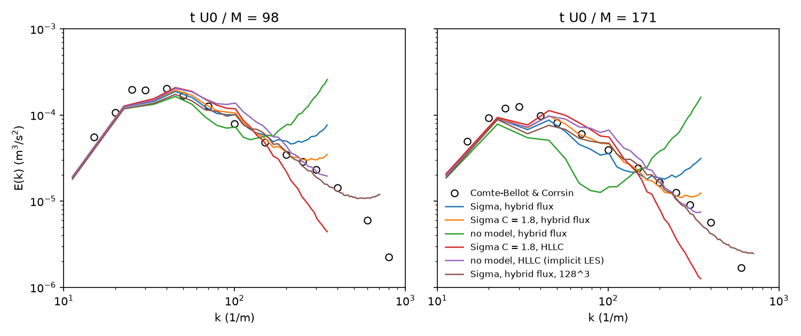
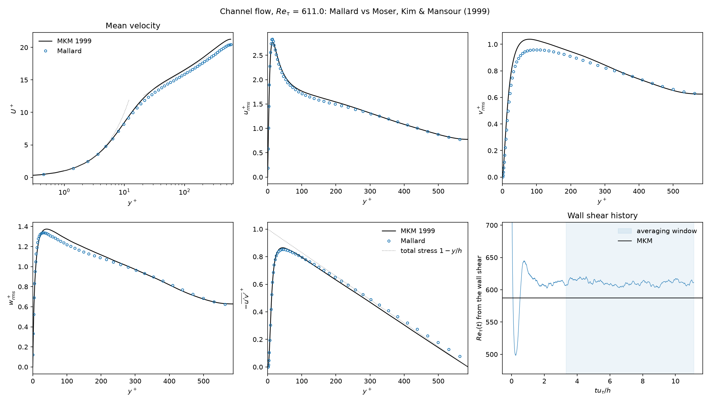
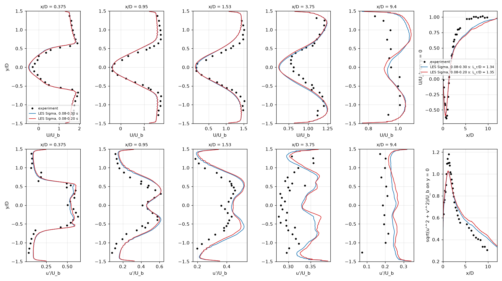

# Design: large-eddy simulation

Status: proposed. Recommendations are marked **Decision**; the alternatives
considered are listed with each. Implementation follows the
[stages](#9-stages), one pull request each; done: 1, 2, 3, 4, 5 (6 and 7 open:
#197, #198).

Mallard resolves every scale it computes today (DNS of flames, detonations,
Taylor-Green and isotropic turbulence). This document adds large-eddy
simulation (LES) of compressible, possibly reacting, flows with **explicit**
subgrid-scale (SGS) models: an eddy viscosity for the momentum, turbulent
Prandtl and Schmidt numbers for heat and species, and a turbulence-chemistry
closure for the filtered reaction rates.

## Goals

- **Explicit models, not implicit LES.** Results must be attributable to the
  models. The scheme's own dissipation is measured at run time and kept below
  the model's (section 4); validation shows the model-off and model-on runs
  differ by much more than the model-on runs differ under refinement of the
  numerical dissipation.
- **Unstructured, mixed and high-order meshes**: triangles, quadrilaterals,
  tetrahedra, hexahedra, prisms and pyramids, with any reconstruction (FO,
  MUSCL, TENO-E of orders 3 to 6).
- **Single gases and reacting mixtures**: finite-rate chemistry,
  mixture-averaged / unity-Lewis / constant-Lewis transport, double flux.
- **Determinism**: results bitwise independent of the MPI rank count and of
  GPU/CPU team widths, as for the rest of the solver ([mpi.md](mpi.md)).
- **No cost and no change without `[les]`**: runs without it give
  byte-identical results and keep their speed.
- **Validation with literature data and quantitative targets** (section 8).

## Non-goals

- Implicit LES, or tuning the scheme's dissipation to stand in for a model.
- Wall models (wall-modeled LES). Walls are resolved (y+ of the first cell
  about 1).
- RANS and hybrid RANS/LES (DES, DDES, WMLES).
- Synthetic inflow turbulence: that is #159. Cases that need it depend on it.
- Flamelet / FPV / FGM tabulated chemistry, transported or presumed PDFs,
  CMC, linear-eddy models, and other closures built on reduced chemistry
  manifolds: Mallard's chemistry is finite-rate with mechanisms read at run
  time, and the closure must keep it.
- SGS models for the isotropic part of the SGS stress, the SGS viscous
  diffusion, the SGS pressure-dilatation and the triple correlation of the
  energy equation (section 1).

## Summary of decisions

| # | Decision | Main alternatives | Why |
|---|---|---|---|
| 1 | Favre-filtered equations closed by an eddy viscosity mu_t, with `lambda_t = cp mu_t / Pr_t` and `rho D_t = mu_t / Sc_t`; mu_t added to the molecular coefficients | Mixed or scale-similarity models; separate SGS flux kernels | Shares the viscous fluxes, boundary treatment, time step and transport infrastructure; the standard closure of compressible LES (Vreman et al. 1995; Garnier et al. 2009) |
| 2 | **Sigma model** (Nicoud et al. 2011) as the primary eddy viscosity; WALE, Vreman and Smagorinsky also available | WALE, Vreman, dynamic Smagorinsky as primary | Local, no test filter, positive; vanishes in pure shear, solid rotation, two-component and axisymmetric/isotropic expansion; cubic near walls; insensitive to the one-dimensional dilatation of flames |
| 3 | Dynamic Smagorinsky deferred | Germano-Lilly with local averaging | Needs a test filter and averaging on unstructured mixed meshes (section 2.5); Sigma gets near-wall and laminar behavior without it |
| 4 | Filter width `Delta = V^(1/d)` (d = 2 or 3) of each cell, independent of the reconstruction order; in 3D times Scotti's anisotropy factor since stage 7 (section 3) | Largest cell extent; Scotti's anisotropy correction; `h / (p + 1)` | A finite volume has one degree of freedom per cell at any order; Sigma and WALE vanish where the cells are most anisotropic (walls) |
| 5 | Eddy viscosity per cell from the viscous cell gradients, averaged to faces; zero on wall faces | Per face from face gradients | One evaluation per cell; enters the time step and output; consistent across ranks |
| 6 | A **kinetic-energy budget diagnostic** that measures the numerical dissipation of resolved kinetic energy against the SGS and molecular dissipation at run time | Inferring numerical dissipation from -dK/dt after the fact | Proves at every output which term dissipates the energy; needs no reference |
| 7 | A **low-dissipation convective flux**: a kinetic-energy-preserving (KEEP) central flux blended with the Riemann solver by a compression-only Ducros sensor | Lower TENO cutoff; Riemann solvers with scaled dissipation only; artificial viscosity | Upwind Riemann fluxes dissipate resolved energy at the grid scale at a rate comparable to the SGS model; the KEEP flux adds none, and shocks keep the Riemann solver |
| 8 | **Thickened flame (TFLES)** with dynamic thickening and the Charlette efficiency (beta = 0.5), Colin's operator for u'_Delta, as the primary combustion closure | PaSR; quasi-laminar | Works with finite-rate mechanisms and molecular transport unchanged; keeps the laminar flame speed exactly; explicit and well validated for premixed LES |
| 9 | PaSR as an optional second closure, later | None; quasi-laminar | Covers non-premixed and MILD regimes; shares TFLES's per-cell rate scaling |
| 10 | Chemistry rates scaled per cell by advancing each Strang reactor over `s dt` | Scaling the rates inside the kinetics | The constant-volume reactor is autonomous, so this is exact; no change to the kinetics or Jacobian |

## 1. Filtered equations

With the spatial filter `\bar{.}` (implicit in the grid, width Delta) and the
Favre filter `\tilde{f} = \bar{rho f} / \bar{rho}`:

```
d rho/dt      + div(rho u)                                     = 0
d(rho u)/dt   + div(rho u u + p I - tau - tau_sgs)             = 0
d(rho E)/dt   + div((rho E + p) u - (tau + tau_sgs) . u + q + q_sgs) = 0
d(rho Y_k)/dt + div(rho Y_k u + j_k + j_k^sgs)                 = omega_k
```

(all variables filtered; bars and tildes dropped). The resolved stress
`tau`, heat flux `q` and diffusion fluxes `j_k` are the molecular ones
evaluated with the filtered state; `p = rho R T` with the filtered mixture
gas constant.

Closures:

- **SGS stress**, `tau_sgs = -rho (u u~ - u~ u~) = 2 mu_t (S - 1/3 tr(S) I)`.
  The isotropic part `-2/3 rho k_sgs I` is not modeled: it is absorbed into
  the pressure. At the turbulent Mach numbers of the validation cases
  (`M_t < 0.3`) it is below 1% of `p` (Erlebacher et al. 1992; Garnier et
  al. 2009, chapter 4), and modeling it (Yoshizawa) brings a constant whose
  value is uncertain.
- **SGS heat flux**, `q_sgs = -lambda_t grad T` with
  `lambda_t = cp mu_t / Pr_t` (and, for mixtures, the enthalpy carried by
  the SGS species fluxes, `sum_k h_k j_k^sgs`, which is what the molecular
  energy flux already does with `j_k`).
- **SGS species fluxes**, `j_k^sgs = -rho D_t (W_k / W) grad X_k + Y_k V_c`
  with `rho D_t = mu_t / Sc_t`, added to the molecular mixture-averaged flux
  in its Hirschfelder-Curtiss form, so the correction velocity `V_c` makes the
  total diffusive fluxes sum to zero to round-off (Poinsot & Veynante
  2012, chapter 4). With unity turbulent Lewis number (`Pr_t = Sc_t`, the
  default) the SGS enthalpy and species fluxes do not separate enthalpy from
  composition at subgrid scales.
- **Neglected**: SGS viscous diffusion, SGS pressure-dilatation, SGS
  turbulent diffusion of kinetic energy (triple correlation) and the
  nonlinearity of `tau(u)` and `q(T)`. Vreman, Geurts & Kuerten (1995) showed
  these are an order of magnitude below the retained terms in mixing layers;
  the same simplification is used by nearly all compressible LES codes.
- **Filtered reaction rates** `omega_k`: section 6.

**Decision 1.** One eddy viscosity `mu_t = rho nu_t` per cell; the
molecular viscous kernels use `mu + mu_t`, `lambda + cp mu_t / Pr_t` and the
species diffusivities plus `mu_t / Sc_t` (as `rho D_k W_k / W` in Mallard's
mole-fraction form). Defaults `Pr_t = Sc_t = 0.9`; both are inputs.

Alternatives: scale-similarity and mixed models (Bardina; Zang, Street &
Koseff) need explicit filtering of the resolved field on the unstructured
mesh, with the same test-filter difficulty as dynamic models (section 2.5);
gradient (Clark) models are not dissipative enough on their own and need an
eddy viscosity anyway. Neither is proposed.

## 2. SGS eddy viscosity

All models below give `nu_t = (C Delta)^2 D(g)` from the resolved velocity
gradient `g_ij = du_i/dx_j` (Vreman's in the form `c Delta^2 D(g)`), with
`S = (g + g^T)/2`. In 2D builds `g` is the 3x3 gradient of a flow with
`u_z = d/dz = 0`.

### 2.1 Requirements

An eddy viscosity should vanish where there is no subgrid turbulence and
scale correctly near walls. Properties of a model's `D(g)` (Nicoud et al.
2011, table I; the entries below are checked in the unit tests, section 7):

| Property | Smagorinsky | WALE | Vreman | Sigma |
|---|---|---|---|---|
| Positive, local, cheap | yes | yes | yes | yes |
| Zero in solid rotation | yes | **no** | **no** | yes |
| Zero in pure shear | **no** | yes | yes | yes |
| Zero for two-component / 2D flows | **no** | **no** | **no** | yes |
| Zero for isotropic expansion | **no** | yes | **no** | yes |
| Zero for axisymmetric expansion | **no** | **no** | **no** | yes |
| Near-wall `nu_t ~ y^3` | **no** (`y^0`) | yes | **no** (`y^1`) | yes |
| Galilean and rotation invariant | yes | yes | yes | yes |

### 2.2 Models

- **Smagorinsky** (1963): `nu_t = (C_s Delta)^2 sqrt(2 S:S)`, `C_s = 0.17`
  (Lilly's value for isotropic turbulence). Kept as the classical reference
  and for ablations; it needs wall damping, which is not provided.
- **WALE** (Nicoud & Ducros 1999):
  `nu_t = (C_w Delta)^2 (S^d:S^d)^(3/2) / ((S:S)^(5/2) + (S^d:S^d)^(5/4))`,
  `S^d = (g^2 + (g^2)^T)/2 - tr(g^2)/3 I`, `C_w = 0.5` (Nicoud & Ducros
  recommend 0.5 to 0.6 for isotropic turbulence).
- **Vreman** (2004): `nu_t = c sqrt(B / (a:a))` with `a_ij = du_j/dx_i`,
  `b = Delta^2 a^T a`, `B = b11 b22 - b12^2 + b11 b33 - b13^2 + b22 b33 - b23^2`,
  `c = 2.5 C_s^2 = 0.07`.
- **Sigma** (Nicoud, Baya Toda, Cabrit, Bose & Lee 2011):
  `nu_t = (C_sigma Delta)^2 sigma_3 (sigma_1 - sigma_2)(sigma_2 - sigma_3) / sigma_1^2`
  with `sigma_1 >= sigma_2 >= sigma_3 >= 0` the singular values of `g`,
  `C_sigma = 1.35` (calibrated on isotropic turbulence in that paper). The
  singular values are the square roots of the eigenvalues of `G = g^T g`,
  found in closed form from its invariants (the trigonometric solution of the
  characteristic cubic, as in the paper's appendix), in double precision.

### 2.3 Recommendation

**Decision 2: Sigma is the primary model** (`model = "sigma"`, the default
when `[les]` is given in 3D).

- It has every property of the table. WALE fails in solid rotation (vortex
  cores, swirling flows) and Vreman near walls and in rotation; both give an
  eddy viscosity in laminar two-dimensional regions (e.g. laminar shear
  layers and flame fronts before transition).
- For reacting flows it is the only one of the four that is zero for the
  one-dimensional dilatation across a planar flame (`g` of rank one: `sigma_2
  = sigma_3 = 0`). The others turn the thermal expansion of every flame into
  an eddy viscosity and an SGS diffusivity, which then thickens laminar
  flames. This also makes the SGS velocity of the combustion closure
  (section 6.3) free of dilatation.
- It costs one 3x3 symmetric eigenvalue problem in closed form per cell,
  negligible next to the reconstruction.
- It needs no test filter, no averaging and no extra transported field, so
  it is local, deterministic across ranks and restartable from the state.

Known limitations: Sigma vanishes for all two-dimensional flows, so 2D builds
(which cannot hold 3D turbulence anyway; they are for tests and laminar
cases) should use WALE or Vreman, and the 2D default is WALE. Its constant is
calibrated on isotropic turbulence; Nicoud et al. found the same constant
adequate for channel flow, and section 8 checks it.

**WALE** is the fallback in 2D and the comparison model in validation.
**Vreman** is the cheapest and is kept for comparison with the literature,
where it is common. **Smagorinsky** is for ablation studies: it shows what
the near-wall and laminar properties buy.

### 2.4 Rejected or deferred alternatives

- **Anisotropic minimum-dissipation (AMD)** (Rozema et al. 2015): attractive
  for anisotropic grids (it uses directional filter widths), but its
  `nu_t = max(0, ...)` clips half of the configurations and its constant
  depends on the discretization order. Possible later addition; not needed
  for the recommended validation.
- **Dynamic Smagorinsky** (Germano et al. 1991; Lilly 1992; for compressible
  flow Moin et al. 1991): **Decision 3, deferred.** See below.

### 2.5 Why not the dynamic Smagorinsky model (yet)

The Germano identity `L_ij = T_ij - \hat{tau}_ij` determines `C_s^2(x, t)` from
the resolved field filtered at a test scale `\hat{Delta} > Delta`. On
Mallard's meshes:

- **The test filter.** A discrete filter on an unstructured mixed mesh (e.g.
  a volume-weighted average over vertex neighbors) has a transfer function
  that depends on the local cell type and arrangement, so its width
  `\hat{Delta}/Delta`, which enters `M_ij` directly, is not uniform: it
  differs between hexahedra (27-cell stencil), tetrahedra (up to about 100
  vertex neighbors) and prisms. Commutative and well-defined unstructured
  filters exist (Haselbacher & Vasilyev 2003; Najafi-Yazdi, Najafi-Yazdi &
  Mongeau 2015), but they are wide, need per-cell weights computed at setup,
  and still give a mesh-dependent effective ratio at mesh transitions.
- **Averaging.** The raw coefficient `C = <L:M> / <M:M>` is negative over
  large regions and must be averaged. Plane or line averages need homogeneous
  directions, which general meshes lack. The alternatives are local volume
  averaging (another filter, with the same issues) or Lagrangian averaging
  (Meneveau, Lund & Cabot 1996), which adds two transported fields with their
  own advection scheme, restart variables and relaxation time.
- **Clipping** (`nu + nu_t >= 0`) is still required, and makes the model
  partly ad hoc.
- **Cost and halo depth**: two extra filter passes per stage over 10 to 20
  quantities, each widening the halo the eddy viscosity needs by one layer.

Sigma achieves the main benefits of the dynamic procedure (zero
`nu_t` in laminar and near-wall regions, correct `y^3`) locally. A dynamic
Sigma or dynamic Smagorinsky with Lagrangian averaging can follow if
validation shows the static constant is inadequate (stage 7).

**As implemented (stage 7, opt-in `dynamic = true`): a global dynamic
procedure.** Section 8.1 showed the best static constant depends on the
resolution (1.8 at 64^3, 1.35 at 128^3), which is what a dynamic constant
should capture. The global form (one constant per step, `C^2 = <L^d:M> /
<M:M>` summed over the domain) avoids the averaging and clipping problems
above, and its test filter, the volume-weighted average over a cell and its
vertex neighbors, enters only through `Delta_hat^2 = Delta^2 + 12 / d
tr(cov)` of each cell's own stencil (`3 Delta` on uniform hexahedra), so
mesh transitions are handled cell by cell. Favre-weighted `L` and `M` (Moin
et al. 1991), filtered gradients for the gradients of the filtered field.
The sums are exact (fixed point, scaled to the largest term), so the constant
does not depend on the rank count. Cost: one extra pass over the vertex
neighbors per step (about 30% of a CPU step on the CBC case, once per step).

| Case | static `C` | dynamic `C` (time mean) | result, dynamic vs static 1.35 |
|---|---|---|---|
| CBC 32^3 | 1.35 / 1.8 | 1.6 (rising from 1.1) | spectral error 0.165 / 0.142 vs 0.153 / 0.151 (1.8: 0.103 / 0.082) |
| CBC 64^3 | 1.35 / 1.8 | 1.4 | 0.116 / 0.077 vs 0.107 / 0.104 (1.8: 0.058 / 0.063) |
| CBC 128^3 | 1.35 / 1.8 | 1.15 | **0.060 / 0.054** vs 0.063 / 0.085 (1.8: 0.124 / 0.141) |
| channel 395, 64^3 | 1.35 | 1.09 | `Re_tau` 408.0 (+4.0%) vs 402.3 (+2.6%); peak `v_rms+` 0.912 vs 0.889 |

The procedure finds the right trend with resolution (1.6, 1.4, 1.15) and the
best spectra of any run at 128^3, but not the 1.8 that fits 64^3: that
optimum compensates the second-order scheme's damping near the cutoff,
which the Germano identity, written for the filter alone, cannot see. In the
channel the domain-wide constant is pulled down by the regions of weak SGS
activity and the mean flow is worse than with the static constant. Hence
opt-in, not the default. `eps_num / eps_sgs` stays below the criterion
(CBC 0.006-0.04, channel 0.40).

## 3. Filter width

**Decision 4.** `Delta = V^(1/d)`: the cube root of the cell volume in 3D
(Deardorff 1970), the square root of the cell area in 2D (the planar area in
axisymmetric runs), for every cell type and reconstruction order.

- **High order.** In a finite volume method each cell carries one average
  whatever the reconstruction order, so the shortest resolved wavelength is
  about `2 h` at every order; a higher-order reconstruction resolves more
  accurately the scales near that cutoff rather than smaller ones. `h / (p +
  1)`, the width used for discontinuous Galerkin and spectral-element LES
  where a cell carries `(p + 1)^d` degrees of freedom, does not apply.
  Low-order schemes damp a band below the cutoff, i.e. act as an additional
  implicit filter; this is what the dissipation budget (section 4) measures,
  rather than a factor folded into Delta.
- **Anisotropy.** Deardorff's width underestimates the largest extent of
  stretched cells. Scotti, Meneveau & Lilly (1993) give a correction
  `f(a_1, a_2) = cosh(sqrt(4/27 ((ln a_1)^2 - ln a_1 ln a_2 + (ln a_2)^2)))`
  of the aspect ratios; the largest extent (`Delta_max`) is used in DES.
  Both matter most in wall cells, where Sigma and WALE are already small
  (`y^3`); the Scotti factor is 1.2 for an aspect ratio of 5 and 1.4 for 10.
  **Implemented (stage 7) as `filter_width = "scotti"`, the default in 3D**, with
  each cell's extents `h_i = V / lambda_i` from the eigenvalues of its
  projected-area tensor `1/2 sum_f A_f A_f^T / |A_f|` (exact for boxes, face
  data only, so periodic cells need no unwrapping), for the eddy viscosity
  only (TFLES keeps `V^(1/3)`). Channel at `Re_tau = 395`, 64^3, Sigma 1.35:
  `Re_tau` 394.8 (+0.7%, against +2.6% with `V^(1/3)`), `Cf` +0.9%, `U+` at
  y+ = 30 / 100 13.40 / 16.61 (MKM 13.49 / 16.53), `eps_num / eps_sgs` 0.21;
  peak `v_rms+` 0.882, unchanged. At `Re_tau = 590` (96^3, section 8.2):
  `Re_tau` 596.6 (+1.6%) against 611.0 (+4.1%) with `V^(1/3)`, `Cf` +2.9%
  against +7.9%, `U+` at y+ = 30 / 100 13.33 / 16.43 (MKM 13.53 / 16.54).
  On cubic cells it is `V^(1/3)`, so the isotropic turbulence and flame cases
  are unchanged. Hence the default in 3D (2D keeps `V^(1/2)`).
- **Mixed meshes.** `V^(1/d)` is continuous across hexahedron-prism-
  tetrahedron transitions of equal edge length up to the volume ratio's
  cube root (a regular tetrahedron of edge h has `V^(1/3) = 0.49 h`, a cube
  `h`): tetrahedral regions get a smaller Delta at the same edge length,
  which is consistent with their higher number of cells per volume.

## 4. Keeping the model's dissipation dominant

### 4.1 The problem

Mallard's convective flux is an approximate Riemann solver applied to
high-order reconstructed states (TENO-E, MUSCL). Its upwind part dissipates
kinetic energy at a rate proportional to `|lambda| (u_R - u_L)^2`, where the
jump `u_R - u_L` of the reconstructions is `O(h^p)` for smooth fields but
`O(1)` relative at the grid cutoff, precisely where the SGS model acts
(Ghosal 1996; Mittal & Moin 1997; Garnier et al. 1999). Two further sources:

- TENO-E's nonlinear stencil selection discards the central stencil in
  troubled cells, and on LES meshes most cells near the cutoff are flagged
  (76% of cells at 64^3 in `examples/isotropic_turbulence`), so the
  reconstruction falls back to more dissipative sector stencils.
- The low-Mach correction (Thornber et al. 2008) already scales the velocity
  jump by `min(1, max(M, M_cut))`, so at `M ~ 0.1` the upwind dissipation of
  the velocity field is reduced roughly tenfold; it does not remove it.

In under-resolved turbulence these terms can match or exceed the SGS
dissipation. Then the results are implicit LES, whatever model is switched
on. The design therefore (a) measures the numerical dissipation at run time,
and (b) provides a convective flux that adds none in smooth regions.

### 4.2 Dissipation budget (decision 6)

The semi-discrete rate of change of the resolved kinetic energy
`K = sum_c V_c rho_c |u_c|^2 / 2` caused by any part `R` of the right-hand
side (`R_rho`, `R_m` per cell, conservative form) is exactly

```
dK/dt|_R = sum_c V_c (u_c . R_m,c - |u_c|^2 / 2 R_rho,c)
```

Mallard evaluates it separately for the convective, molecular viscous and
SGS fluxes (one extra RHS evaluation, at the output interval only). For a
periodic or walled domain the exact (continuous) contributions are

- convection: `Pi = int p div u dV` (pressure-dilatation work; transport
  terms integrate to zero),
- molecular viscosity: `-eps_mol = -int tau : grad u dV`,
- SGS: `-eps_sgs = -int tau_sgs : grad u dV`.

The **numerical dissipation** is then `eps_num = Pi_h - dK/dt|_conv`, with
`Pi_h` the scheme's own pressure work: on interior faces, the work of the
two-point pressure flux `mean(p) n` of the cell values, `sum_f mean(p) (u_1 -
u_0) . n A_f` (a central flux with first-order states changes `K` by exactly
this, section 4.3), plus the whole kinetic-energy rate of the boundary faces'
fluxes, so that `eps_num` is the dissipation of the interior faces. The run
reports `eps_mol`, `eps_sgs`, `eps_num`, `Pi_h` (`pressure_work`) and `Pi`
from the cell gradients (`pressure_dilatation`) in `[integrals]` (with
`budget = true`). The criterion
for an LES result to count as explicit-model LES is **`eps_num <= 0.5 eps_sgs`
averaged over the analysis window**, i.e. the model removes at least two
thirds of the energy that leaves the resolved scales through the cutoff.
`eps_num` includes the reconstruction's and the Riemann solver's dissipation
together (dK/dt of the convective operator, whatever causes it); the time
integrator's dissipation (SSPRK3's, of order `(lambda dt)^4`) is not
included and is negligible at the CFL numbers used.

Why the discrete pressure work: until #197 `eps_num` was `Pi - dK/dt|_conv`
with `Pi` from the cell gradients, exact only up to their discretization
error. That is harmless where `|Pi|` is a few percent of the dissipation
(isotropic turbulence and the channel at `M_t <= 0.2`: on the 64^3 CBC case
with Sigma `C = 1.8` the numerical share is -0.9% with `Pi_h` against +0.7%
with `Pi`), but not in a flame at 1 atm, where thermal expansion makes `p
div u` 1e3 to 1e4 times the dissipation and the gradient estimate of `Pi`
then measures its own error (initial state of a coarse run of section 8.3's
flame: `Pi = 18.6` W from the gradients, dominated by the gas leaving
through the outlet at 1 atm, against `Pi_h = 0.022` W, `dK/dt|_conv =
0.024` W and an SGS dissipation of 0.0014 W). `Pi_h` uses the same face pressures and cell velocities as the
convective operator, so constant pressure cancels exactly and the open
boundaries' fluxes (an outlet's `p u . n`) drop out.

### 4.3 Low-dissipation convective flux (decision 7)

`[numerics] convective_flux = "hybrid"` replaces the Riemann flux by

```
F = F_KEEP(W_L, W_R) + phi_f (F_Riemann(W_L, W_R) - F_KEEP(W_L, W_R))
```

at every face quadrature point, with the same reconstructed states.

- **`F_KEEP`** is the kinetic-energy- and entropy-preserving two-point flux
  of Kuya, Totani & Kawai (2018): with arithmetic means `\bar{.}`,
  `C = \bar{rho} \bar{u}.n`, mass `C`, momentum `C \bar{u} + \bar{p} n`,
  energy `C (\bar{e} + u_L . u_R / 2) + (p_L u_R.n + p_R u_L.n) / 2`. For a
  mixture, `e = p / ((gamma - 1) rho) + e0` per side with the face's
  surrogates. Its momentum flux has Jameson's (2008) form `C \bar{u} + \bar{p}
  n` with the mass flux `C`, so for cell values (`W_L, W_R` the two cells'
  averages) the semi-discrete kinetic energy changes only by the pressure
  work, on any mesh: per face, `(u_R - u_L) . (C \bar{u} + \bar{p} n) - C
  (|u_R|^2 - |u_L|^2) / 2 = \bar{p} (u_R - u_L) . n`. With high-order
  reconstructed states this holds to the reconstruction's accuracy.
- **`phi_f = max(phi_c0, phi_c1)`** from a cell sensor: the Ducros et al.
  (1999) sensor restricted to compressions (Bhagatwala & Lele 2009),
  `theta = H(-div u) (div u)^2 / ((div u)^2 + |omega|^2 + eps)`, and
  `phi_c = 1` where `theta > theta_*` (default 0.65), else `phi_min` (default
  0). Shocks therefore keep the full Riemann solver and TENO's
  shock-capturing; vortical and expansion regions, and flames (expansions),
  get the central flux.
- Species stay upwinded by the mass flux (Larrouturou) with the blended
  mass flux, so mass fractions stay in [0, 1] and sum to one; their
  numerical diffusion is not part of the kinetic-energy budget and is
  reported separately in validation via scalar variance decay where
  relevant.
- The low-Mach correction acts on the Riemann part only.
- Double flux: the blend applies to both of a face's fluxes, each central flux
  with its own side's frozen thermodynamics on both sides.
- Boundary faces other than walls and symmetry planes (whose mirror ghost
  states make the central flux exact: no mass flux, the pressure force)
  keep the Riemann solver.
- As implemented (stage 2): contacts and expansions are central, so on
  Sod's problem (MUSCL, 200 cells) the L1 density error is 1.8 times the
  Riemann solver's, with a 0.1% overshoot at the contact; without the
  sensor (central everywhere) the shock oscillates and the error is more
  than twice the hybrid's. With first-order reconstruction the convective
  kinetic-energy rate equals the pressure work to round-off on triangles
  and tetrahedra (tested).

Stability. The central flux has no dissipation, so the SGS model and the
molecular viscosity are the only sinks at the cutoff, which is the intended
LES. KEEP-type fluxes are stable for turbulence on smooth meshes (Kuya et al.
2018; the same form underlies the second-order central schemes of
production LES codes on unstructured meshes). The residual risk is
aliasing on very irregular meshes or with nonlinear TENO stencils; `phi_min
> 0` (e.g. 0.05) is the documented remedy, and the budget reports the
dissipation it adds.

Alternatives considered:

- **Lowering TENO's dissipation** (fixed small `C_T`, smaller
  `stencil_factor`, `troubled_threshold` up): reduces but never removes the
  upwind dissipation of the Riemann solver, and makes shock capturing less
  robust everywhere. Useful in combination; the budget quantifies it.
- **Scaling only the Riemann solver's dissipation** (e.g. Roe with its
  dissipation matrix multiplied by `phi`): equivalent to the blend above for
  Rusanov and close to it for Roe, but tied to one solver; the blend works
  with all five.
- **Artificial bulk viscosity (localized artificial diffusivity, Cook &
  Cabot)** for shocks with a central flux everywhere: needs second
  derivatives and tuned constants, and is itself numerical dissipation that
  the budget would have to separate.
- **Implicit LES** (no model, rely on TENO/Riemann dissipation): a non-goal.

## 5. Implementation: SGS fluxes in the solver

- Input `[les]`: `model` (`sigma`, `wale`, `vreman`, `smagorinsky`),
  optional `C`, `Pr_t`, `Sc_t`. `[les]` needs `type = "navier_stokes"`.
- `les.h`: the models as one POD with `KOKKOS_INLINE_FUNCTION nu_t(g,
  Delta)`, captured by value like `Euler`.
- `Delta` per cell, computed once at setup (`V^(1/d)`).
- **SGS coefficients** per cell, `[mu_t, lambda_t, mu_t / (Sc_t W)]`
  (`les_coefficients`), computed after the viscous gradients of each RHS on
  all local cells, so halo cells next to owned faces have them from the same
  gradients as their owners. Single gases take `lambda_t = cp mu_t / Pr_t`
  with the constant `cp`; mixtures each cell's `cp(T, Y)` and mean molar mass
  `W`.
- **Viscous fluxes**: `ViscousFluxFunctor` and `MixtureViscousFluxFunctor`
  add the face means of the SGS coefficients to `mu`, the conductivity and
  (mixtures) every species' `rho D_k W_k / W` (as `W_k mu_t / (Sc_t W)`).
  The molecular coefficients and their output (`MU`, `LAMBDA`, `D_k`) are
  untouched. Wall faces get no SGS flux (the wall shear stress and heat flux
  are molecular; Sigma and WALE are `O(y^3)` there anyway); other boundary
  faces take the cell's value.
- **Time step**: single gases use `max(4/3 (mu + mu_t), gamma (mu / Pr +
  mu_t / Pr_t)) / rho`; mixtures grow `nu_eff` by `max(4/3 nu_t, lambda_t /
  (rho cv), nu_t / Sc_t)`. The eddy viscosity is recomputed from the state
  in `calc_dt` (one gradient evaluation per step), so a restarted run takes
  exactly the time steps of the uninterrupted one.
- **Axisymmetric runs** are not supported (LES of turbulence is
  three-dimensional; the hoop terms would need `mu_t` in the reconstruction's
  geometric source).
- **Output**: `MU_T` (cell eddy viscosity).
- **Budget**: `[integrals] budget = true` adds the columns
  `ke_rate_convective, ke_rate_viscous, ke_rate_sgs` (the `dK/dt|_R` of
  section 4.2) and `eps_numerical = pressure_dilatation - ke_rate_convective`,
  from one extra RHS evaluation that neither updates the mixture
  temperature seeds nor advances the characteristic boundaries, so output
  does not change the solution.
- Without `[les]` no new kernel runs and no view is allocated; the existing
  kernels take the empty-view branch, so results are byte-identical.

## 6. Turbulence-chemistry interaction

### 6.1 The candidates

The filtered rates `\bar{omega}_k` must be modeled because on an LES mesh the
flame (thermal thickness `delta_L ~ 0.1-0.5 mm` for hydrocarbon and hydrogen
flames at 1 atm) is thinner than Delta (1-5 mm in a laboratory burner LES).

| Closure | Idea | With finite-rate mechanisms | Explicit? | Premixed | Non-premixed |
|---|---|---|---|---|---|
| Quasi-laminar | `omega(\tilde{Y}, \tilde{T})` | yes | **no**: an under-resolved flame is thickened by the scheme | DNS-like meshes only | if mixing is resolved |
| **TFLES** (Butler & O'Rourke 1977; Colin et al. 2000) | thicken the flame by `F` so it is resolved; restore the SGS wrinkling by an efficiency `E` | yes, unchanged | yes | yes, the standard premixed LES closure | only with the thickening switched off there (dynamic) |
| PaSR (as in Sabelnikov & Fureby 2013) | `omega = kappa omega(\tilde{Y}, \tilde{T})`, `kappa = tau_c / (tau_c + tau_mix)` | yes | yes, but `tau_c` is ill-defined for multi-step chemistry | flame still under-resolved unless the mesh resolves it | yes |

- **Quasi-laminar** (no model) is the model-off baseline. On an LES mesh it
  is implicit: the resolved flame thickness is set by the scheme's
  dissipation and the cell size. Rejected as the closure; kept as the
  reference that shows what the model changes.
- **TFLES**: the transformation `D -> F D`, `omega -> omega / F` keeps the
  laminar flame speed `s_L ~ sqrt(D omega)` and multiplies the thickness by
  `F`, for any mechanism and transport model, because it is an exact
  rescaling of the one-dimensional flame equations. The efficiency `E >= 1`
  (`D -> E F D`, `omega -> E omega / F`) multiplies the speed by `E`, the
  SGS flame-surface wrinkling. Dynamic thickening (Légier et al. 2002)
  applies `F` only in the flame through a sensor `Omega`, so
  mixing and non-reacting regions keep their molecular and SGS transport.
- **PaSR**: local, cheap, used for non-premixed and MILD combustion; but it
  does not resolve the flame structure (the flame is still thinner than the
  mesh, so its propagation is again set by numerics in premixed regimes),
  and `tau_c` for a multi-step mechanism (from the Jacobian's eigenvalues,
  from fuel consumption, from a reference flame) changes the results by
  tens of percent.

### 6.2 Recommendation

**Decision 8: TFLES with dynamic thickening and the Charlette efficiency**
is the primary closure. It keeps the finite-rate chemistry and the
molecular transport models as they are, so the laminar flame speed,
thickness ratio and response to strain are those of the mechanism; it is
explicit (every effect is a term with a model constant); and its premixed
validation is extensive (Colin et al. 2000; Charlette et al. 2002; Wang,
Boileau & Veynante 2011; Volvo and swirl burners in AVBP).

**Decision 9: PaSR is worth adding as a second closure** for non-premixed
and partially premixed cases, but after TFLES is validated. It reuses
TFLES's per-cell rate scaling (section 6.4) and the SGS mixing time
`tau_mix = Delta^2 / nu_t` from section 2, so it costs about one stage.

### 6.3 TFLES formulation

Per cell, frozen over a time step (computed at the start of each step from
the current state, so restarts reproduce):

- **Thickening** `F = 1 + (F_max - 1) Omega` with
  `F_max = max(1, n_res Delta / delta_L)`: `n_res` (default 5) cells across
  the thickened flame, `delta_L` the laminar thermal thickness (input; e.g.
  from Cantera's 1D flame, `(T_b - T_u) / max |dT/dx|`).
- **Sensor** `Omega` in [0, 1]: from the progress variable
  `c = (T - T_u) / (T_b - T_u)` clipped to [0, 1],
  `Omega = min(1, c (1 - c) / (c_0 (1 - c_0)))` with `c_0 = 0.05`: one in the
  whole flame including its preheat zone, zero in fresh and burnt gas. `T_u`
  and `T_b` are inputs. It is local (no filtering pass, so no halo exchange)
  and smooth. Alternatives: the reaction-rate sensor of Légier et al.
  (`Omega = tanh(beta omega / omega_max)`, filtered to widen it over the
  preheat zone, which needs a filtering pass and a halo exchange per step),
  and Jaravel's multi-step variant; the temperature-based sensor is chosen
  for its locality and because it cannot fire in non-reacting mixing of
  cold streams. Its weakness, heat loss lowering `c` in burnt gas, is not
  present in the validation cases.
- **Efficiency** (Charlette, Meneveau & Veynante 2002, with `beta = 0.5`):
  `E = (1 + min[F - 1, Gamma(F, u'_Delta / s_L, Re_Delta) u'_Delta / s_L])^beta`
  with the filter width of the thickened flame `Delta_e = F delta_L`, so the
  ratio `Delta_e / delta_L = F`; `Gamma` is their fit of the efficiency
  function, and `Re_Delta = u'_Delta Delta_e
  / nu`. In unthickened regions (`F = 1`) `E = 1`.
- **SGS velocity** `u'_Delta = c_2 Delta^3 |lap(curl u)|` with `c_2 = 2`
  (Colin et al. 2000), which removes the dilatational part of the resolved
  field near the flame. The Laplacian of the vorticity is the divergence of
  its least-squares gradient: two more gradient passes than the eddy
  viscosity. It is evaluated on owned cells and its result (`F`, `E`,
  `Omega` per cell) is exchanged once per step to the halo. Alternative:
  `u'_Delta` from the eddy viscosity (`nu_t / (C Delta)`), which with Sigma
  is also dilatation-free for planar flames, local and cheaper; kept as an
  option if the Laplacian proves noisy on tetrahedra.
- **Transport**: species diffusivities and the conductivity become
  `E F D_k` and `E F lambda`, and the SGS diffusivities `(1 - Omega) D_t`
  (the thickened flame is resolved, so its SGS transport is in `E`);
  viscosity is not thickened.
- **Chemistry**: rates `E omega / F`, see 6.4.
- **Inputs** (`[les.combustion]`): `model = "tfles"`, `delta_L`, `s_L`,
  `T_unburnt`, `T_burnt`, optional `n_res` (5), `beta` (0.5),
  `efficiency = "charlette" | "none"`.

### 6.4 Chemistry rate scaling (decision 10)

Mallard's chemistry is Strang split: each owned cell is an adiabatic,
constant-volume reactor `dY/dt = omega(Y, T)/rho`. That system is
autonomous, so multiplying the rates by `s` is identical to integrating it
over `s dt` instead of `dt`. TFLES (`s = E / F`) and PaSR (`s = kappa`)
therefore only need a per-cell multiplier of the reactor's integration time.
The kinetics, Jacobian, Rosenbrock integrator, sub-step history (`CHEM_H`),
skipping of inactive cells and team-parallel lanes are untouched, so the
chemistry stays bitwise independent of rank count and team width.

### 6.5 Compatibility

- **Mixture-averaged, unity- and constant-Lewis transport**: thickening
  multiplies each `D_k` and `lambda` by the same factor, so Lewis numbers
  are unchanged.
- **Double flux**: concerns only the convective energy flux; independent.
- **Determinism**: `F`, `E`, `Omega` are per-cell functions of the state and
  of its gradients over the local stencil, exchanged to the halo by the same
  exchange as the state; the result is bitwise independent of the rank
  count. No reduction enters the model.

### 6.6 As implemented (stage 5)

- `F`, `E`, `Omega` and `E / F` are computed in `calc_dt` (once per step,
  from the state, so restarts reproduce) on owned cells: the vorticity from
  the transport gradients, exchanged to the halo, its least-squares gradient,
  and its Laplacian as the divergence of the face gradients (cell means
  corrected along the line of centroids, no flux through boundary faces);
  the fields are then exchanged to the halo (two exchanges of three values
  per cell and step).
- The thickening multiplies `LAMBDA`, every `rho D_k W_k / W` and the time
  step's `nu_eff` by `E F` after the eddy viscosity of each RHS, and the SGS
  heat and species coefficients by `1 - Omega`; viscosity is unchanged.
- `HRR` and `OMEGA_*` outputs are the modeled rates (times `E / F`).
- The SGS model in 2D builds should be Vreman for flames: WALE's eddy
  viscosity is not zero for the one-dimensional dilatation across a flame.
- Results, one-dimensional stoichiometric H2/air flame (h2o2.yaml,
  mixture-averaged, `s_L = 2.3324` m/s, `delta_L = 0.330` mm from
  Cantera), MUSCL and HLLC, strip cells of aspect ratio 10 (`Delta = 3.16
  dx`), `n_res = 5`:

  | Mesh | Model | `F` | Consumption speed | Displacement speed | Thermal thickness |
  |---|---|---|---|---|---|
  | 2 cells per `delta_L` | TFLES | 7.91 | 2.327 m/s (-0.2%) | 2.291 m/s (-1.8%) | 2.615 mm (`F delta_L` = 2.610 mm) |
  | 0.5 cells per `delta_L` | TFLES | 31.6 | 2.328 m/s (-0.2%) | 2.251 m/s (-3.5%) | |
  | 0.5 cells per `delta_L` | none (quasi-laminar) | 1 | 2.273 m/s (-2.5%) | 2.240 m/s (-4.0%) | one cell (numerical) |

  The thickened flame keeps the laminar speed and has the thickness `F
  delta_L` it is designed to have; the quasi-laminar flame's speed is also
  within 5% in this one-dimensional case, but its structure is one cell
  wide, set by the scheme. The displacement speeds include the slow drift
  of a long domain's flame position (they are fitted over the last half of
  the run). The thickened post-flame recombination zone is `F` times longer
  too (rates times `1 / F` while `c < 0.95`), so the peak temperature in a
  domain of a few thickened thicknesses stays below the adiabatic one
  (2224 K against 2384 K at `F = 7.9`).

## 7. Tests (each must fail under a plausible bug)

- **Model kernels** (exact values): Sigma, WALE, Vreman, Smagorinsky on
  analytic gradients: pure shear (WALE, Vreman, Sigma give 0;
  Smagorinsky `(C Delta)^2 |s|`), solid rotation (Smagorinsky and Sigma give
  0, WALE and Vreman positive), isotropic and axisymmetric expansion (Sigma
  0), a generic gradient against an independent SVD / eigenvalue
  evaluation, invariance under a random rotation `R g R^T` and under adding
  a uniform velocity (gradients unchanged), and scaling `nu_t ~ Delta^2 |g|`.
- **Filter width**: `Delta^d = V` per cell on every cell type; a test that
  turns red if the width uses an edge length, the inverse, or the
  measure of axisymmetric runs.
- **Solver**: `[les]` off is byte-identical to no `[les]`; a decaying
  random field loses kinetic energy faster with the model than without, by
  the amount the budget reports; laminar Couette and Poiseuille flows are
  unchanged by Sigma and WALE (pure shear, `mu_t = 0` to round-off) but not
  by Smagorinsky; the budget's `ke_rate_sgs` equals `-int 2 mu_t |S^d|^2 dV`
  computed independently on a smooth field; `MU_T` output and the time
  step include `nu_t`.
- **Mixtures**: SGS species fluxes sum to zero; a uniform-composition flow
  is unchanged by `Sc_t`.
- **MPI**: distributed runs with `[les]` (2D WALE and Vreman, 3D Sigma;
  single gas and mixture; hybrid flux; TFLES) match serial runs bitwise.
- **Hybrid flux**: KEEP conserves kinetic energy to round-off with FO
  reconstruction on a periodic mesh of triangles (and tetrahedra) without
  viscosity; a shock tube still captures the shock (sensor at 1) and
  matches the exact solution as the Riemann solver alone does; free-stream
  preservation.
- **TFLES**: a 1D laminar flame thickened by `F = 4` and 8 keeps `s_L`
  within 2% and its thickness scales by `F` within 5%; `Omega` is 0 in
  fresh and burnt gas; `E = 1` for `u' = 0`; the chemistry multiplier
  `s` integrates exactly like rates scaled by `s` for a 0D reactor.

## 8. Validation

Each case is an example with its reference data, analysis tool and the
results quoted in its input header, like `examples/isotropic_turbulence`.
Every case runs three ways at the main resolution: **model on**, **model
off** (same scheme, same mesh) and with the **default upwind flux** instead
of the hybrid one, plus a **grid refinement** with the model on, and
reports the dissipation budget. The proof that the model, not the scheme,
does the work is that (a) `eps_num <= 0.5 eps_sgs`, (b) model-off differs
from the reference by much more than model-on, and (c) model-on results
converge toward the reference under refinement without retuning.

### 8.1 Decaying isotropic turbulence (Comte-Bellot & Corrsin 1971)

- Grid turbulence at `M = 5.08 cm`, `U_0 = 10 m/s`, stations
  `t U_0 / M = 42, 98, 171`. Periodic box of side `L = 11 M` (about ten
  integral scales), air viscosity; a fictitious
  sound speed sets the turbulent Mach number to 0.1 (same Reynolds number;
  compressibility effects below 1% in kinetic energy).
- Initial field: random solenoidal velocity matching the measured spectrum
  at station 1, truncated at the grid cutoff (`tools/`), uniform density and
  pressure; a short pre-run (`0.5` eddy turnover) to establish
  phase correlations is excluded from the comparison, as is common.
- Meshes `32^3` and `64^3` hexahedra (plus `64^3` tetrahedra to test the
  unstructured path), TENO5 and MUSCL, hybrid flux, Sigma (and WALE,
  Vreman, Smagorinsky at 64^3).
- **Targets**: spectra at stations 2 and 3 within 15% of the measurements
  for `k < 2/3 k_c` (`k_c = pi N / L`); resolved kinetic energy within 5% of
  the measured energy integrated up to `k_c`; `eps_num <= 0.5 eps_sgs` over
  stations 2-3. Model-off must show the pile-up at `k_c` (central flux) or
  the over-dissipation (upwind), and miss these targets.

#### Results (stage 3, `examples/cbc_les`)



Hexahedra, MUSCL without limiter, initial phases developed by two rescaled
pre-runs. Spectral error: log10 RMS of `E_LES / E_CBC` for `k <= 2/3 k_c`;
energy: resolved energy over the measured energy up to `k_c`; budget:
shares of the total dissipation of resolved energy, averaged over t = 0 to
station 3 (stations 2 / 3 for the first two columns):

| Mesh | Flux | Model | Spectral error | Energy | Numerical | SGS | Molecular |
|---|---|---|---|---|---|---|---|
| 32^3 | hybrid | Sigma | 0.153 / 0.151 | 1.54 / 1.51 | -0.012 | 0.830 | 0.182 |
| 32^3 | hybrid | Sigma `C = 1.8` | 0.103 / 0.082 | 1.29 / 1.20 | -0.002 | 0.891 | 0.111 |
| 64^3 | hybrid | Sigma | 0.107 / 0.104 | 1.25 / 1.02 | 0.013 | 0.691 | 0.296 |
| 64^3 | hybrid | Sigma `C = 1.8` | **0.058 / 0.063** | 1.08 / 0.97 | 0.013 | 0.796 | 0.191 |
| 64^3 | hybrid | WALE | 0.090 / 0.086 | 1.20 / 0.98 | 0.007 | 0.730 | 0.263 |
| 64^3 | hybrid | Vreman | 0.108 / 0.106 | 1.25 / 1.02 | 0.012 | 0.689 | 0.298 |
| 64^3 | hybrid | Smagorinsky | 0.099 / 0.094 | 1.23 / 1.01 | 0.014 | 0.703 | 0.283 |
| 64^3 | hybrid | none | 0.226 / 0.375 | 1.81 / 1.76 | -0.077 | 0 | 1.077 |
| 64^3 | HLLC | Sigma `C = 1.8` | 0.154 / 0.217 | 0.95 / 0.93 | **0.463** | 0.435 | 0.103 |
| 64^3 | HLLC | none (implicit LES) | 0.135 / 0.114 | 1.20 / 1.12 | **0.838** | 0 | 0.162 |
| 128^3 | hybrid | Sigma | **0.063 / 0.085** | 1.03 / 0.91 | 0.020 | 0.522 | 0.459 |
| 128^3 | hybrid | Sigma `C = 1.8` | 0.124 / 0.141 | 0.98 / 0.92 | 0.019 | 0.651 | 0.330 |
| 128^3 | hybrid | none | 0.182 / 0.249 | 1.13 / 0.77 | 0.018 | 0 | 0.982 |

Findings:

- **With the hybrid flux the model does the work**: numerical dissipation
  is 1-2% of the total at every resolution (`eps_num / eps_sgs <= 0.04`,
  against the criterion 0.5). Model-off runs pile energy up at `k_c` (the
  spectrum rises by an order of magnitude) and miss the spectrum by 2-4
  times the model-on error.
- **With HLLC everywhere the scheme does the work**: 84% of the dissipation
  without a model and still 46% with one (`eps_num / eps_sgs = 1.06`), so
  such runs are implicit LES whatever the model; implicit LES matches the
  spectrum about as well as the explicit models at their default constants,
  which is why a budget, not the spectrum alone, is needed to tell them
  apart.
- **Model constant and resolution**: at 64^3 (`k_c` in the inertial range)
  every model at its literature constant leaves a pile-up over the last
  third of the wavenumbers; Sigma with `C = 1.8` matches the spectrum to
  0.06 decades (15%). At 128^3 the literature constant (1.35) is the best
  (0.06-0.09 decades) and 1.8 over-dissipates. The second-order
  discretization's own transfer function acts like a larger filter on the
  coarser mesh. Recommendation: keep `C = 1.35` (the default), use 1.5-1.8
  when `k_c` lies in the inertial range, and check with the budget and the
  spectrum. The channel (8.2) brackets the same range.
- **TENO-E with the hybrid flux** (32^3) gave `eps_num = -0.22`: the
  nonlinear stencil selection feeds energy into the resolved field when
  nothing upwinds it. Use MUSCL without limiter (or a linear reconstruction)
  with the hybrid flux; TENO stays for shocks with the Riemann flux.
- The targets of this section (15% for every `k <= 2/3 k_c`) are met in the
  mean (0.06 decades = 15%) but not point by point: the largest single-shell
  deviation is 31-47%, at the lowest shells (few modes, realization noise of
  one random field) and near `2/3 k_c`.

### 8.2 Turbulent channel flow (Moser, Kim & Mansour 1999; Lee & Moser 2015)

- `Re_tau = 395` (and 590): box `2 pi h x 2 h x pi h`, periodic in x and z,
  isothermal no-slip walls, constant mass flow forcing at the bulk Reynolds
  number of the DNS (`Re_b = 2 h U_b / nu` about 13,700 for 395), bulk Mach 0.2.
  **Depends on #172** (mass-flow forcing and mesh stretching).
- Mesh: `Delta x+ ~ 40-50`, `Delta z+ ~ 20`, first cell `y+ < 1`, tanh
  stretching: 64 x 64 x 64 hexahedra at 395 (96 x 96 x 96 at 590), plus a
  coarser `48^3` for refinement.
- **Targets**: friction Reynolds number within 3% of the DNS (equivalently
  `C_f` within 6%); mean velocity `U+` within 3% across `y+ = 30-300`;
  peak `u'_rms+` within 10% and at `y+` 10-20; `v'_rms+`, `w'_rms+` and
  `-<u'v'>+` within 10% of their peaks. Model-off at the same mesh must
  miss `Re_tau` and the peak `u'_rms+` by more than twice the model-on
  error. Budget reported per wall-normal band.

#### Results (stage 4, `examples/channel_les`)


`Re_tau = 395`, hybrid flux, MUSCL without limiter, averaged over t =
100-300 h/U_b (11-12 h/u_tau), resolved fluctuations; dissipation shares of
the kinetic-energy budget over the same window:

| Mesh | Flux | Model | `Re_tau` (392.2) | `Cf` | `U+(30)` / `U+(100)` (13.49 / 16.53) | peak `v_rms+` (1.00) | numerical / SGS / molecular |
|---|---|---|---|---|---|---|---|
| 64^3 | hybrid | Sigma | 402.3 (+2.6%) | +4.8% | 13.10 / 16.24 | 0.89 | 3.5 / 12.6 / 83.9% |
| 64^3 | hybrid | Sigma `C = 1.8` | 389.4 (-0.7%) | -1.9% | 13.68 / 16.98 | 0.85 | 2.8 / 16.6 / 80.6% |
| 64^3 | hybrid | none | 420.1 (+7.1%) | +14.2% | 12.27 / 15.16 | 0.97 | 5.0 / 0 / 95.0% |
| 64^3 | HLLC | Sigma `C = 1.8` | 317.6 (-19%) | -35% | 17.86 / 22.05 | 0.78 | **13.5** / 5.4 / 81.1% |
| 48^3 | hybrid | Sigma `C = 1.8` | 381.3 (-2.8%) | -5.9% | 14.09 / 17.47 | 0.80 | 3.2 / 17.9 / 78.9% |
| 48^3 | hybrid | none | 405.3 (+3.3%) | +6.3% | 12.67 / 15.74 | 0.98 | 6.1 / 0 / 93.9% |

Findings:

- At 64^3 both Sigma constants meet the `Re_tau` target (3%) and the mean
  profile target (3% for y+ = 30-300); without a model `Re_tau` is 7% high,
  more than twice the model-on errors. `v_rms+` is 11-15% low (only the
  resolved part is counted) and misses the 10% target; `u_rms`, `w_rms` and
  `-u'v'` are within 10%.
- At 48^3 the model-off run is closer to MKM in `Re_tau` than at 64^3 and
  than the model-on run at 48^3 (+3.3% against -2.8%): on this mesh the
  model-off result benefits from compensating errors, so the 48^3 pair does
  not discriminate; the 64^3 pair does. Sigma's error decreases under
  refinement (-2.8% -> -0.7% for `C = 1.8`).
- The SGS model carries 13-18% of the dissipation of resolved energy; most
  of it is molecular at this wall-resolved resolution. The hybrid flux's
  numerical dissipation is 3-6% (`eps_num / eps_sgs` = 0.17-0.28, within the
  criterion 0.5).
- **With HLLC instead of the hybrid flux the result is wrong and the budget
  says why**: the scheme removes 2.5 times as much resolved energy as the
  model (13.5% against 5.4%), the near-wall streaks are too strong (peak
  `u_rms+` 3.77), the turbulent momentum transfer too weak, and `Re_tau`
  19% low (`Cf` -35%).
- **The DNS at `Re_tau = 180`** (`examples/channel_retau180`, 192 x 96 x
  128, no model; #209), averaged over t = 80-160 h/U_b: with HLLC 6.8% of
  the dissipation is numerical and `Re_tau = 173.7` (-2.5% from MKM's
  178.1, as the example's 172.6); with the hybrid flux 0.9% is numerical and
  `Re_tau = 179.8` (+0.9%). The upwind dissipation explains most of that
  DNS's deficit.

#### Results at `Re_tau = 590` (`examples/channel_les/input_590.toml`)



96^3 hexahedra (dx+ = 38, dz+ = 19, dy+ = 0.87 at the wall), the numerics
of the 395 case, `Re_b = 21,907` (MKM's `U_b+ = 18.65`), averaged over t =
60-200 h/U_b (7.6-8.1 h/u_tau) after the synthetic initial field (the
figure: Sigma with Scotti's width, the default). MKM's `Re_tau = 587.2`:

| Model | `Re_tau` | `Cf` | `U+(30)` / `U+(100)` (13.53 / 16.54) | peak `u_rms+` (2.77) | peak `v_rms+` (1.04) | numerical / SGS / molecular |
|---|---|---|---|---|---|---|
| Sigma, Scotti width (default) | **596.6 (+1.6%)** | +2.9% | 13.33 / 16.43 | 2.84 | 0.95 | 3.3 / 16.2 / 80.6% |
| Sigma, `V^(1/3)` | 611.0 (+4.1%) | +7.9% | 12.90 / 15.88 | 2.83 | 0.96 | 2.3 / 13.5 / 84.2% |
| none | 632.7 (+7.8%) | +15.7% | 12.18 / 14.92 | 2.78 | 1.02 | 3.3 / 0 / 96.7% |

- With Scotti's width the targets of this section hold at 590: `Re_tau`
  within 3% (1.6%), the mean profile within 2% for y+ = 30-100, `u_rms`,
  `w_rms` and `-u'v'` within 10%. With `V^(1/3)` the model halves the
  model-off error but misses the `Re_tau` target (+4.1%); the cells are the
  same in wall units as at 395, and the near-wall ones are the more
  anisotropic, so the width matters more. `eps_num / eps_sgs` = 0.20 and
  0.17.
- **`v_rms+`** is 8-9% low at 590 and 11-12% low at 395 on 64^3 (dx+ = 39,
  dz+ = 19), 8% low at 395 on 96 x 64 x 96 (dx+ = 26, dz+ = 13; `Re_tau`
  396.3, +1.0%): it improves with the streamwise and spanwise resolution and
  barely depends on the model (Scotti 0.88, `V^(1/3)` 0.89, `C = 1.8` 0.85,
  the dynamic constant 0.91, no model 0.97 at 395), so it is the resolution
  of the wall-normal motions of the near-wall cycle. Only the resolved part
  is counted; an isotropic SGS share `2/3 k_sgs` from Yoshizawa's estimate
  would add about 1%.

### 8.3 Reacting validation

1. **Laminar flame invariance** (stage 5, H2/air and CH4/air, existing
   `premixed_flame`): with `F = 1, 4, 8`, `s_L` within 2% of the
   unthickened flame and of Cantera; thickness ratio within 5% of `F`.
2. **Flame-vortex or flame in decaying turbulence** (2D/3D periodic box,
   no inflow needed): turbulent consumption speed against the efficiency
   function's prediction `E s_L` at modest `u'/s_L`; model-off (`E = 1`)
   comparison.
3. **Volvo bluff-body flame** (Sjunnesson, Henrikson & Löfström 1992),
   propane/air `phi = 0.65`, non-reacting
   and reacting: mean and RMS axial velocity at `x/h = 0.375, 0.95, 1.53,
   3.75, 9.4` within 10% of `U_b`, and the recirculation length. Results
   below: non-reacting done; reacting set up but not run at an acceptable
   thickening (see its plan).

#### Results: premixed flame in decaying turbulence (`examples/flame_turbulence`)


DNS reference (`input.toml`): stoichiometric H2/air, `S_L = 2.332` m/s,
`delta_L = 0.330` mm, 224 x 128 x 128 cells of `delta_L / 10`, `u' = 2.1
S_L`, `l_t / delta_L = 2.4`, `Ka = 2.0`; `h / eta = 1.4`, numerical
dissipation 0.4% of the total. The turbulent flame speed `S_T` is the rate
at which the fresh-gas volume (`theta < 0.5`, smooth) decreases per unit
cross-section (the fresh gas is at rest against the closed end), fitted
over the window. LES (`les.toml`): the same initial field box-filtered to
`Delta = 4, 8, 16` DNS cells (0.40, 0.80, 1.60 `delta_L`; `F = 2, 4, 8`
at `n_res = 5`), domains extended on the burnt side so the thickened
burnt-gas profile is not truncated. Variants: TFLES with Colin's subgrid
velocity (the default), TFLES with `u' = C_u nu_t / Delta` (`C_u = 28`),
TFLES with `E = 1`, quasi-laminar (Sigma model, no flame model), and no
model at all. Laminar check: the thickened laminar flames in the same
domains give `S_T / S_L` = 0.98-1.03.

`S_T / S_L` and its error against the DNS (1.132 over 0.2-0.4 ms; 1.233
over 0.3-0.4 ms, when the wrinkling has developed):

| `Delta / delta_L` | Colin (default) | `C_u = 28` | `E = 1` | quasi-laminar | no model |
|---|---|---|---|---|---|
| 0.4 (`F = 2`) | 1.056 (-6.7%) / 1.114 (-9.7%) | 1.065 (-5.9%) / 1.126 (-8.7%) | 1.050 (-7.2%) | 1.088 (-3.9%) / 1.156 (-6.2%) | 1.086 (-4.0%) |
| 0.8 (`F = 4`) | 1.053 (-6.9%) / 1.136 (-7.9%) | 1.034 (-8.6%) / 1.082 (-12%) | 0.985 (-13%) | 1.166 (+3.0%) / 1.265 (+2.6%) | 1.164 (+2.8%) |
| 1.6 (`F = 8`) | **2.240 (+98%)** / 2.361 (+91%) | 1.008 (-11%) / 1.042 (-16%) | 0.947 (-16%) | 1.051 (-7.1%) / 1.221 (-1.0%) | 1.058 (-6.6%) |

(two numbers: windows 0.2-0.4 / 0.3-0.4 ms.)

- **TFLES** converges to the DNS from below as `Delta` decreases and is
  smooth in time (rms deviation of `S_T(t)` from the DNS 8-20%), with
  `|eps_num / eps_sgs| <= 0.14` (Colin r16: 0.20). The thickened flame
  loses most of the resolved wrinkling at `F = 8` (resolved surface 0.96
  of the cross-section against the DNS's 1.13), so `E` must supply it.
- **Colin's subgrid velocity overshoots at `Delta = 1.6 delta_L`**: mean
  `E = 2.10` and `S_T` +98%. The a priori test on the filtered DNS
  (`tools/tfles_apriori.py`, t = 0.125-0.2 ms, fresh gas next to the flame)
  shows why: Colin's `u' = 2 Delta^3 |lap(curl u)|` is 3.3 / 7.0 / 10 `S_L`
  at `Delta` = 0.4 / 0.8 / 1.6 `delta_L`, while the DNS's velocity
  fluctuation below `F delta_L` is 0.6 / 1.0 / 1.2 `S_L` (5-8 times less);
  the wrinkling factor of the DNS's flame surface at the scale `F
  delta_L` is 1.003 / 1.009 / 1.022, against Colin's `E` = 1.01 / 1.16 /
  1.80. On coarse meshes the operator is dominated by the largest resolved
  eddies, which the factor 2 calibration of Colin et al. (at `Delta` well
  inside the inertial range) does not cover. Lowering `beta` to 0.3 halves
  the overshoot (`S_T` 1.24 at `F = 8`) but does not fix the operator.
- **Option `subgrid_velocity = "eddy_viscosity"`**: `u' = C_u nu_t /
  Delta`. On the same filtered DNS, Mallard's Sigma `nu_t` gives `C_u` =
  22 / 28 / 39 at the three widths (a priori, `Delta`-dependent).
  Sensitivity a posteriori, `S_T` over 0.2-0.4 ms: `C_u` = 22 / 28 / 39
  gives 0.975 / 1.008 / 1.138 at `F = 8` and 1.013 / 1.034 / 1.101 at `F =
  4`. It removes the overshoot, but `C_u` is calibrated on this DNS.
- **Quasi-laminar and model-off** runs have the closest mean `S_T` on
  coarse meshes but are erratic in time (rms deviation 32-36% at `Delta >=
  0.8 delta_L`): the flame is one or two cells thick, its speed is set by
  the scheme, and the numerical dissipation is 15% (quasi-laminar, `F =
  8`; `eps_num / eps_sgs` = 0.39) and 21% (no model) of the total. They
  are not LES by the criterion of section 4.2 at `Delta = 1.6 delta_L`.
- Temperature PDFs in the flame brush (DNS box-filtered to the LES
  width): L1 distance 0.32 / 0.58 / 0.64 for TFLES, 0.04 / 0.12 / 0.33
  quasi-laminar. TFLES puts the brush at intermediate temperatures, as a
  thickened flame must; the unthickened flame matches the filtered DNS's
  bimodal shape better at small `Delta`.

**Independent check (case 2)**, not used for any calibration: a second DNS
with a different turbulent field (seed 2, `u' = 1.42 S_L`, `l_t = 0.75`
mm, 176 x 96 x 96 cells of `delta_L / 10`, to 0.35 ms) and the same LES
variants. The turbulence is weaker and the flame stays nearly flat (DNS
resolved surface 0.97-1.00, `S_T / S_L` = 0.996 over 0.15-0.35 ms), so the
case tests whether a model invents wrinkling that is not there:

| `Delta / delta_L` | Colin (default) | `C_u = 28` | `E = 1` | no model |
|---|---|---|---|---|
| 0.4 | 0.990 (-0.5%) | 0.991 (-0.5%) | 0.991 (-0.5%) | 0.989 (-0.6%) |
| 0.8 | 0.960 (-3.6%) | 0.974 (-2.2%) | 0.975 (-2.0%) | 0.989 (-0.7%, rms 46%) |
| 1.6 | **1.964 (+97%)**, `E = 1.78` | 0.993 (-0.2%), `E = 1.03` | 1.001 (+0.5%) | 0.930 (-6.6%, rms 47%) |

Colin's operator doubles the flame speed at `Delta = 1.6 delta_L` here too,
with almost no subgrid wrinkling to model; `C_u = 28` stays within 4% at
every width (over 0.25-0.35 ms as well). This confirms the overshoot and
that the eddy-viscosity velocity does not add spurious wrinkling, but it
cannot validate the magnitude of `C_u`: `E = 1` is as good in this case.
In the weak turbulence the SGS dissipation is small and `eps_num` is
negative (the scheme adds no dissipation of its own); `eps_num <= 0.5
eps_sgs` holds for every TFLES run of both cases.

**Decision.** Colin's operator stays the default (it is the published
model) and `subgrid_velocity = "eddy_viscosity"` (`C_u = 28`) is an
opt-in. Colin's efficiency overpredicts the turbulent flame speed by about
a factor of 2 at `Delta = 1.6 delta_L` (`F = 8`) in both cases, and is
within 10% for `Delta <= 0.8 delta_L`; for coarser meshes use
`eddy_viscosity` or `efficiency = "none"`. `C_u = 28` is calibrated a
priori on case 1 and only checked for the absence of overshoot on case 2;
`S_T` changes by -3% to +13% over the a priori range `C_u` = 22-39 (case 1, `F = 8`).

#### Results: non-premixed flame in decaying turbulence (PaSR, experimental)

DNS: an H2/N2 (25% H2) - air counterflow diffusion flame profile (`K = 160`
1/s, peak 1544 K, `Z_st = 0.556`) in the box and turbulence of the premixed
DNS, pressure outlets on both ends, to 0.4 ms (`tools/flame_turbulence.py
init --x-f`, `analyze --z-fuel --z-st`). LES at `Delta` = 0.27 and 0.53 mm
(8 and 16 DNS cells) with the Sigma model and `[les.combustion] model =
"pasr"`, against quasi-laminar chemistry. Heat release over 0.2-0.4 ms
(DNS: stoichiometric surface 1.58, `T` there 1262 K):

| `Delta` | PaSR | quasi-laminar |
|---|---|---|
| 0.27 mm | -10.7% (`kappa` 0.62 at `Z_st`) | +16.6% |
| 0.53 mm | -50% (`T_st` 892 K: near extinction; `kappa` 0.26) | +41% |

`eps_num / eps_sgs` <= 0.10 (PaSR) and 0.23 (quasi-laminar). PaSR moves the
heat release the right way at the finer width and overcorrects at the
coarser one, where `tau_mix = Delta^2 / (nu + nu_t)` with `C_mix = 1`
overestimates the mixing time; it ships as experimental, not as a default.

#### Results: Volvo bluff body, non-reacting (`examples/volvo_bluff_body`)



The rig of Sjunnesson et al. at the conditions of the AIAA Model Validation
for Propulsion workshop: a channel of height `3 D` with an equilateral
triangle of edge `D = 40` mm, air at 288 K and `U_b = 16.6` m/s
(`Re_D = 45,000`), span periodic over `2 D` (the workshop's choice; the rig
is `6 D` wide), inlet `5 D` upstream of the base (`nscbc_inlet` with
digital-filter turbulence, `u' = 5% U_b`, `L = 10` mm), outlet `17 D`
downstream (`nscbc_outlet`), no-slip adiabatic walls without a wall model.
Sigma with Scotti's width, hybrid flux, MUSCL without limiter, 2.7M
hexahedra (`tools/make_volvo_mesh.py`): `Delta = 1.25` mm `= D / 32` in the
near wake and shear layers, 0.6 mm at the separation corners. Statistics
over 0.08-0.30 s (about 26 shedding periods, 4 flow-throughs of the
domain), averaged over the span. Reference: the LDA data as plotted by Wu
et al. (2017), digitized from the vector figures
(`examples/volvo_bluff_body/reference`).

| Quantity | LES | Experiment |
|---|---|---|
| Recirculation length `L_r / D` (mean `U = 0` on the centerline) | 1.34 | 1.35 |
| Centerline minimum of `U / U_b` (at `x / D`) | -0.59 (0.61) | -0.64 (0.75) |
| Mean `|U - U_exp| / U_b` at `x/D` = 0.375 / 0.95 / 1.53 / 3.75 / 9.4 | 0.13 / 0.14 / 0.11 / 0.07 / 0.08 | |
| Mean `|u' - u'_exp| / U_b` at the same stations | 0.05 / 0.08 / 0.08 / 0.05 / 0.06 | |
| Shedding frequency (Strouhal `f D / U_b`) | 118 Hz (0.285) | |
| `eps_num / eps_sgs`; shares numerical / SGS / molecular | **-0.38**; -52 / 135 / 17% | |

- The recirculation length is within 1% and the RMS velocity within 10% of
  `U_b` at every station. The mean axial velocity is within 10% at
  `x/D >= 3.75` but 11-14% off (mean over each profile's points) in the
  near wake, where the error comes from the steep shear layers and the outer
  flow (1.6 `U_b` against 1.7 at `x/D = 0.95`); downstream of the bubble
  the centerline velocity recovers more slowly than measured (0.80 against
  0.97 `U_b` at `x/D = 5`), which Wu et al. (2017) also report, with other
  solvers, for this domain and inflow. The statistics at `x/D = 9.4` are not converged
  (asymmetric).
- **Budget**: `eps_num` is negative and steady (-0.38 `eps_sgs` in every
  40 ms window from 0.08 to 0.30 s): the convective operator feeds resolved
  energy at 38% of the rate the model removes it, rather than dissipating
  it. The criterion `eps_num <= 0.5 eps_sgs` holds, but the sign means the
  model's dissipation is partly offset by the scheme, not that the scheme
  helps. The KEEP flux preserves kinetic energy exactly only for cell values
  (section 4.3); with the unlimited MUSCL states on this stretched,
  non-orthogonal mesh it does not, as TENO's stencil selection did not in
  section 8.1. The source has not been localized (the budget is a global
  sum). Model-off runs were not made for this case.
- **Mesh orthogonality matters for the central flux.** A first mesh had
  vertical mesh lines meeting the slanted faces at 60 degrees: the wall
  cells there grew grid-scale velocity up to Mach 0.4-0.8 within 15-40 ms
  (also with `upwind_floor = 0.05`), while the same flow with HLLC stayed
  below 0.15. With mesh lines normal to the faces the largest Mach number
  stays at 0.2 (the separation corners). A non-rectangular inlet block
  (curved mesh lines up to the inlet face) diverged in 230 steps; the inlet
  half of the upstream block is now Cartesian.
- Cost: 626,000 steps of 0.48 us (acoustic CFL 0.8 at the 0.54 mm wall
  cells), 14 ms each on four A100s (2.8 hours).

#### Volvo bluff body, reacting: set up, not validated

`examples/volvo_bluff_body/reacting.toml`: propane-air at `phi = 0.65`, 288
K, `U_b = 17.3` m/s; `mechanisms/c3h8_2step.yaml`, the two-step mechanism of
Westbrook & Dryer (1981) with its fuel step tuned to GRI-Mech 3.0's laminar
flame (`s_L` 0.209 m/s as GRI, `T_b` 1766 K against 1792, thermal thickness
0.471 mm against 0.552; Mallard's 1D flame on it: `s_L` -1.5%, `T_max` 1767
K, thickness 0.473 mm). TFLES with the eddy-viscosity efficiency.

What a first attempt on a 2 mm mesh (0.66M cells, `F = 21`) showed before
it was stopped:

- **Cost**: 85 ms per step on four A100s, 8M cells/s, about 24 times the
  cost per cell of the non-reacting flow (chemistry about 40% of it); unity
  Lewis numbers saved nothing and looser integrator tolerances (`rtol` 1e-5,
  `atol` 1e-8) made the chemistry five times slower.
- **Ignition**: burnt gas only in the wake was flushed out before the
  recirculation zone formed, and the flame blew off. Burnt gas filling the
  channel downstream of the base works, but the fresh/burnt contact the
  inflow then pushes out overshoots under the central flux (2550 K from a 2
  mm edge, 1890 K from an 8 mm one); double flux diverged within 700-2800
  steps.

**Thickening must stay at `F <= 5`**, i.e. `Delta <= delta_L = 0.47` mm
wherever the flame is, with `n_res = 5`. Estimated cost (0.20 s simulated:
0.06 s to establish the flame, 0.14 s of statistics; acoustic time step
proportional to the smallest cell; 2M cells/s per A100):

| Mesh | Cells | `F` | Steps | Time on A100s | GPU hours |
|---|---|---|---|---|---|
| 2 mm | 0.66M | 21 | 470k | 11 h on 4 | 45 |
| 1.25 mm (the non-reacting mesh) | 2.7M | 13 | 800k | 19 h on 16 | 300 |
| 1.0 mm | 5.3M | 11 | 1.0M | 31 h on 24 | 740 |
| 0.47 mm in the flame region (x < 10 D), coarser elsewhere, span 2 D | ~28M | 5 | 1.3M | ~220 h on 24 | ~5,000 |
| the same, span 1 D | ~15M | 5 | 1.3M | ~120 h on 24 | ~2,700 |

The `F <= 5` case is out of reach until the mixture solver is faster per
cell; the two-step mechanism is already the smallest that gives `s_L`
and `T_b`, so chemistry is not the lever. The affordable reacting test of
the inflow-outflow path at `F <= 5` is a premixed slot (Bunsen) jet with
digital-filter inflow, LES against a Mallard DNS of the same case, as
for the flame in decaying turbulence.

## 9. Stages

One pull request each, stacked; the umbrella issue links them.

1. **SGS eddy viscosity**: `[les]` with Sigma, WALE, Vreman, Smagorinsky;
   filter width; SGS heat and species fluxes (single gas and mixtures);
   time step; `MU_T`; dissipation budget in `[integrals]`; tests and docs.
2. **Hybrid convective flux**: KEEP flux and compression-only Ducros sensor
   for single gases, mixtures and double flux; tests and docs.
3. **Decaying isotropic turbulence validation** (Comte-Bellot & Corrsin):
   initial-field tool, reference data, example, budget study (upwind vs
   hybrid, model on vs off, 32^3/64^3).
4. **Channel validation** at `Re_tau = 395` (590 if affordable), after #172.
5. **TFLES**: thickening, sensor, Charlette efficiency with Colin's
   operator, per-cell chemistry time scaling; laminar-flame invariance tests.
6. **Reacting validation**: flame in decaying turbulence, Volvo bluff body.
7. **Optional**: PaSR; dynamic Sigma / Lagrangian dynamic Smagorinsky;
   Scotti filter width; AMD.

## 10. Risks

- **Hybrid flux stability** on irregular tetrahedral meshes. Mitigation:
  `phi_min`, tests on tetrahedra, budget.
- **Sigma's closed-form singular values** lose relative accuracy for
  nearly degenerate `G` in single precision. Mitigation: evaluated in double
  in every build, clipped to non-negative eigenvalues.
- **The budget's `Pi`** is only as accurate as the gradients; reported with
  the result and small in the target cases.
- **Channel cost** at `Re_tau = 590` (about 1M cells, `10^5` steps): one
  A100 for about a day; 395 first.
- **TFLES sensor** based on temperature misses flames with strong heat loss;
  the reaction-rate sensor is the documented alternative.

## References

DOIs checked against Crossref. Entries move to [references.md](../references.md)
with the stage that implements them.

- Bhagatwala & Lele 2009, *J. Comput. Phys.* 228, 4965. [doi:10.1016/j.jcp.2009.04.009](https://doi.org/10.1016/j.jcp.2009.04.009)
- Butler & O'Rourke 1977, *Proc. Combust. Inst.* 16, 1503. [doi:10.1016/S0082-0784(77)80432-3](https://doi.org/10.1016/S0082-0784%2877%2980432-3)
- Charlette, Meneveau & Veynante 2002, *Combust. Flame* 131, 159. [doi:10.1016/S0010-2180(02)00400-5](https://doi.org/10.1016/S0010-2180%2802%2900400-5)
- Colin, Ducros, Veynante & Poinsot 2000, *Phys. Fluids* 12, 1843. [doi:10.1063/1.870436](https://doi.org/10.1063/1.870436)
- Comte-Bellot & Corrsin 1971, *J. Fluid Mech.* 48, 273. [doi:10.1017/S0022112071001599](https://doi.org/10.1017/S0022112071001599)
- Deardorff 1970, *J. Fluid Mech.* 41, 453. [doi:10.1017/S0022112070000691](https://doi.org/10.1017/S0022112070000691)
- Ducros, Ferrand, Nicoud, Weber, Darracq, Gacherieu & Poinsot 1999, *J. Comput. Phys.* 152, 517. [doi:10.1006/jcph.1999.6238](https://doi.org/10.1006/jcph.1999.6238)
- Erlebacher, Hussaini, Speziale & Zang 1992, *J. Fluid Mech.* 238, 155. [doi:10.1017/S0022112092001678](https://doi.org/10.1017/S0022112092001678)
- Filatyev, Driscoll, Carter & Donbar 2005, *Combust. Flame* 141, 1. [doi:10.1016/j.combustflame.2004.07.010](https://doi.org/10.1016/j.combustflame.2004.07.010)
- Garnier, Adams & Sagaut 2009, *Large Eddy Simulation for Compressible Flows*, Springer. [doi:10.1007/978-90-481-2819-8](https://doi.org/10.1007/978-90-481-2819-8)
- Garnier, Mossi, Sagaut, Comte & Deville 1999, *J. Comput. Phys.* 153, 273. [doi:10.1006/jcph.1999.6268](https://doi.org/10.1006/jcph.1999.6268)
- Germano, Piomelli, Moin & Cabot 1991, *Phys. Fluids A* 3, 1760. [doi:10.1063/1.857955](https://doi.org/10.1063/1.857955)
- Ghosal 1996, *J. Comput. Phys.* 125, 187. [doi:10.1006/jcph.1996.0088](https://doi.org/10.1006/jcph.1996.0088)
- Haselbacher & Vasilyev 2003, *J. Comput. Phys.* 187, 197. [doi:10.1016/S0021-9991(03)00095-0](https://doi.org/10.1016/S0021-9991%2803%2900095-0)
- Jameson 2008, *J. Sci. Comput.* 34, 188. [doi:10.1007/s10915-007-9172-6](https://doi.org/10.1007/s10915-007-9172-6)
- Kuya, Totani & Kawai 2018, *J. Comput. Phys.* 375, 823. [doi:10.1016/j.jcp.2018.08.058](https://doi.org/10.1016/j.jcp.2018.08.058)
- Lee & Moser 2015, *J. Fluid Mech.* 774, 395. [doi:10.1017/jfm.2015.268](https://doi.org/10.1017/jfm.2015.268)
- Légier, Poinsot, Varoquié, Lacas & Veynante 2002, in *Advances in LES of Complex Flows*, Springer, 315. [doi:10.1007/978-94-017-1998-8_27](https://doi.org/10.1007/978-94-017-1998-8_27)
- Lilly 1992, *Phys. Fluids A* 4, 633. [doi:10.1063/1.858280](https://doi.org/10.1063/1.858280)
- Meneveau, Lund & Cabot 1996, *J. Fluid Mech.* 319, 353. [doi:10.1017/S0022112096007379](https://doi.org/10.1017/S0022112096007379)
- Mittal & Moin 1997, *AIAA J.* 35, 1415. [doi:10.2514/2.253](https://doi.org/10.2514/2.253)
- Moin, Squires, Cabot & Lee 1991, *Phys. Fluids A* 3, 2746. [doi:10.1063/1.858164](https://doi.org/10.1063/1.858164)
- Moser, Kim & Mansour 1999, *Phys. Fluids* 11, 943. [doi:10.1063/1.869966](https://doi.org/10.1063/1.869966)
- Najafi-Yazdi, Najafi-Yazdi & Mongeau 2015, *J. Comput. Phys.* 292, 272. [doi:10.1016/j.jcp.2015.03.034](https://doi.org/10.1016/j.jcp.2015.03.034)
- Nicoud & Ducros 1999, *Flow Turbul. Combust.* 62, 183. [doi:10.1023/A:1009995426001](https://doi.org/10.1023/A:1009995426001)
- Nicoud, Baya Toda, Cabrit, Bose & Lee 2011, *Phys. Fluids* 23, 085106. [doi:10.1063/1.3623274](https://doi.org/10.1063/1.3623274)
- Poinsot & Veynante 2012, *Theoretical and Numerical Combustion*, 3rd ed., self-published.
- Rozema, Bae, Moin & Verstappen 2015, *Phys. Fluids* 27, 085107. [doi:10.1063/1.4928700](https://doi.org/10.1063/1.4928700)
- Sabelnikov & Fureby 2013, *Combust. Flame* 160, 83. [doi:10.1016/j.combustflame.2012.09.008](https://doi.org/10.1016/j.combustflame.2012.09.008)
- Scotti, Meneveau & Lilly 1993, *Phys. Fluids A* 5, 2306. [doi:10.1063/1.858537](https://doi.org/10.1063/1.858537)
- Sjunnesson, Henrikson & Löfström 1992, AIAA Paper 92-3650. [doi:10.2514/6.1992-3650](https://doi.org/10.2514/6.1992-3650)
- Smagorinsky 1963, *Mon. Weather Rev.* 91, 99. [doi:10.1175/1520-0493(1963)091<0099:GCEWTP>2.3.CO;2](https://doi.org/10.1175/1520-0493%281963%29091%3C0099%3AGCEWTP%3E2.3.CO%3B2)
- Vreman 2004, *Phys. Fluids* 16, 3670. [doi:10.1063/1.1785131](https://doi.org/10.1063/1.1785131)
- Vreman, Geurts & Kuerten 1995, *Appl. Sci. Res.* 54, 191. [doi:10.1007/BF00849116](https://doi.org/10.1007/BF00849116)
- Wang, Boileau & Veynante 2011, *Combust. Flame* 158, 2199. [doi:10.1016/j.combustflame.2011.04.008](https://doi.org/10.1016/j.combustflame.2011.04.008)
- Westbrook & Dryer 1981, *Combust. Sci. Technol.* 27, 31. [doi:10.1080/00102208108946970](https://doi.org/10.1080/00102208108946970)
- Wu, Ma, Lv & Ihme 2017, AIAA Paper 2017-1573 (arXiv:1707.05805). [doi:10.2514/6.2017-1573](https://doi.org/10.2514/6.2017-1573)
