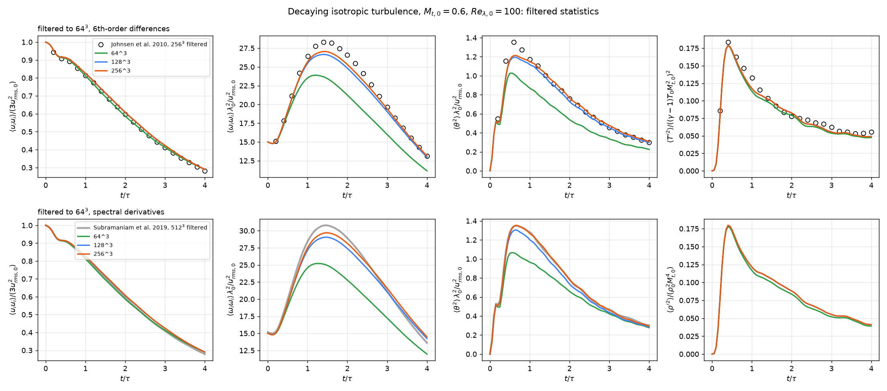

# Examples

Run each case from its own directory, e.g.

```sh
cd examples/riemann_2d
../../build/src/Mallard -i input.toml --kokkos-num-threads=8
python ../../tools/animate.py solut riemann
```

| Case | What it shows | Size, time on 12 CPU threads |
|---|---|---|
| `sod` | Sod shock tube with TENO5 on a 200x4 strip | 800 cells, seconds |
| `shu_osher` | Mach 3 shock running into an entropy wave, the standard test for high-order schemes | 800 cells, seconds |
| `riemann_2d` | 2D Riemann problem, configuration 3, on 320,000 triangles with TENO5 | ~20 minutes |
| `riemann_2d_quads` | The same problem on 160,000 quadrilaterals | ~9 minutes on 6 threads |
| `double_mach` | Double Mach reflection of a Mach 10 shock: a split bottom boundary (inflow, then wall) and an exact moving shock on the top boundary | 460,000 triangles, ~1 hour |
| `explosion_3d` | Spherical explosion (3D build): one octant with symmetry planes, TENO5 on 64^3 hexahedra; the solution stays spherically symmetric | 262,144 cells, ~5 minutes on 8 threads |
| `taylor_green_3d` | Taylor-Green vortex at Re = 1600 (3D build): the high-order workshop DNS case on the octant [0, pi]^3 with symmetry planes. At 64^3 per octant (128^3 full box) the dissipation peak is 0.01302 at t = 8.1, against 0.01286 at t = 9.0 for the 512^3 spectral DNS | 262,144 cells, 32,000 steps: ~1 hour on one A100 |
| `taylor_green_3d` (`input_periodic.toml`) | The same case on the full periodic box [0, 2 pi]^3 (no symmetry planes), for runs on several GPUs | 128^3 = 2.1M cells |
| `cbc_les` | Large-eddy simulation of decaying grid turbulence (Comte-Bellot & Corrsin 1971; 3D build) with the Sigma model and the hybrid KEEP/HLLC flux on 32^3 to 128^3 hexahedra (`tools/cbc_les.py`): spectra within 0.06-0.09 decades RMS of the measurements at 128^3 (and at 64^3 with `C = 1.8`), with 1-2% of the dissipation numerical; model off, the energy piles up at the grid cutoff; with HLLC alone, 84% of the dissipation is numerical. Details in the input's header and `docs/design/les.md` | 262,144 cells, 2,035 steps: 3 minutes on 4 CPU threads |
| `isotropic_turbulence` | Decaying compressible isotropic turbulence with eddy shocklets (3D build), the case of Johnsen et al. (2010): Mt = 0.6, Re_lambda = 100, k0 = 4 on the periodic box, as DNS on 64^3, 128^3 and 256^3 hexahedra (TENO5) from the same random initial field (`tools/isotropic_turbulence_restart.py`). At 256^3 (k_max eta >= 2.7) kinetic energy, temperature and density variances are grid-converged to 0.3% and the enstrophy to 3%; filtered to 64^3 as the references, the enstrophy is within 2.4% (mean) of Johnsen et al.'s filtered 256^3 and 0.3% of Subramaniam et al.'s filtered 512^3, the dilatation variance within 0.6%. `tools/isotropic_turbulence_stats.py`, `plot_isotropic_turbulence.py` and `animate_isotropic_turbulence.py` analyze and animate it; details in the input's header | 16.8M cells, 4,307 steps: about an hour on 12 A100s (128^3: 17 minutes on 3) |
| `sphere_mach3` | Mach 3 flow over a sphere (3D build) on an unstructured Gmsh tetrahedral mesh of the quarter domain (generate it with `tools/make_sphere_mesh.py`): HLL with bound-preserving TENO5. The bow-shock standoff settles at Delta / R = 0.226, 10% above Billig's correlation (0.205): 0.01 D, under half the tetrahedron edge length (0.025 D) in the shock layer | 800,000 tetrahedra, ~1.5 hours on four A100s |
| `sedov_3d` | Sedov-Taylor point blast (3D build): one octant, bound-preserving TENO5 on 128^3 hexahedra, against the exact similarity solution (`tools/sedov.py`). The shock radius stays within 1-3% of R = 1.0328 (E t^2 / rho0)^(1/5) | 2.1M cells, ~1.5 hours on four A100s |
| `poiseuille_pipe` | Hagen-Poiseuille flow in a round pipe (axisymmetric), driven by a body force from rest: the steady profile converges to the exact one at second order (mean error 3.2e-4 U on 32 cells across the radius) | 128 quads, 1 minute on one thread |
| `noh_axisymmetric` | Spherical Noh implosion on the meridian plane (axisymmetric, bound-preserving TENO5): shock radius within 1% of t / 3 in every direction, post-shock density 62-63 of the exact 64 (higher in the first cells along the axis, the usual overshoot at symmetry lines) | 40,000 quads, ~2 minutes on 4 threads |
| `sedov_axisymmetric` | Sedov-Taylor blast as an axisymmetric run, against the exact solution (`tools/sedov.py`): shock radius 0.6% ahead of R(t) at t = 0.8, spherical to 2% at the density peak | 65,536 quads, 5 minutes on one A100 |
| `sphere_axisymmetric` | Steady flow past a sphere at Re = 100 and 150 (axisymmetric, Mach 0.2) on a half O-grid from `tools/make_cylinder_mesh.py --half`: drag within 1.2% of the Clift-Grace-Weber correlation, separation angle within 0.2 degrees, wake length 0.885 D and 1.21 D (Johnson & Patel: 0.88, about 1.2); check with `tools/plot_sphere_axisymmetric.py` | 16,384 quads, 285,000 viscous-limited steps: ~30 minutes on one A100 |
| `wedge` | Mach 1.76 flow over an 8 degree ramp; the oblique shock matches theory (p2/p1 = 1.498) | 19,200 quads, minutes |
| `cylinder` | Viscous flow past a cylinder at Re = 100 (vortex shedding) on a Gmsh O-grid; generate the mesh with `tools/make_cylinder_mesh.py` first. Reproduces St, Cd and lift amplitude to within 2% | 49,152 quads, ~50 min on a laptop CPU |
| `sphere_re300` | Viscous flow past a sphere at Re = 300 (3D build): periodic shedding of hairpin vortices, on a Gmsh mesh of prisms (boundary layer) and tetrahedra from `tools/make_sphere_re300_mesh.py`; MUSCL. St = 0.133, Cd = 0.669, Cl = 0.073 against 0.137, 0.656, 0.069 (Johnson & Patel 1999), within 0.2%, 0.4% and 5% of a mesh with 2.4 times the cells | 850,000 cells, 1.04M steps: ~4.7 hours on four A100s |
| `channel_retau180` | Turbulent channel flow at Re_tau = 180 (3D build): DNS at bulk Mach 0.2 between isothermal walls, periodic in x and z, on the 4 pi h x 2h x 4/3 pi h box of Moser, Kim & Mansour (1999), with the mass flow held by `[source] mass_flow` and a tanh-stretched generated mesh (`[mesh] stretching`); MUSCL. Generate the initial state with `tools/channel_init.py`; `[statistics]`, `tools/plane_average.py` and `tools/plot_channel.py` compare the profiles with MKM, `tools/animate_channel.py` animates the near-wall vortices. Over 12.3 h/u_tau: Re_tau = 172.6 against 178.1 (Cf 7% low), the viscous sublayer as MKM, the u_rms peak 8% high and v_rms, w_rms, -u'v' within 1-4% | 2.36M cells (dx+ = 11.3, dz+ = 5.6, dy+ = 0.84 at the wall), 978,000 steps: 5 hours on four A100s |
| `viscous_shock_tube` | Daru & Tenaud viscous shock tube at Re = 200: shock / boundary-layer interaction in a closed box, giving a lambda shock and a primary vortex by t = 1. Matches the grid-converged wall density of Zhou et al. to 0.5 RMS; check with `tools/plot_viscous_shock_tube.py` | 500,000 quads, 58,500 viscous-limited steps: use a GPU build (or Nx = 500, Ny = 250: ~20 min on 6 threads) |
| `mallard` | Mach 8 flow over a flying mallard from an impulsive start: RHLL with bound-preserving TENO5 on a Gmsh triangle mesh; generate the mesh with `tools/make_mallard_mesh.py` first | 1.07M triangles, ~1.5 hours on a GPU |
| `reactive_shock_tube` | Reactive shock tube in 2H2-O2-7Ar (Fedkiw et al. 1997; Martinez Ferrer et al. 2014): the gas behind the reflected shock ignites and a detonation overtakes the reflected shock; the front at 230 us converges to 99.6 mm under refinement | 2,400 cells (50 um); 4,800 and 9,600 for the convergence check |
| `detonation_1d` | Planar CJ detonation in 2H2-O2-7Ar at 6.67 kPa, started from its ZND structure (generate it with `tools/detonation_reference.py` and `tools/znd_restart.py`, see the input's header): the front keeps D_CJ = 1617 m/s within 0.01% at 20 cells per induction length, and the von Neumann pressure | 3,934 cells (10 per induction length); 7,868 and 15,736 for 20 and 40 |
| `detonation_2d` | Cellular detonation in 2H2-O2-7Ar at 6.67 kPa (V9): the ZND detonation of `detonation_1d` in a 6 cm channel, perturbed by six pockets of fresh gas, with the numerical soot foil (`P_MAX`); generate the initial state first (see the input's header). Front speed 1617.0 m/s (D_CJ to 0.01%); eight triple points (15 mm cells) thin out to 3 cm cells and fainter tracks over 33 cm of travel; the track pattern is the same at 10 and 20 cells per induction length. `tools/soot_foil.py` and `tools/animate_detonation_2d.py` analyze and animate it | 1.2M cells, 18,900 steps: 39 minutes on two A100s |
| `detonation_3d` | Cellular detonation in a 3 cm square duct (3D build), 2H2-O2-7Ar at 6.67 kPa at 10 cells per induction length, in a window that follows the front (`tools/detonation_window.py`), started from a 2D cellular detonation (`input_2d.toml`) turned into in-phase transverse waves in y and z: the rectangular mode with numerical soot foils on all four walls, triple-point tracks and slapping-wave bands; front speed D_CJ to 0.2% over 17 cm. `tools/soot_foil_3d.py` and `tools/animate_detonation_3d.py` analyze and animate it | 19.2M hexahedra, 12,180 steps: 4.6 hours on four A100s |
| `premixed_flame` | Freely propagating stoichiometric H2/air flame at 1 atm with mixture-averaged transport (V8), started from Cantera's flame in its frame (generate the restart file first, see the input's header); the consumption speed settles within 0.1% of Cantera's 2.332 m/s | 300 cells, 20 per thermal thickness, ~10 min on one thread |
| `flame_outflow` | A stoichiometric H2/air flame blown out through a characteristic outlet, fed by a characteristic inlet: while the flame leaves, the pressure stays within 0.7% of the target and within 0.3% across the domain | 60 cells, ~2 minutes on 3 threads |
| `flame_2d` | Lean H2/air flame (phi 0.4, 700 K, 1 atm) in a periodic channel with mixture-averaged transport and, in `unity/`, unity Lewis numbers, from the same wrinkled front: differential diffusion makes the burnt gas 0.96-1.02 times the adiabatic flame temperature (unity Lewis: uniform) and the flame up to 14% faster; planar flames on the same mesh are within 0.6% of Cantera. Generate the initial states first (see the input's header); `tools/animate_flame_2d.py` animates both side by side | 72,576 cells, 300,000-380,000 steps: 70-80 minutes per run on one A100 |
| `counterflow_diffusion` | H2/N2 (1:3) against air from opposed round jets, 10 mm apart (V10, 3D build): a quarter domain with N2 coflows, started from Cantera's `CounterflowDiffusionFlame` (generate the mesh and initial state first, see the input's header and `README.md`). Peak temperature against local strain rate within 2% of Cantera's from 344 to 1640 1/s (+0.49% at this input's 711 1/s), within 0.6% at matched flame strain; it goes out between 1818 and about 1975 1/s (Cantera: 1816 1/s) | 46,464 hexahedra, 15 cells per flame width: 75 minutes on one A100 |
| `triple_flame` | Triple flame of H2:N2 = 1:1 against air at 300 K (mixture-averaged transport) in mixing layers of 4 and, in `thick/`, 12 thermal thicknesses, against Ruetsch, Vervisch & Liñán (1995): held in place by raising the inflow to its speed, it propagates at U<sub>F</sub> / S<sub>L</sub> = 2.31 and 2.46 at local mixing thicknesses D<sub>TF</sub> = 9 and 28, rising with D<sub>TF</sub> as theirs (1.23 to 1.51); higher than their one-step, unity-Lewis values because the hydrogen tip burns at 1.24-1.30 S<sub>L</sub>, while the flow divergence alone gives 1.86-1.90, below √(ρ<sub>u</sub>/ρ<sub>b</sub>) = 2.44. Generate the initial states first (see the input's header); `tools/triple_flame_analysis.py` and `tools/animate_triple_flame.py` analyze and animate it | 166,000 and 276,000 cells, 12 per thermal thickness, about 330,000 steps: 4 hours per run on two A100s |
| `flame_vortex` | Premixed flame-vortex interactions on the spectral diagram of Poinsot, Veynante & Candel (1991): vortex pairs of 1-8 thermal thicknesses at 3-100 S<sub>L</sub> against a rich H2/air flame (phi = 4, deficient-reactant Lewis number 2.2, no heat losses). Small pairs fall below the 5% cut-off, larger ones wrinkle the front or cut off pockets of fresh gas, and none quenches, up to Ka(r) = 25 (Poinsot et al.'s quenching needs heat losses, which Mallard does not model). Generate the initial state first (see the input's header); `tools/flame_vortex_analysis.py` classifies the runs and `tools/animate_flame_vortex.py` animates them | 26,000-85,000 cells, 12 per thermal thickness (24 for the smallest pairs): 12 minutes to 1.5 hours per run on one A100 |
| `h2_ignition` | Constant-volume ignition of stoichiometric H2/air at 1200 K, 1 atm with `MallardReactor` (`../../build/src/MallardReactor -i input.toml`, writes `reactor.csv`); ignition delay 44.2 us as Cantera | 0D, milliseconds |
| `shock_bubble_3d` | Mach 1.25 shock on a helium bubble in air (3D build; Haas & Sturtevant 1987): Navier-Stokes with mixture-averaged transport at Re = 1.5e3 (the bubble scaled down to 0.18 mm), a quarter of the square shock tube at 128 cells per diameter; the kidney-shaped bubble, the air jet and the vortex ring. Refracted and transmitted shocks, ring and late downstream face within 0-8% of the measured velocities (961, 359, 178, 166 m/s against 960, 365, 165, 165), all within 1.2% at 96 cells per diameter; generate the initial state first (see the input's header); `tools/shock_bubble.py` compares, `tools/animate_shock_bubble.py` animates | 11.4M hexahedra, 52,091 steps: 3.4 hours on four A100s |

## Isotropic turbulence



`isotropic_turbulence` on 64^3, 128^3 and 256^3, filtered to 64^3 as the
references: top, sixth-order differences against Johnsen et al. (2010,
circles); bottom, spectral derivatives against Subramaniam et al. (2019,
grey). 64^3 is under-resolved (k_max eta ~ 0.7) and misses 15% of the
enstrophy; 128^3 and 256^3 agree within 2%. The remaining differences from
the references (kinetic energy +2%, temperature variance -5%) are of the size
of the spread between random initial fields, whose realizations the
references do not publish.
