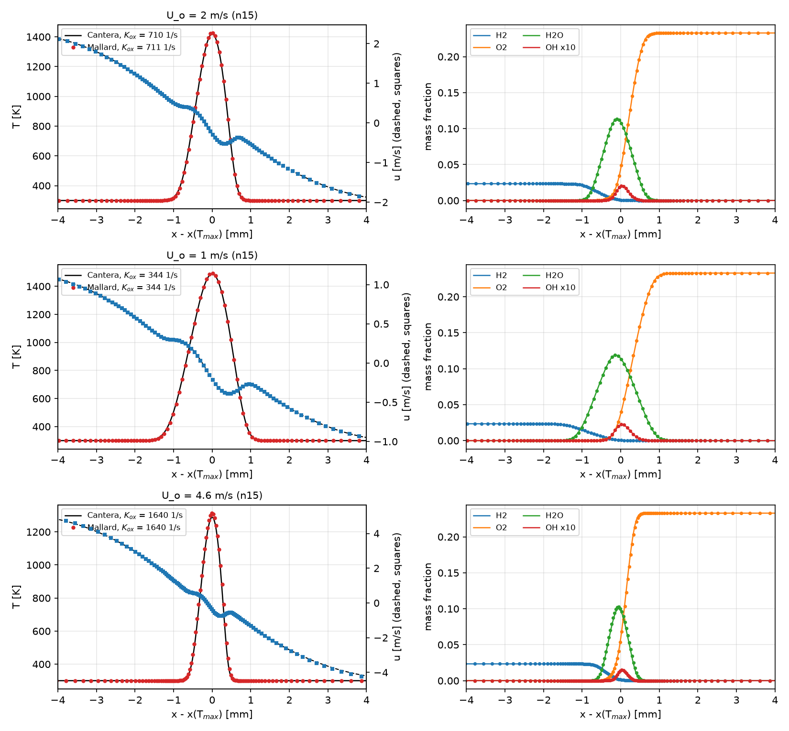

# Counterflow diffusion flame (V10)

H2/N2 (1:3 by volume) against air, both at 300 K and 1 atm, from opposed
round nozzles 10 mm apart, against Cantera's `CounterflowDiffusionFlame`
with the same mechanism (`mechanisms/h2o2.yaml`) and mixture-averaged
transport.

Cantera solves the axisymmetric stagnation-flow similarity problem: plug
flows from two infinitely wide nozzles, the radial velocity `r V(x)`, and
everything else a function of `x` only. Mallard has no axisymmetric
formulation, and a planar run is a different flow (planar stagnation flow
has another relation between nozzle velocity, strain and flame, with no
exact rescaling onto the axisymmetric one), so the run is 3D: a quarter of
the two jets, with symmetry planes `y = 0` and `z = 0`, plug jets (`upt`)
at `r < 5 mm` surrounded by N2 coflows at the same velocity so that each
whole nozzle plane is an inlet, and pressure outlets at `y, z = 7.5 mm`.
The jets are momentum-balanced (`rho_f U_f^2 = rho_o U_o^2`). A finite jet
only approximates the similarity solution, so the comparison is made where
it holds best, on the stagnation line, at matched strain rate.

The mesh (`tools/counterflow_setup.py`) is a tensor product of hexahedra:
along `x`, 15 cells per FWHM of the temperature profile through the flame
and mixing layer (57 um at `U_o = 2 m/s`), growing by 8% per cell towards
the nozzles; across, four times that out to `r = 2 mm`, then growing. The
run starts from Cantera's solution at the same nozzle velocities.

## Running

From this directory (3D build):

```sh
python ../../tools/counterflow_setup.py reference/U2.csv . --cells-per-width 15
mpirun -n 1 ../../build/src/Mallard -i input.toml
python ../../tools/plot_counterflow.py counterflow --run "U_o = 2 m/s" . --history --still 5e-3
```

The first command writes the mesh, the initial state and `input.toml`
(replacing this one, without its header). 46,464 cells; 4 / `K_ox` = 5.5 ms
is 312,000 steps, 75 minutes on one A100. The references are made by
`tools/counterflow_reference.py`: the strain sweep (`strain.csv`), full
solutions at given oxidizer velocities (`--profile 2` writes `U2.csv`, the
initial state) and at given strain rates (`--match 711` writes `K711.csv`,
the profile overlay).

## Validation

Strain is measured the same way in both: on the stagnation line, `K_ox` is
the first maximum of `-du/dx` met going from the oxidizer nozzle towards the
flame (the local strain rate of the oxidizer stream, before the flame's
dilatation reverses the gradient), and `V_T` is the spread rate `v / r` at
the peak temperature, the strain the flame itself sees. Mallard's line is
the row of cells next to the axis, extrapolated to `r = 0`. Each run is
steady after 2-5 / `K_ox` (the higher strains take longer); the values below
are at its end, 5.4-6.3 / `K_ox`.

| `U_o` [m/s] | cells per FWHM | `K_ox` [1/s] | `T_max` [K] | Cantera at `K_ox` | error | `V_T` [1/s] | Cantera at `V_T` | error |
|---|---|---|---|---|---|---|---|---|
| 1 | 15 | 344 | 1495.1 | 1489.0 | +0.41% | 387 | 1488.6 | +0.43% |
| 2 | 10 | 704 | 1431.5 | 1421.0 | +0.74% | 727 | 1420.1 | +0.80% |
| 2 | 15 (this input) | 711 | 1426.9 | 1420.0 | +0.49% | 717 | 1421.9 | +0.36% |
| 2 | 22 (to 3.3 / `K_ox`) | 713 | 1424.4 | 1419.6 | +0.34% | 719 | 1421.6 | +0.20% |
| 2, jets 7.5 mm, sides 11.25 mm | 15 | 688 | 1433.9 | 1423.6 | +0.73% | 674 | 1429.3 | +0.32% |
| 3 | 15 | 1064 | 1383.2 | 1370.3 | +0.94% | 1003 | 1376.7 | +0.48% |
| 4 | 10 | 1418 | 1343.8 | 1323.4 | +1.54% | 1317 | 1329.6 | +1.07% |
| 4 | 15 | 1418 | 1343.7 | 1323.4 | +1.53% | 1257 | 1339.0 | +0.35% |
| 4, jets 7.5 mm, sides 11.25 mm | 15 (to 4 / `K_ox`, still rising) | 1325 | 1361.5 | 1336.1 | +1.90% | 1137 | 1356.8 | +0.35% |
| 4.6 | 15 | 1640 | 1313.8 | 1288.5 | +1.96% | 1454 | 1306.1 | +0.59% |
| 5.1 | 15 | 1818 | 1287.5 | 1239.7 (extinction, 1816 1/s) | +3.9% | 1593 | 1274.3 | +1.04% |
| 5.6 | 15 | 1890-1975 | goes out | extinct | | | | |


With the 5 mm jets, the peak temperature at matched `K_ox` is within 2% of
Cantera's up to 1640 1/s, 90% of Cantera's extinction strain rate (1816
1/s), but the excess grows with strain, from 0.4% at 344 1/s to 2.0% at 1640
1/s. Resolution accounts for little of it: at `U_o = 2 m/s` it falls from
0.74% to 0.49% and 0.34% at 10, 15 and 22 cells per FWHM, and at 4 m/s it is
the same at 10 and 15. The flames see less strain than the similarity
solution for the same `K_ox`: `V_T / K_ox` is 0.89 in Mallard at `U_o = 4
m/s` against 0.95 in Cantera, presumably because finite jets with coflows
are not stagnation flows with a uniform radial pressure gradient, and near
extinction `T_max(K_ox)` is steep, so the same strain offset costs more
temperature. The offset depends on the jets: wider ones give a lower `K_ox`
and a hotter flame at the same nozzle velocity, and at 4 m/s an excess of
1.9%, still rising when the run stopped. Matched at the flame's own strain
`V_T` instead, the peak temperatures agree within 0.3-0.6% at 15 cells per
FWHM over the whole branch and for both jet widths, and within 1.0% at
Cantera's extinction strain (`V_T` is the more resolution-sensitive measure:
0.8-1.1% at 10 cells). At `U_o = 5.1 m/s` Mallard's flame still burns at
`K_ox` = 1818 1/s, Cantera's extinction strain rate; at 5.6 m/s (`K_ox`
1890-1975 1/s while it burns) the peak temperature on the axis falls from
1271 to 390 K in 1.3 ms. Mallard's extinction strain rate is therefore 0-9%
above Cantera's.

Temperature, axial velocity and species on the stagnation line, against
Cantera's flame with the same `K_ox` (`--match`), aligned at the peak
temperature:



During the first strain times, the temperature in the coflow can be off by
5-12 K where a composition front (fuel or air against the N2 coflow) crosses
the coarse outer cells: the conservative scheme's pressure and temperature
errors at species interfaces (V4). They shrink under refinement, stay far
from the axis, and do not affect the comparison.
